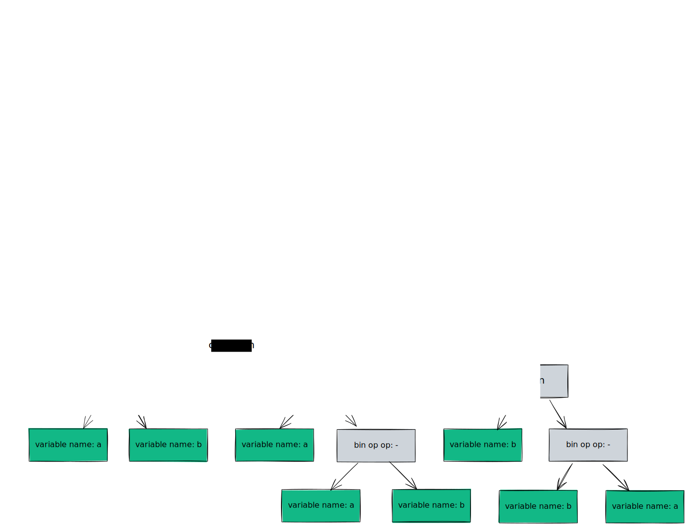

# Abstract syntax tree

> In [[Computer_science|computer_science]], an abstract syntax tree (AST), or just syntax tree,
> is a tree representation of the abstract ==syntactic structure of text==
> (often source code) written in a formal language. Each node of the tree
> denotes a construct occurring in the text.\
> — <cite>[Wikipedia](https://en.wikipedia.org/wiki/Abstract_syntax_tree)</cite>
<!--SR:!2023-07-20,1,250-->

Abstract syntax trees are used in program analysis and program
transformation systems. As example Euclidean algorithm is shown below.

_An abstract syntax tree for the Euclidean algorithm_