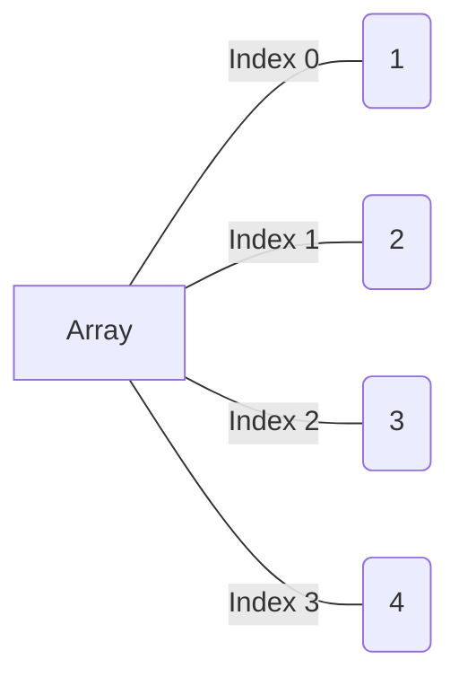

# Array (computer science)

Array is one of most basic data structure in computer science.

## Array (data structure)

> Array is a [[Data_structure|data structure]] consisting of a collection of
> elements (values or variables), each identified by at least one array index or
> key.\
> — <cite>[Wikipedia](https://en.wikipedia.org/wiki/Array_\(data_structure\))</cite>

> An assemblage of items that are randomly accessible by integers, the index.\
> — <cite>[Dictionary of Algorithms and Data Structures](https://xlinux.nist.gov/dads/HTML/array.html)</cite>

Array in memory is a **contiguous** block of memory locations (which allocated
when you create it). Array usually at least has an **address** in memory and
**size** (number of items in array). Each element of array has an index
(location of elements or address), and first index is `0`.

size_of_array = last_index ==+ 1==
<!--SR:!2023-07-21,2,236-->

| 0   | 1   | 2   | 3   | 4   | 5   |
| --- | --- | --- | --- | --- | --- |
|     |     | `9`   |     |     | `1`   |
|     | `5`   |     |     |     |     |
|     |     |     | `10`  |     |     |
|     |     |     |     | `6`   |     |
|     | `7`   |     |     | `11`  |     |
*Graphical representation of array in memory*\
How many total items in this array? Is empty items has address in memory?
?
6*5 = 30
yes, empty items has address in memory
<!--SR:!2023-07-21,2,239-->

## Array (data type)

> In [[Computer_science]], **array** is a [[Data_type|data type]] that represents a
> collection of _elements_ [[Value|values]] or
> [[Variable|variables]], each selected by one or more
> indices (identifying keys) that can be computed at
> [[Runtime|runtime]] during program execution. Such a
> collection is usually called an **array variable** or **array value**. By
> analogy with the mathematical concepts [[Vector]] and
> [[Matrix|matrix]], array types with one and two indices are
> often called **vector type** and **matrix type**, respectively. More
> generally, a multidimensional array type can be called a **tensor type**, by
> analogy with the physical concept, [[Tensor]].
>
So in general array is a 1 way storing several items (such as integers). Usually
array store the same type of items (this depending on language). Every item in
array indexed (by integer number starting from 0) and you can access array item
by index (key in array). As rule index starting from [[Zero-based_numbering|0]]
to `n-1` where `n` is a number of items in array.

In general array is ==list of data elements==.
Size of an array is ==how many data elements the array holds==.
<!--SR:!2023-07-27,8,230!2023-07-21,2,239-->

The index of an array is the number that identifies ==where a piece of data
lives== inside the array.

In most programming languages, arrays are ==zero-indexed==, meaning that the
first element of the array is at index 0, the second element is at index 1, and
so on.
<!--SR:!2023-07-20,1,219-->



When you create array ([[Initialization|initialize]]) you must set array size
(number of items stored in the array). Size of array is fixed. Also, computer
==allocate some [[Computer_memory|memory]]== to store array, during its
initialization.
<!--SR:!2023-07-21,2,236-->


When allocating an array the computer always keeps track: ? Beginning address
and array size


An array is stored such that the **position of each element** can be computed
from its **index tuple** by a mathematical formula. So a computer can find the
value at any index by performing simple addition.

| value          | A   | B   | C   | D   | E   | F   | G   | H   | I   | J   |
| :------------- | :-- | :-- | :-- | :-- | :-- | :-- | :-- | :-- | :-- | :-- |
| memory address | 10  | 11  | 12  | 13  | 14  | 15  | 16  | 17  | 18  | 19  |
| index          | 0   | 1   | 2   | 3   | 4   | 5   | 6   | 7   | 8   | 9   |

Read value at index 3:

1. Array begins from memory address 10
2. Index 3 will be exactly 3 positions after address 10
3. So, memory address for index 3 is 13
4. Read value from memory address 13 = D

Examples, how to use [[Array_in_programming_languages|array in programming languages]].

Array operations explained in [[Array_operations|array operations]].

## Ordered array

Ordered array is same as array, but with one difference: elements in ordered
array are sorted ==in some order== (usually ascending or descending), and when
you modify array, you must keep it sorted.

Ordered array are identical to "classic" array, but here only one difference,
whenever you modify the array, you must keep it in ==sorted order==.
<!--SR:!2023-07-21,2,239-->

And this brings some specific rules. For example, we want to add 75 into ordered
array at some point

```
3.17.80.202                 # initial array, we want to add 75
*.**.17<75<80.**.*** # 3 steps, we go through array, to find right place for 75
                     # this steps are called comparison

3.17.80.202.[ ]      # we allocate memory for new element
3.17.80.[ ].202      # we shift right all elements after 75
3.17.[ ].80.202      # here at least 2 operations?

3.17.75.80.202       # new ordered array
```
When inserting into an ordered array, we need to always conduct a ==search==
before the actual insertion to determine the correct spot for the insertion.
<!--SR:!2023-07-21,2,236-->

In the worst case when using linear search, we spent ==$N+2$== steps to insert
new value into ordered array. But with [[Binary_search_algorithm|binary search]] we can insert elements
more effectively.
<!--SR:!2023-07-20,1,216-->

Main advantage of ordered array is that we can use ==[[Binary_search_algorithm|binary search]]== algorithm
to find elements in array very efficiently.
<!--SR:!2023-07-21,2,239-->
