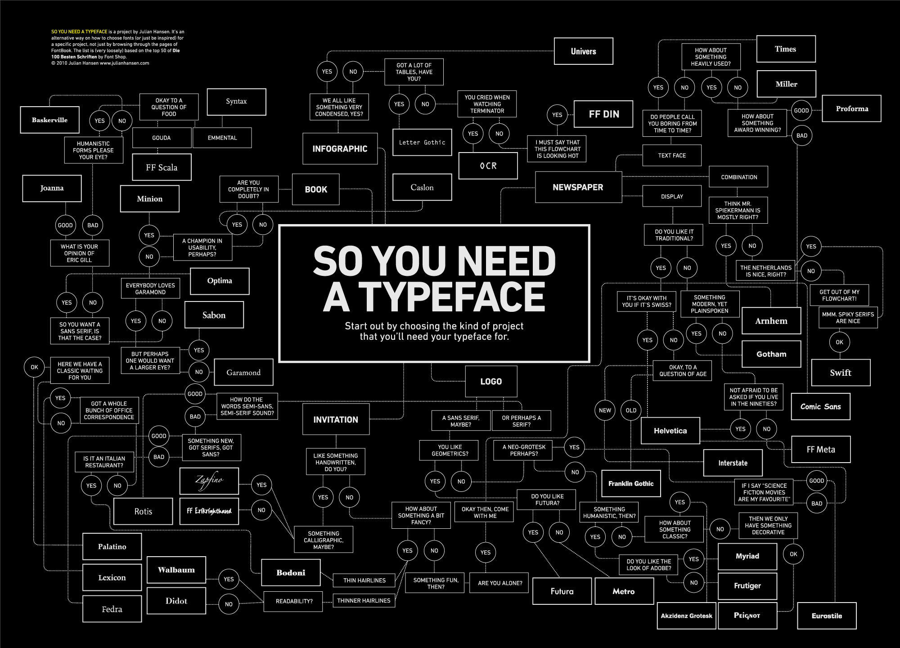

# Font

> In metal typesetting, a font is a particular size, weight and style of a
> **typeface**. Each font is a matched set of type, with a piece (a "sort") for
> each glyph. A typeface consists of various fonts that share an overall design.
> Each font is a matched set of type, with a piece (a "sort") for each glyph. A
> typeface consists of various fonts that share an overall design.\
> — <cite>[Wikipedia](https://en.wikipedia.org/wiki/Font)</cite>

I keep storing [[My_favorite_fonts|fonts]], which I use daily or which looks
great for me.

A computer font is implemented as a digital data file containing a set of
graphically related glyphs. They are widely used in modern
[[Computer_software|software]].

[[Unicode]] fonts like GNU Unifont can contain thousands glyphs.

Here great list of various typefaces:

_[So You Need A Typeface — Julian Sonne Hansen](https://julianhansen.com/soyouneedatypeface)_

Critical elements of typesetting:

_[Alphabet of Typography – Pop Chart](https://popchart.co/products/alphabet-of-typography)_

## TODO

- [ ] add here font properties, types, etc.
- [ ] [Паратайп | Основные принципы сочетания шрифтов](http://rus.paratype.ru/pairing-typefaces)
