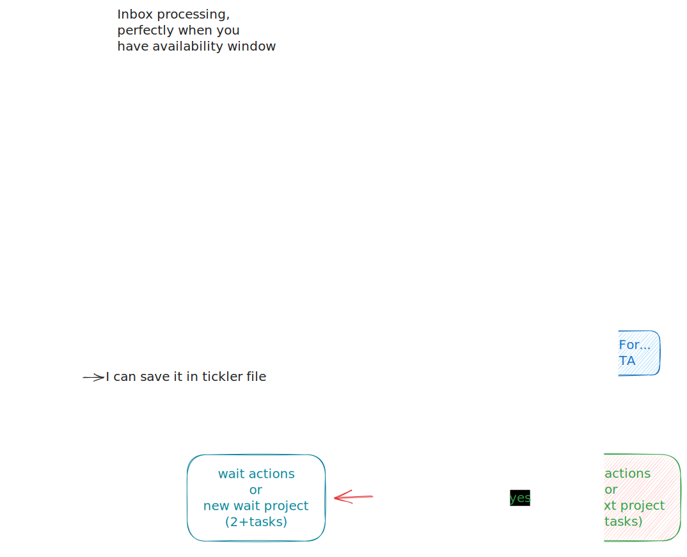

# Getting Things Done (GTD)

> Getting Things Done (GTD) is a way of organizing all the things a person has
> to do. The method was made by David Allen. He has written a book about this
> subject, with the title of his method.
>
> The Getting Things Done method follows a simple rule: by writing down all
> tasks your mind is free to focus on the task at hand. In this way, the mind
> does not have to remember all the things he still has to do.\
> — <cite>[Wikipedia in Simple English](https://simple.wikipedia.org/wiki/Getting_Things_Done)</cite>

I like ideas of GTD productivity system (or framework). I not read the book
(TODO need read I think), but I use daily GTD method. This method allow getting
things done **better way** than just allow things to happen.

Gtd allow to organize messy ideas/tasks, and you start actually doing and track
them. This will reduce stress and free up your brain time.

General ideas/concepts, which you write in lists, which provide proven system to
work with tasks:
?
- **Inbox** list.
- **Next** actions list.
- Waiting list for, aka blocked tasks
- Projects list, or context
- Some day/maybe list

You need to review this lists **regularly**.

## Inbox

Inbox is where you can **QUICK as possible** add all your tasks, ideas,
temporary data, etc...
Using Taskwarrior I can add task through special scratch window, bind to
<kbd>s-grave</kbd> keybinding.

Using Inbox lists, I'm reducing brain time to remember all these things.

Outside of home/PC I use special lists files, which I'm editing in [[Markor]].

## Processing

General tips:

- Process items from oldest to newest.
- Follow workflow (see below) to understand how to work with items.
- Next action needs to be a **physical** and **visible** action, you pre-process
  task while review inbox and leave small chance to avoid task.
- `next` or "as-soon-as-possible", task which you can do now (or anytime). If you're not planning do this
task, you need to move them into `wailt` list or `someday` list.
- `wait` or `someday`, task which you can't do now, but you need to do it in the future.
Taskwarrior allow hide this tasks from `next` list, but you can see them by
using `task list all`.
- If the action requires more than one action it’s recorded in the projects list as well.
- Delegated or blocked (`wait`) task must be marked with current day, to
calculate how long task is blocked, and maybe you need to remind someone about
it.

_GTD workflow_

## Projects

It's very hard to work on very big task, so you need to split them into small
tasks and save them as project lists. These lists have project title and
optional description. Make sure you have at least one `next` action in your
project list, otherwise project will be become stuck. If they stuck, maybe you
need to move whole project into `someday` list.

## Contexts

Contexts are “tags” you put on the items on your next actions lists saying
**where** the action can be done, or what **equipment** you need to perform it.
An action can be “tagged” with a context in several ways; the easiest is
probably to simply have different next actions lists—one for each context.
Modern software can implement context based on your location or simple commands
to switch your context.

It is common to prefix contexts with a `@` symbol.

Examples of contexts are `@home`, `@computer`, and `@office`.

### Examples of actions and their contexts

| Action                             | Context         |
| ---------------------------------- | --------------- |
| Buy more rainbow-colored dog food  | @city or @store |
| Play Gothic 1                      | @computer       |
| Smile to a stranger                | @everywhere     |
| Discuss with boss                  | @boss           |

## The “some day/maybe” list

This list simply contains ideas and projects you _might_ want to realize at some
time in the future. Example: you want to read some big cool book, but you're reading
already some other book, and haven't time to it, and someday you will start read
it and move task from someday to next list.

This list should be reviewed weekly along with the rest of the system as
described in the _weekly review_ section below.

## Calendar

Calendar items have the highest priority. It's sort of next tasks, but with specific
timestamp field. Unusually these items are very sensitive to time.

## Weekly review, critical factor for success

Weekly review is sort of maintenance of your GTD system. Like database
maintenance tasks.

I like to right down all my weekly tasks on Sunday, when I have free time.

Reviewing task requirements:

- Make sure each project has at least one _next action_ (projects maintenance).
- Make sure that each action on your next actions list is _actually_ something
you want or need to do if you have the time during the coming week. Be honest
with your self and decide do you want work with it or move into someday list.
- Look through your someday/maybe list and see if some projects/actions should
be moved to the list of current projects/the next actions list. Don't forget
about `next` task requirement in projects.

Trigger lists, question which you ask yourself to recall things:

- Boss
- Co-workers
- Projects started, not completed
- Projects that need to be started
- People I need to get back to
- Roommates
- Family
- Friends
- Promises
- Outside people
- Phone calls
- Text messages
- Delegated tasks/projects
- Waiting my reply
- Reports
- IRL
- Mentoring
- Pet projects
- Readings
- Meetings
- Content I want to create
- Content I want to consume
- Financial check
- Rent
- Food
- Clothes
- Billings and Utilities
- Completions critical to projects
- Ordered items tracking
- Travel
- Health
- My help needed
- Professional improvement
- Future Birthdays
- Anniversaries
- Repair

When working through your trigger list, put anything that you remember in your
in list to be processed afterward. One goal of this to find some tasks outside
of inbox list.

## Research directory (in wiki)

It's containing some materials which I want to read when I have free time.
Only the things you actually want to read when you have the time should be put
in this folder. In this directory each note have links to external article or
book, which I can read (outside of PC, they are available through
[[Open_Publication_Distribution_System_OPDS|OPDS]]).

## Tickler file

This strangely-named concept is simply a collection of 43 (physical) file
folders. Why 43? Because that means that you can have one for each of the **31**
days of a month plus one for each of the **12** months of the year. If you’re
reaching for your calculator now—just trust me on the number 43.

This sort of calendar, but with much fewer restrictions. Each day/month you
check tickler files (for current day) and decide what to-do with these tasks.
You can schedule it again or move into `next` list. It can be used as reminder
system, to send messages to yourself in the future.

Tickler file requirements

- Tickle items should only be visible on (and after) the day you need to see
them.
- For every tickle item, you should know why you get it in your inbox (again).
- For every tickle item, you should know when you put it in your tickler system.
- The transaction cost of using a tickler system should be as low as possible.

## Resources

- [x] [GTD in 15 minutes](https://hamberg.no/gtd). Actually taken more than few
hours from me 🙂. But this material is very good, and I filled this note mostly
from this article.
