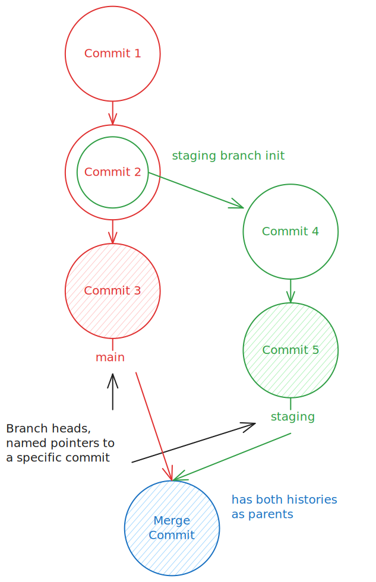

# Git Version Control System

Distributed revision control system, [[computer_program|computer program]],
designed to help people create other computer program together.

> Git is a free and open source distributed version control system designed to
> handle everything from small to very large projects with speed and efficiency.
> — <cite>[Git](https://git-scm.com/)</cite>

Git is useful to work with code without fear, you can experiment with code, use
multiple branches as features tree, if your decision was incorrect, you can
easily revert you changes. It's also useful for reviewing your changes and
collaborate.

Additional details can be found in @ProGitChacon2022 book. You
can also use built-in help: `man git`, `git help` or `git [command] –help`.

After installing git, you usually need to configure it, here minimal
configuration example, with my personal data:
```sh
git config --global user.name "First Lastname"
git config --global user.email "user@domain.tld"
```
Main objects in Git is commits and branches, they can be presented as nodes
graph:


_Git branching and committing_

Does Git store an entire snapshot of files per commit?
&#10;
Yes! Git stores an entire snapshot of files (not file changes) on a per-commit
level, but with some optimizations (data deduplication with pointers and
compression). So by default Git not good solution to work with large binary
files.

## Git tips

Here I store various flashcards, how to use git (sort of cheat sheet).

### General

Check the Git version:
&#10;
`git --version`

Show general help:
&#10;
`git --help` <!--SR:!2024-09-19,3,251-->

Show help on a Git subcommand (like `clone`, `add`, `push`, `log`, etc.):
&#10;
`git help subcommand`

Execute a some Git subcommand:
&#10;
`git subcommand` <!--SR:!2024-10-09,24,272-->

Execute a Git subcommand on a custom repository root path:
&#10;
`git -C path/to/repo subcommand`

Execute a Git subcommand with a given configuration set:
&#10;
`git -c 'config.key=value' subcommand`

### Create repository

Create a new local repository, _project_name_ is optional. If no project name specified you'll create git repository in current directory. You can also use non-existing **nested** directories, git automatically create needed structure.
&#10;
`git init [project_name]` <!--SR:!2025-12-16,476,312-->

Download from an existing repository. URL can be `http[s]...` or `git@...` (require specific private ssh key). If project path specified, git will clone into this directory.
&#10;
`git clone URL [project_path]`

Perform a shallow clone, to only get the latest commits, which helps to save data (good for limited data connections) when cloning large repos.
&#10;
`git clone --depth 1 <remote-url>`

Unshallow a clone.
&#10;
`git pull --unshallow`

### Git aliases

Alternative commands, like `git s` and `g` are special aliases, require specific git alias configuration.

Check your aliases:

`bat ~/.gitconfig`

### Observe a Repository

List new or modified files not yet committed (changes from last commit)
&#10;
`git status` or `git s`

Show the changes to files not yet staged (committed before).
Pretty useful to see what you changed before stage it.
&#10;
`git diff`

<!--SR:!2023-03-31,1,208-->

Show the changes to staged files (not committed)
&#10;
`git diff --cached`

Show all staged and unstaged file changes
&#10;
`git diff HEAD`

Show the changes between two commit ID's
&#10;
`git diff commit_id_1 commit_id_2` Can be used with `HEAD` as well.

Show changes to files WITHOUT considering them a part of git. This can be used to diff files which are not part of a git repo!
&#10;
`git diff --no-index path/to/file/A path/to/file/B`

List the change dates and authors (who committed) for a file
&#10;
`git blame [file]`

Show the file changes (not a diff) for a commit ID and/or file
&#10;
`git show [commit]:[file]` <!--SR:!2024-09-17,1,231-->

Show full change history. Is possible to list remote changes?
&#10;
`git log`, `gl` is mine custom alias for graph view of commits.
Yes, you can log the commits of a remote repo as well (remote/branch):
`git log origin/main` <!--SR:!2024-09-19,3,253-->

How customize output of `git log`, for example:
- show full branch names
- hide branch names
- compact view of log, limit to 1 commit
- graph mode and all branches
&#10;
A: decorate flags
- `git log --decorate=full`, show full branch names
- `git log --decorate=no`, hide branch names
B: compact view of log, limit to 1 commit
- `git log --oneline -n1`
C: graph mode and all branches
- `git log --oneline --graph --all`

`git log --oneline --decorate --graph --parents`
```
 $ git log --oneline --decorate --graph --parents
*   cb0280e a563a6a a3c16d4 (HEAD -> main) F: Merge branch 'add_classics', amend
|\
| * a3c16d4 a7bb5fe (add_classics) D:\ add classic
* | a563a6a a7bb5fe E: update contents
|/
*   a7bb5fe ea61d81 a772d04 Merge branch 'remake'
|\
| * a772d04 a9333c8 (remake) Add remake
| * a9333c8 1656f66 (develop) ad second commit
| * 1656f66 1f7ea8a Test branch
* | ea61d81 1f7ea8a add
|/
* 1f7ea8a d05a05c C: add EN quotes
* d05a05c 351cadb B: add titles
* 351cadb A: add contents.md
```
Can you explain output (only significant parts)?
&#10;
- `*` asterisk represent commit
- `cb0280e a563a6a a3c16d4 (HEAD -> main)`, first hash it's merg-commit hash,
second two are parent commits (merge from → to).
- the next section is a visual representation of the branch structure. It shows
the commits on the add_classics branch and the main branch before the merge.
Notice that they both share a common parent.
- etc.

You have this git graph, which type of merge Git will do?
```text
`A--->B` # main
     `C--->D--->E`  # featureq
```
&#10;
Git will do a fast-forward merge, which means that it will simply move the HEAD
pointer from B to E, and we don't need to create a new merge commit.

Get details of repository object (by commit hash)
&#10;
`git cat-file -p [commit hash]`

What `.git/refs/heads/main` this file contains?
&#10;
It's a file which contain the `main` branch ref (commit hash that the branch
points to).

Git log, but limit to the last 10 commits and disable pager
&#10;
`git --no-pager log -n 10`

Find git commit that introduced a string in any branch
&#10;
`git log -S <string> --source --all`

View commits which would be pushed (commits in current local branch).
&#10;
`git log @{u}..`

View changes which are new on a feature branch.
&#10;

```sh
git log -p feature --not main
git diff main...feature
```

Show change history for file/directory including diffs
&#10;
`git log -p [file/directory]`

View differences of branches/stash with meld, other tool?
TODO: review this
&#10;
```sh
## To get list of toolname runt this:
## git difftool --tool-help

## Compare current branch with another branch
git difftool -d branchname -t toolname

## Compare current branch with stash
git difftool -d stash -t toolname
```
YOU CAN EDIT files in meld and save them!

### Branches

Working With Branches List all local branches
&#10;
`git branch`

List all branches, local and remote
&#10;
`git branch -a[v]`

Create a new branch called new **branch**, how to create and switch in same
time?
&#10;
- `git branch new_branch`
- `git switch -c new_branch` <!--SR:!2024-09-17,1,232-->

Delete the branch called my **branch**
&#10;
`git branch -d my_branch`

Force Delete the branch "branch_name".
&#10;
`git branch -D [branch_name]`

To delete a remote branch "branch_name":
&#10;
`git push --delete origin [branch_name]` or
`git push origin :<remotebranch>`

How to rename (move) a branch?
&#10;
`git branch -m[--move] old_name new_name` <!--SR:!2024-09-17,1,232-->

Continue merge after resolving conflicts
&#10;
`git merge --continue`
And if you don't want to edit the message when continuing/resuming the merge:
`git merge --continue --no-edit`

Branches: To delete all branches on remote that are already merged:
&#10;
`git branch --merged | egrep -v "(^*|main|dev)" | xargs git branch -d`

Switch to a **my_branch**
&#10;
`git switch my_branch` <!--SR:!2024-09-19,3,253-->

Merge branch **foo** into branch **bar**. First we need to find/switch to merge
base (the best common ancestor?) of two branches, then we can merge them.
&#10;
`git switch bar; git merge foo`

Create a bare branch; without any commits.
&#10;
`git checkout --orphan branch_name`

Checkout a new branch from a different starting point.
&#10;
`git checkout -b main upstream/main`

Reset local branch to **origin** branch, then checkout it.
&#10;
`git checkout -B main origin/main`. If -B is given, <new-branch> is created if it doesn’t exist; otherwise, it is reset. <!--SR:!2024-09-17,1,232-->

Undo parts of the last commit in a specific file.
&#10;
`git checkout -p HEAD^ -- /path/to/file`

Revert a commit, but keep the history of the event as a separate commit.
&#10;
`git revert <commit SHA>`

Perform an interactive rebase for the last (prior) 7 commits:
&#10;
`git rebase -i @~7`

Tag the current commit
&#10;
`git tag my_tag`
`git tag -a <tag> <commit> -m "<commit message>"`

Push a tag to remote:
&#10;
`git push origin <tagname>`

To delete a tag locally
&#10;
`git tag -d <tagname>`

Sign new tags:
&#10;
`git tag -s v1.5 -m 'my signed 1.5 tag'`

Delete a tag `<tagname>` on remote
&#10;
`git push --delete origin <tagname>` <!--SR:!2024-09-17,1,232-->

Make an existing branch track a remote branch.
&#10;
`git branch -u upstream/foo`

### Changes into repository

Stages the file, ready for commit
&#10;
`git add [file]` <!--SR:!2024-09-19,3,252-->

Stage all changed files or files which ready for commit
&#10;
- `git add .`
- `git add [--all | -A]` <!--SR:!2024-10-19,34,232-->

Stop tracking the file completely (leave it on disk) and remove from repo!
&#10;
`git rm --cached [file]`
Here exist alternative `"un-track"` and `"track"` commands, with this solution
file will stay in repo, but will not be tracked (updated) anymore, e.g., a
dev.properties file that you would need to change for your local environment but
you would never want to check in these changes:
`git update-index --assume-unchanged <file>`
If you want to start tracking changes again:
`git update-index --no-assume-unchanged <file>`

To list untracked files.
&#10;
`git ls-files --others --exclude-standard`

Remove untracked files.
&#10;
Use it with `-n` to see what will be removed.
`git clean -f -d``

Remove untracked and ignored files.
&#10;
Use it with `-n` to see what will be removed.
`git clean -f -d -x`

Commit all staged files (staged changes) to versioned history
&#10;
`git commit -m "Your commit message"` <!--SR:!2024-09-20,4,272-->

==7== digits are the Git default for a short SHA, so that's fine for most
projects.

Edit previous commit message.
&#10;
`git commit --amend`

Change last commit message (one command).
&#10;
`git commit --amend -m "New commit message"`

Change author of a commit.
&#10;
`git commit --amend --author="Author Name <email@address.com>"`

Commit in the past
&#10;
Newer versions of Git allow `--date="2 day ago"` usage for commit flag.
`git commit --date "2 day ago" -m "Your commit message"` <!--SR:!2024-09-17,1,231-->

```sh
## more recent versions of Git also support --date="2 days ago" directly
git commit --date="`date --date='2 day ago'`"
git commit --date="Jun 13 18:30:25 IST 2015"
```

Commit all your tracked files to versioned history
&#10;
`git commit -am "commit message`

Sign a commit
&#10;
`git commit -a -S -m 'Signed commit'`

Unstaged file, keeping the file changes
&#10;
`git reset [file]`

Undo last commit but keep the changes
&#10;
`git reset --soft HEAD~1`

Revert everything to the last commit. So it removes staged and working directory
changes.
&#10;
`git reset --hard` but be careful, you can lose your changes. Maybe need stash
them first.

Undo last commit. If you want to nuke commit C to never see it again:
```
A-B-[C]
  ↑
  main
```
&#10;
`git reset --hard HEAD~1`. Always be careful when using git reset --hard. It's a
powerful tool, but it's also a dangerous one. <!--SR:!2024-09-19,3,253-->

Undo last commit. If you want to undo the commit, but keep your changes:
&#10;
`git reset HEAD~1`

Go 2 commits back.
&#10;
`git reset --hard HEAD~2`

Checkout the current branch, and rebase from `<remote>`
&#10;
`git reset --hard <remote>/<branch>`

Apply only the changes made within a given commit. This is different to the `merge` command, as it would otherwise apply all commits from a branch.
`git cherry-pick [HASH]`

### Synchronize changes

"Authoritative source of truth" repo, we mean that it's the one you and your
team treat as the "true" repo. It's the one that contains the most up-to-date
version of the accepted code. In Git terminology this is ==`origin`== (single
word). <!--SR:!2024-09-19,3,252-->

Get the latest changes from origin (no merge)
&#10;
`git fetch`. This downloads copies of all the contents of the `.git/objects`
directory (and other bookkeeping information) from the remote repository into
your current one.

Pull changes, while overwriting any local commits.
&#10;

```sh
git fetch --all
git reset --hard origin/master
```

Fetch the latest changes from origin and merge
&#10;
`git pull [<remote>/<branch>]`

Fetch the latest changes from origin and rebase
&#10;
`git pull --rebase` <!--SR:!2024-10-29,44,250-->

Let's assume we have a branch `feature_branch` that we want to merge into `main`.
```text
A - B - C    main
   \
    D - E    feature_branch
```
How this graph looks like after we rebase `feature_branch` on top of `main`?
&#10;
```text
A - B - C
         \
          D - E   main, feature_branch
```

Is rebase a public branch (like `main`) onto some other branch is good idea?
&#10;
You should never rebase a public branch (like `main`) onto anything else. Other
developers have it checked out, and if you change its history, you'll cause a
lot of problems for them. In main we can make some updates, and if we rebase them into feature branch it can be completely broken (not expecting such changes). <!--SR:!2024-09-19,3,251-->

Pull down a remote branch, but rebase any locally differing commits onto the top of the incoming commits:
&#10;
`git pull <remote> <branch> --rebase`

Push local changes to the origin
&#10;
`git push`

To force a push, when you know what you're doing!
&#10;
`git push -f`

Push to the tracked main branch.
&#10;
`git push origin main`

Push a local branch to a remote with a different name.
&#10;
`git push origin <localbranch>:<remotebranch>`

Push to a specified repository.
&#10;
`git push git@github.com:[USER_NAME]/[REPO_NAME].git`

### Git stash

Stash changes locally. This will keep the changes in a separate changelist, - called 'stash', and the working directory is cleaned. You can apply changes from the stash at any time.
&#10;
`git stash`

Stash changes with a message.
&#10;
git stash push accepts the message with option -m and accepts a list of files to stash as arguments.
`git stash push -m <message>`

List all the stashed changes.
&#10;
`git stash list`

Apply the most recent change and remove the stash from the stash list.
&#10;
`git stash pop`

Apply stash from the stash list, but does not remove the stash from the list.
&#10;
`git stash apply stash@{6}`

### Git remote

How add remote repo, can we use relative path?
&#10;
Use this command to add a remote repo:
`git remote add <name> <uri>`
Yes you can use relative path, like `../some_other_repo/`.

How to list remote origin?
&#10;
`git ls-remote`

How to merge remote repo into local repo?
&#10;
`git merge remote/branch`. For example: `git merge origin/main`.

Remove all stale branches; ones that have been deleted on remote. So if you have
a lot of useless branches, delete them on GitHub and then run this.
&#10;
`git remote prune origin`

Prune all remotes at once.
&#10;
`git remote prune $(git remote | tr '\n' ' ')`

### Configuration

Set your identity with `git config` globally?
&#10;
```sh
git config --global user.name "John Doe"
git config --global user.email johndoe@example.com
```

List local or global configurations using `git config`?
&#10;
```sh
git config --local --list
git config --global --list
```
<!--SR:!2024-09-17,1,233-->

Actually you are able to store and retrieve custom configuration in git config
file, how to do it?
&#10;
```sh
git config --add --local foo.bar baz
cat .git/config
# [foo]
#         bar = baz
git config --get foo.bar
```

How to remove a configuration key/value pair, for example local `foo.bar`?
&#10;
```sh
git config --unset --local foo.bar
# or remove all if you have duplicated keys, git use latest key if there duplicates
# soft "not-allowed" duplicates mode
git config --unset-all --local foo.bar
```

How to complete remove configuration section?
&#10;
```sh
git config --remove-section section
```

The GPG key used for signing your commits
`git config --global user.signingkey 0A46826A`

Set signing of commits globally
`git config --global commit.gpgsign true`

Set your editor.
`git config --global core.editor nvim`

Enable color support for commands like `git diff`.
`git config --global color.ui true`

Which git configuration locations you know? How they override each other?
&#10;
Here locations, priority from low to high:
- System: `/etc/gitconfig`
- Global for user: `~/.gitconfig`, overrides system
- Local for repository: `.git/config`, overrides global
- Worktree: `.git/config`, overrides local

### gitignore

What should you ignore in typical coding project?
&#10;
- Ignore things that can be generated (e.g. compiled code, minified files, etc.)
- Ignore dependencies (e.g. node_modules, venv, packages, etc.)
- Ignore things that are personal or specific to how you like to work (e.g.
editor settings, but not code assignments config)
- Ignore things that are sensitive or dangerous (e.g. .env files, passwords, API
keys, etc.)

`node_modules` vs `node_modules/` in `.gitignore` file, what is difference?
&#10;
First one ignore directory name or file name as a "section", second one ignore
directory only
```
"node_modules"
--------------
node_modules/code.js
src/node_modules/code.js
src/node_modules

"node_modules/"
--------------
node_modules/code.js
a/node_modules/code.txt
```

A nested `.gitignore` file (in multiple directories) only applies to the
directory ==it's in and its subdirectories==.

Remove file from git after adding it into `.gitignore`
&#10;
```sh
## Check: you committed all required changes before
git rm -r --cached .
git add .
git commit -m "Fix untracked files"
```

You can add comments to your .gitignore file by starting a line with a ==`#`==.

Ignoring single files
&#10;
```
example.txt
examples/example.txt
```

Keeping single files (pattern negation)::`bash !example.txt`

Ignore multiple files with the same extension::`*.txt`, `*` wildcard pattern

Ignoring files only in the root directory
&#10;
Must include a slash in the beginning `/example.txt`

Ignore multiple files with the same name (prefix)::`example*`

Ignoring files in every directory::`bash **/example.txt`

Ignores files named `Example.txt` and `example.txt`::`[Ee]xample.txt`

### Other

List files changed in a given commit.
&#10;
`git diff-tree --no-commit-id --name-only -r [HASH]`

Revisions can also be identified with `:/text`. So, this will show the first
commit that has the string "cool" in its message body.
&#10;
`git show :/cool`

List files changed in a given commit; user-facing approach.
&#10;
`git show --pretty="" --name-only bd61ad98`

See everything you have done, across branches, in a glance, then go to the place right before you broke everything.
&#10;
`git reflog`
`git reset HEAD@{hash}`

To revert first/initial commit on a branch:
Running git reset --hard HEAD~1 will give error:
fatal: ambiguous argument `'HEAD~1'`: unknown revision or path not in the working tree.
&#10;
`git update-ref -d HEAD`

To import commits from another repo:
&#10;
`git --git-dir=../some_other_repo/.git format-patch -k -1 --stdout <commit SHA> | git am -3 -k`

Update all submodules.
&#10;
`git submodule update --init --recursive` <!--SR:!2024-09-17,1,233-->

Check any signatures it finds and list them in its output:
`git log --pretty="format:%h %G? %aN %s"`

Sync a fork with the master repo.
&#10;
```sh
git remote add upstream git@github.com:name/repo.git # <-- Set a new repo.
git remote -v # <-- Confirm new remote repo.
git fetch upstream # <-- Get branches.
git branch -va # <-- List local - remote branches.
git checkout master # <-- Checkout local master branch.
git checkout -b new_branch # <-- Create and checkout a new branch.
git merge upstream/master # <-- Merge remote into local repo.
git show 83fb499 # <-- Show what a commit did.
git show 83fb499:path/to/file.ext # <-- Show the file as it was in 83fb499.
git diff branch_1 branch_2 # <-- Check difference between branches.
git log # <-- Show all of the commits.
git status # <-- Show the changes from the last commit.
```

Change the date of an existing commit.

```sh
git filter-branch --env-filter \
    'if [ $GIT_COMMIT = 119f9ecf58069b265ab22f1f97d2b648faf932e0 ]
     then
         export GIT_AUTHOR_DATE="Fri Jan 2 21:38:53 2009 -0800"
         export GIT_COMMITTER_DATE="Sat May 19 01:01:01 2007 -0700"
     fi'
```

Display the commit history of a set of files.
`git log --pretty=email --patch-with-stat --reverse --full-index -- Admin\*.py > Sripts.patch`

Move your most recent commit from one branch, to stage it on [BRANCH].

```sh
git reset HEAD~ --soft
git stash
git checkout [BRANCH]
git stash pop
git add .
```

How to implement typical and simple Git workflow with pull-requests and feature branches,
main steps?
&#10;
1. Update my local main branch with `git pull [origin main]`
2. Checkout a new branch for the changes I want to make with `git switch -c <branchname>`
3. Make changes to files and commit
4. Push feature branch with MR create flag `git push -o merge_request.create
   origin <branchname>`, or just push and create MR through Web UI.
5. Ask a team member to review my pull request
6. Once approved, click the "Merge" button on GitHub to merge my changes into main
7. Delete my feature branch, pull `main`, and repeat with a new branch for the
   next set of changes

## Merge Conflicts

When merge conflicts happens?
&#10;
Merge conflicts happen when you merge branches that have competing commits, and
Git needs **your help** to decide which changes to incorporate in the final
merge. Often, merge conflicts happen when people make different changes to the
same line of the same file, or when one person edits a file and another person
deletes the same file.

Merge conflict example, which lines are referring to remote changes?
```
If you have questions, please
<<<<<<< HEAD
open an issue
=======
ask your question in IRC.
>>>>>>> branch-a
```
&#10;
Second chunk (after `=======`).
Conflict markers `<<<<<<<` - local changes from HEAD, `=======` changes divider,
`>>>>>>>` remote changes from `branch-a`.

What if there merge conflict with removed file, someone removed file, but you
have done some changes to it, what to do?
&#10;
You can add this file with `git add` or remove with `git rm` and resolve merge
conflict.

## External links

- [x] [Learn Git - Boot.dev](https://www.boot.dev/courses/learn-git)
- [x] [Resolving a merge conflict using the command line - GitHub Docs](https://docs.github.com/en/pull-requests/collaborating-with-pull-requests/addressing-merge-conflicts/resolving-a-merge-conflict-using-the-command-line)
- [ ] [Команда Git Rerere](https://medium.com/nuances-of-programming/%D0%BA%D0%BE%D0%BC%D0%B0%D0%BD%D0%B4%D0%B0-git-rerere-%D0%B0%D0%B2%D1%82%D0%BE%D0%BC%D0%B0%D1%82%D0%B8%D0%B7%D0%B8%D1%80%D1%83%D0%B9%D1%82%D0%B5-%D1%80%D0%B5%D1%88%D0%B5%D0%BD%D0%B8%D1%8F-%D0%B4%D0%BB%D1%8F-%D1%83%D1%81%D1%82%D1%80%D0%B0%D0%BD%D0%B5%D0%BD%D0%B8%D1%8F-%D0%BA%D0%BE%D0%BD%D1%84%D0%BB%D0%B8%D0%BA%D1%82%D0%BE%D0%B2-%D1%81%D0%BB%D0%B8%D1%8F%D0%BD%D0%B8%D1%8F-5dac55edadcc)

- [ ] [[research/Linux_Community-Submitting_patches]]
- [ ] [GitHub - conventional-commits/conventionalcommits.org: The conventional commits specification](https://github.com/conventional-commits/conventionalcommits.org)

- [ ] [The ULTIMATE Git workflow using Neovim's Fugitive, Telescope & Git-Signs!](https://www.youtube.com/watch?v=IyBAuDPzdFY)
- [ ] [pre-commit](https://pre-commit.com/)
- [ ] [GitHub - jsirex/git-tutorial: Day to day git tutorial]( https://github.com/jsirex/git-tutorial/tree/master)
- [ ] [Removing sensitive data from a repository - GitHub Docs](https://docs.github.com/en/authentication/keeping-your-account-and-data-secure/removing-sensitive-data-from-a-repository)
- [ ] [ThePrimeagen/git-worktree.nvim](https://github.com/ThePrimeagen/git-worktree.nvim)
- [ ] [arslanbilal/git-cheat-sheet: :octocat: git and git flow cheat sheet](https://github.com/arslanbilal/git-cheat-sheet)
- [ ] [version control - How to remove/delete a large file from commit history in the Git repository? - Stack Overflow](https://stackoverflow.com/questions/2100907/how-to-remove-delete-a-large-file-from-commit-history-in-the-git-repository/61602985#61602985)
- [ ] [Git Cheat Sheet, by GitLab](https://about.gitlab.com/images/press/git-cheat-sheet.pdf)
- [ ] [git index - Git - Difference Between 'assume-unchanged' and 'skip-worktree' - Stack Overflow](https://stackoverflow.com/questions/13630849/git-difference-between-assume-unchanged-and-skip-worktree)
- [ ] [bennadel/git-cheat-sheet: A small git cheat sheet of common use-cases for my future self.](https://github.com/bennadel/git-cheat-sheet)
- [ ] [github - How to remove file from Git history? - Stack Overflow](https://stackoverflow.com/questions/43762338/how-to-remove-file-from-git-history)
  `git filter-repo --invert-paths --path <path to the file or directory>`
- [ ] [cirosantilli/test-git-conflict: Generate various kinds of Git conflicts, including conflicts suitable to interactively test a merge resolution tool. More fun stuff at: https://github.com/cirosantilli/test-git-web-interface](https://github.com/cirosantilli/test-git-conflict)
- [ ] [Git - SubmittingPatches Documentation](https://git-scm.com/docs/SubmittingPatches)
- [ ] [Git - gittutorial Documentation](https://git-scm.com/docs/gittutorial)
- [ ] [[research/Chacon_and_Ben-Pro_Git|Pro Git]]
- [ ] [[diff]]
- [A collection of useful .gitattributes templates](https://github.com/gitattributes/gitattributes)
- [A collection of useful .gitignore templates](https://github.com/github/gitignore)

