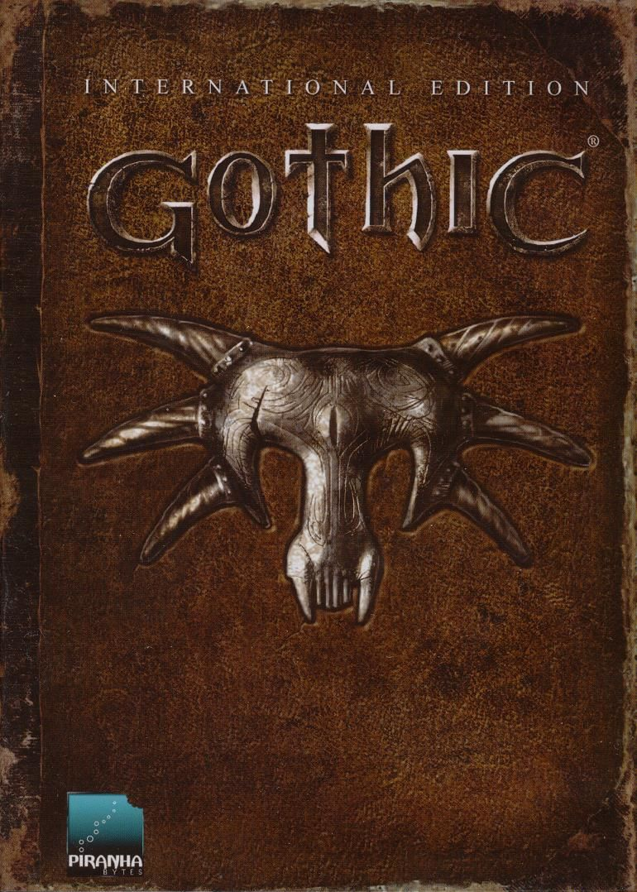

# Gothic

> 
> Gothic is a 2001 fantasy-themed action role-playing video game for Microsoft
> Windows and Nintendo Switch developed by the German company Piranha Bytes.
>
> Gothic was well received by critics. Reviewers credited the game for its
> story, complex interaction with other in-game characters, and graphics, but
> criticized it for the difficult control scheme and high system requirements.
> It was the first game of the game series of the same name.
>
> — <cite>[Wikipedia](https://en.wikipedia.org/wiki/Gothic_\(video_game\))</cite>

Old game, I think first played it somewhere in 2005-2006 with my brother. But I
mostly watched him (as usual). Maybe I used some cheats (`b->marvin->b`).

I want to play it again, but this time in "right way". My initial point is
watching video guide, to understand basic controls:

Full game controls available at [[Gothic_controls|controls]] note.

## Resources

- [StrategyWiki](https://strategywiki.org/wiki/Gothic)
- [World of Players RU](https://worldofplayers.ru/)
- [Gothic 1 on Steam](https://store.steampowered.com/app/65540/Gothic_1/)
- [Gothic - Неолурк](https://neolurk.org/wiki/Gothic)
- [Модостроение | World of Players RU](https://worldofplayers.ru/forums/353/)

