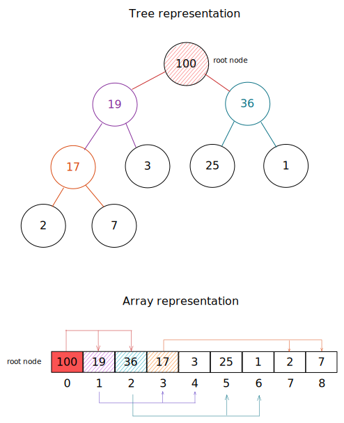

# Heap (data structure)

> In [[Computer_science]], a heap is a specialized tree-based [[Data_structure]]
> which is essentially an almost complete binary tree that satisfies the heap
> property: in a max heap, for any given node C, if P is a parent node of C,
> then the key (the value) of P is greater than or equal to the key of C. In a
> min heap, the key of P is less than or equal to the key of C. The node at the
> "top" of the heap (with no parents) is called the root node.
>
> -- [Wikipedia](https://en.wikipedia.org/wiki/Heap_\(data_structure\))

Heap is a special type of binary tree with specific criteria:

- it's an almost complete binary tree
- values of each node must be no greater (or less) than value of its child
  nodes.

_Example of a binary max-heap with node keys being integers between 1 and 100_