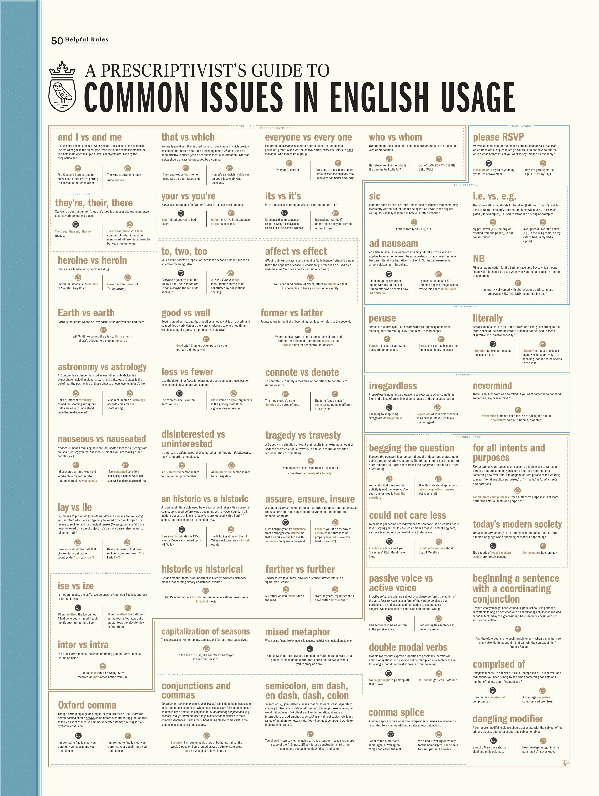

# How I learn English language

TODO: better group resources

I usually just read some content in [[English_language|English]]. I also consume
[[Media|media]] content in English.

I am a native speaker of [[Russian_language|Russian]], and I need to study
English with Russian in same time (to understand grammar terms, differences,
etc.).

Fundamentals of English grammar:

- [ ] , need to lean concepts
- [ ] [[research/Петров-Полиглот]]
- [[research/Черниховская-English_Start-up]]
- [[research/Murphy_Essential_Grammar_in_Use_Elementary]]
- [[research/Murphy_Essential_Grammar_in_Use_Intermediate]]

- [[Duolingo]]
- [English Playlists](https://boosty.to/englishplaylists)
- [[Puzzle_English|Puzzle English]], mostly not used anymore.

## A Prescriptivist's Guide to Common Issues in English Usage

> This prescriptive chart addresses 50 common issues plaguing writers of all
> stripes and straits—providing succinct usage rules and fun,
> pop-culture-centric example sentences for each entry.\
> — <cite>[Popchart](https://popchart.co/products/a-prescriptivists-guide-to-common-issues-in-english-usage)</cite>

## References

- [[Touch_typing|Touch typing]] greatly help me to memorize words and phrases.
- [ ] [9 часов английского](https://www.youtube.com/watch?v=PqBT7xpmZlE)
- [General Writing Introduction - Purdue University](https://owl.purdue.edu/owl/general_writing/index.html)
- [[English_language_transcription]]
- [engVid](https://www.engvid.com/)
- [Изучение Английских Слов с помощью параллельных переводов онлайн](https://studyenglishwords.com/)
- [English Grammar – Your guide to error-free writing](https://www.englishgrammar.org/)
- [English Grammar Online - free exercises, explanations, vocabulary, dictionary and teaching materials](https://www.ego4u.com/)
- [English Grammar reference | British Council](https://learnenglish.britishcouncil.org/english-grammar-reference)
- [English Language & Usage Stack Exchange](https://english.stackexchange.com/)
- [Обзор литературы для подготовки к IELTS + ссылка на скачивание пособий](https://m.pikabu.ru/story/obzor_literaturyi_dlya_podgotovki_k_ielts__ssyilka_na_skachivanie_posobiy_5632803#comments)
- [Lingualeo](https://lingualeo.com/ru/dashboard)
- [Английский язык для начинающих - изучить английский бесплатно](http://begin-english.ru/)
- [Grammar](https://www.reddit.com/r/grammar/)
- [grammar · engVid](https://www.engvid.com/topic/grammar/)
- [Grammarly](https://www.grammarly.com/blog/)
- [Must have книги для прокачки английского. Подборка от преподавателей](https://m.geektimes.ru/post/295267/comments/)
- [PuzzleEnglish](https://puzzle-english.com/)
- [HiNative | A question and answer community for language learners.](https://hinative.com/en-US)
- [Freerice](https://freerice.com/categories/english-vocabulary)
- [5000 важных английских слов](https://britlex.ru/dictionary.php)
- [Urban Dictionary, February 20: snoozefeed](http://www.urbandictionary.com/)
