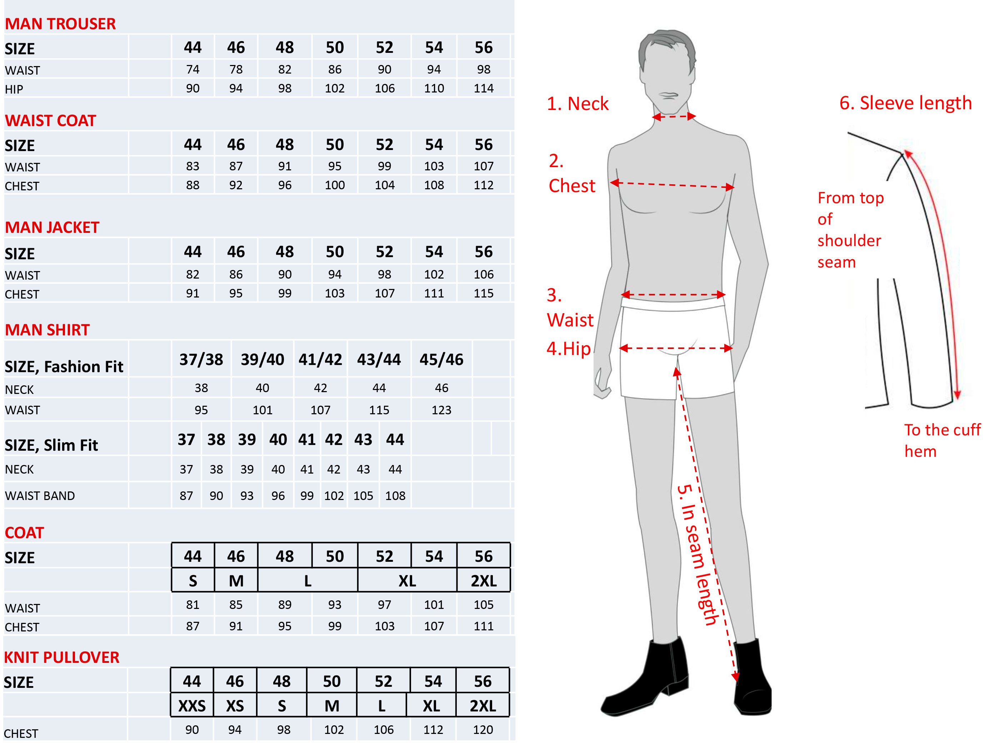

# In real life (IRL)

> Real life is a phrase used originally in literature to distinguish between the
> real world and fictional, virtual or idealized worlds, and in acting to
> distinguish between actors and the characters they portray. It has become a
> popular term on the Internet to describe events, people, activities, and
> interactions occurring offline; or otherwise not primarily through the medium
> of the Internet. It is also used as a metaphor to distinguish life in a
> vocational setting as opposed to an academic one, or adulthood and the adult
> world as opposed to childhood or adolescence.\
> — <cite>[Real life](https://en.wikipedia.org/wiki/Real_life#related_terminology)</cite>

IRL is abbreviation for "in real life". I use it to describe my real life
activities.

For life support I need [[My_buy_list|buy some things]], [[Cooking|cook]] food
and [[My_inventory|keep inventory]] (which require [[Maintenance|maintenance]]).

Sometimes I do some [[Do_it_yourself_DIY|cool things]] or spent time for
[[Art|art]].

Also, worth to mention this notes [[Home_construction|home construction]] and
[[Government|government]].

## Size chart

Measure checklist:

- Use a tape measure with cm (metric system).
- Wear underwear or very thin clothes for accurate measurements and appropriate
shoes for correct length of trousers.
- Neck: Measure around the fullest part of our neck, keeping tape level. Allow
for your index finger to fit between the tape and your neck for a comfortable
fit.
- Chest: Measure your chest under your arms, holding tape level. Be sure to
cross over the shoulder blades and the fullest part of your chest.
- Waist: Measure your waist where the waistband normally sits.
- Hip: Measure your hip around the fullest part
- In seam length: Measure from the crotch to your desired trouser length. Or use
a pair of trousers that fits you well, measure from the top of the inner leg
seam to the hem at the bottom of the leg.
- Sleeve length: Use a jacket that fits well around the shoulders. Stand with
the arm relaxed down the side of your body. Measure from the top of the shoulder
seam, let the tape measure follow the outside of the sleeve to the desired
length of the sleeve.

## References

- [Size chart for mens uniforms | Uniforms by Olino](https://webshop.olinouniforms.com/en-us/size-chart-men).
- [This to That, how glue things to other things](http://www.thistothat.com/)
