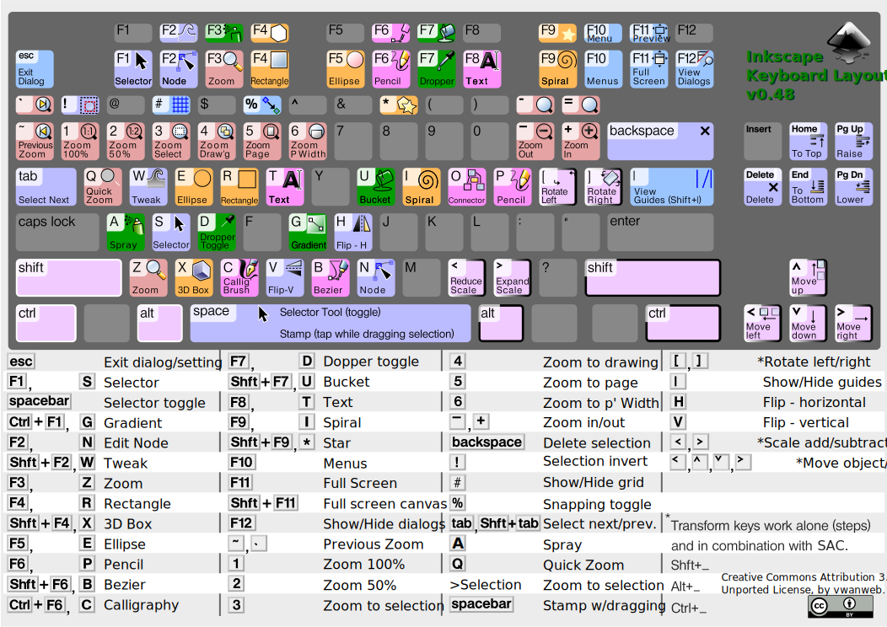

# Inkscape

> Inkscape is a free and open-source [[vector_graphics]] for GNU/Linux, Windows
> and macOS. It offers a rich set of features and is widely used for both
> artistic and technical illustrations such as cartoons, clip art, logos,
> typography, diagramming and flowcharting. It uses vector graphics to allow for
> sharp printouts and renderings at unlimited resolution and is not bound to a
> fixed number of pixels like raster graphics. Inkscape uses the standardized
> Scalable Vector Graphics (SVG) file format as its main format, which is
> supported by many other applications including web browsers. It can import and
> export various other file formats, including SVG, AI, EPS, PDF, PS and PNG.\
> — <cite>[Wikipedia](https://en.wikipedia.org/wiki/Inkscape)</cite>

## Learning

Keybindings cheat sheet: 
_[Inkscape Keyboard Layout v0.48.4 - Openclipart](https://openclipart.org/detail/188861/inkscape-keyboard-layout-v0484)_

## External links

- [ ] [Изометрическое Черчение в Inkscape](https://habr.com/en/articles/722566/)
- [ ] [Inkscape keyboard and mouse reference | Inkscape](https://inkscape.org/doc/keys.html)
- [ ] [The Inkscape Master Class | Logos By Nick Academy](https://logosbynick.teachable.com/courses/enrolled/485218)
- [ ] [Inkscape Beginner Tutorials - Quickstart](https://inkscape.org/gallery/=tutorial/inkscape-beginner-tutorials/).
- [ ] Interesting article how to integrate Inkscape with latex:
      [How I draw figures for my mathematical lecture notes using Inkscape](https://castel.dev/post/lecture-notes-2/).
- [ ] inkscape-open-symbols\* - Symbol libraries are sets of SVG symbols located
      in one SVG document,
      [PanderMusubi/inkscape-open-symbols: Open source SVG symbol sets that can be used as Inkscape symbols](https://github.com/PanderMusubi/inkscape-open-symbols)
