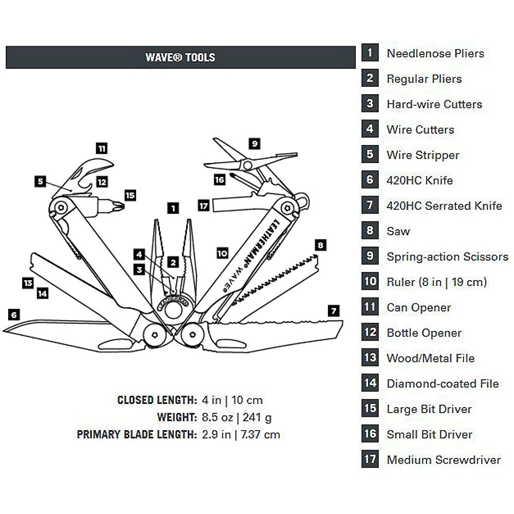
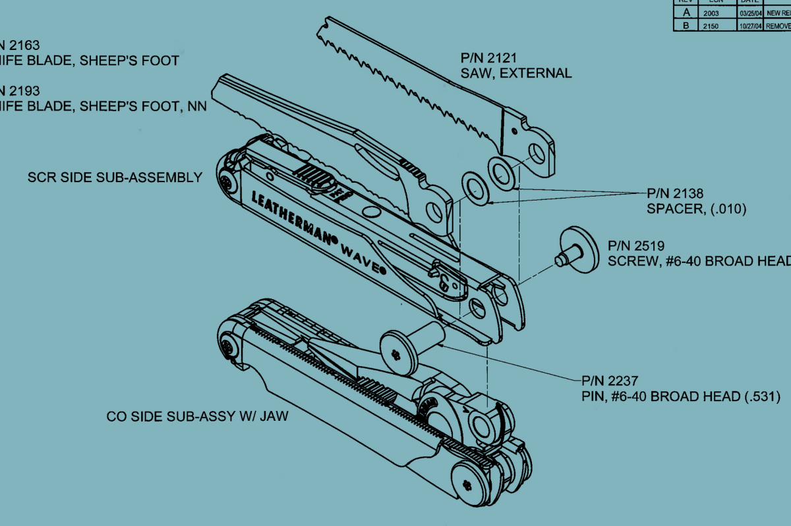

# Leatherman

> Leatherman is an American brand of **multi-tool** made by Leatherman Tool
> Group of Portland, Oregon. The company was founded in July 1983 by Timothy S.
> Leatherman and Steve Berliner in order to market the former's idea of a
> capable, easily portable hand tool with multiple functions. That same year,
> Leatherman Tool Group sold its first Multi-Tool, which was called the PST
> (Pocket Survival Tool).\
> — <cite>
> [Leatherman - Wikipedia](https://en.wikipedia.org/wiki/Leatherman)</cite>

> Leatherman was inspired to design a "Boy Scout knife with pliers" while Timothy
> S. Leatherman and his wife traveled Europe and the Middle East in 1975, often
> attempting to use a simple pocketknife to repair both their aged and repeatedly
> malfunctioning Italian Fiat 600 car (bought in Amsterdam for $300) and leaky
> hotel plumbing. He spent several years perfecting the "Mr. Crunch" prototype and
> received his first U.S. patent (4,238,862) in 1980.
> [Company history - Wikipedia](https://en.wikipedia.org/wiki/Leatherman#Company_history)</cite>

## Leatherman Wave

I have a [Wave+](https://www.leatherman.com/wave-10.html) Multi-Tool.

I use it for occasional repairs, outdoor activities, and as a backup tool.

_Wave+_

### Tools Included

1. Needlenose Pliers
2. Regular Pliers
3. Replaceable Wire Cutters
4. Replaceable Hard-wire Cutters
5. Electrical Crimper
6. Wire Stripper
7. 420HC Knife
8. 420HC Serrated Knife
9. Saw
10. Spring-action Scissors
11. Ruler (8 in | 19 cm)
12. Can Opener
13. Bottle Opener
14. Wood/Metal File
15. Diamond-coated File
16. Large Bit Driver
17. Small Bit Driver
18. Medium Screwdriver

_Wave+ Tools_

## Disassembly

This graphic shows the disassembly of the Wave+ Multi-Tool.

Some notes about the disassembly:

- You need to be in good mood and have a lot of patience.
- Prepare some box to store the screws and parts (with sections).
- If you're planning to clean, prepare sort of cleaning liquid, capacious container
  and brush.
- Don't lose the small parts, they are **easy** to lose. So you need big desk
with free space to work.

_Engineer Explains Wave_
