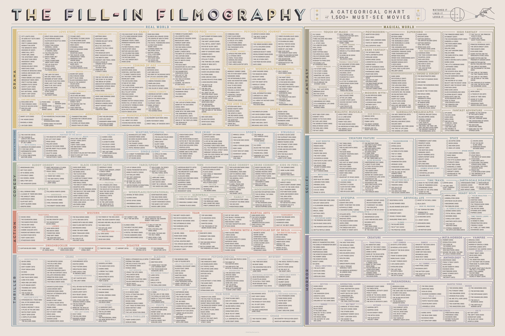

# My movies, which I watched and want to watch

I started track of movies I watched in 2022. So this list is of course
incomplete.

## The Fill-In Filmography

Good inspiration for watching movies.

> A massive mapping of cinematic genres (with representative movies for each
> category), this big-screen behemoth is fully customizable to reflect your
> personal tastes—just grab a pencil and fill in the circle next to each film to
> mark it as “Loved It,” “Liked It,” or merely “Watched It”! Whether your prefer
> Period Pieces, Musicals, or tales of Haunted Dolls, there’s something here for
> cinephiles of every sort.\
> — <cite>[popchart](https://popchart.co/products/the-fill-in-filmography)</cite>

## To watch/rewatch

- [ ] Интерстеллар (2014)
- [ ] 9 дней одного года
- [ ] Лесная братва (2006)
- [ ] Гнев человеческий
- [ ] Lord of the Rings: The Two Towers (2002)
- [ ] Lord of the Rings: The Return of the King (2003)
- [ ] The Hobbit: An Unexpected Journey (2012)
- [ ] The Hobbit: The Desolation of Smaug (2013)
- [ ] The Hobbit: The Battle of the Five Armies (2014)
- [ ] Большой и Добрый Великан
- [ ] Castelvania
- [ ] Ведьмина служба доставки
- [ ] Нефть
- [ ] Сериал метод
- [ ] Учитель на замену
- [ ] One Eight Seven
- [ ] Фантомас
- [ ] Судьба резидента
- [ ] Журналист (Сергей Герасимов). 1967, Киноповесть
- [ ] Свинарка и пастух
- [ ] Двенадцать месяцев. В яранге горит огонь
- [ ] Дед Мороз и серый волк

### Questionable

- [ ] Создатель (2023)
- [ ] Другая Земля (2011)
- [ ] Армагеддец (2013)
- [ ] Город астероидов (2023)
- [ ] Помутнение (2006)
- [ ] Антология Навстречу тьме», эпизод «Культурный шок (2019)
- [ ] Связь (2012)
- [ ] Безопасность не гарантируется (2012)
- [ ] Исходный код (2011)
- [ ] Идиократия (2005)
- [ ] Матрица: Воскрешение (2021)
- [ ] Бескрайний бассейн (2023)
- [ ] Довод (2020)
- [ ] Паранормальное (2017)
- [ ] Зависнуть в Палм-Спрингс (2020)
- [ ] Петля времени (2012)
- [ ] К звёздам (2019)
- [ ] Добыча (2022)
- [ ] Примесь (2013)
- [ ] Особое мнение (2002)
- [ ] Специальный полуночный выпуск (2015)
- [ ] М3ГАН (2022)
- [ ] Сила цвета (2018)
- [ ] Высшее общество (2018)
- [ ] В чужой шкуре (2020)
- [ ] По ту сторону чёрной радуги (2010)
- [ ] Пекло (2007)
- [ ] Детонатор (2004)
- [ ] Кловерфилд, 10 (2016)
- [ ] Луна 2112 (2009)
- [ ] 2046 (2004)
- [ ] Преступления будущего (2022)
- [ ] Чужие на районе (2011)
- [ ] Сквозь снег (2013)
- [ ] Донни Дарко (2001)
- [ ] Начало (2010)
- [ ] Трудно быть Богом (2013)
- [ ] Фонтан (2006)
- [ ] Мир будущего (2015)
- [ ] Паприка (2006)
- [ ] Грань будущего (2014)
- [ ] Планета обезьян: Революция (2014)
- [ ] Район № 9 (2009)
- [ ] Аннигиляция (2017)
- [ ] Прибытие (2016)
- [ ] Дюна (2021)
- [ ] Меланхолия (2011)
- [ ] Искусственный разум (2001)
- [ ] Она (2013)
- [ ] Бегущий по лезвию 2049 (2017)
- [ ] После Янга (2021)
- [ ] Нет (2022)
- [ ] Безумный Макс: Дорога ярости (2015)
- [ ] Из машины (2014)
- [ ] Всё везде и сразу (2021)
- [ ] Вечное сияние чистого разума (2004)
- [ ] Побудь в моей шкуре (2013)
- [ ] Вторжение динозавра (2006)
- [ ] Дитя человеческое (2006)
- [ ] Авантюрист стал бессмертным

## Anime 🙃

- [ ] Реинкарнация безработного
- [ ] Этот замечательный мир!

## Watched

- [x] Невероятный мир глазами Энцо, dramatic, family movie 9/10
- [x] ВАЛЛ·И (2008), sensitive, happy end, for children
- [x] Меланхолия (фильм, 2011), depressive a little, but not a lot for me. Make
  me think about life. 9.1/10
- [x] Sicario (2015), after second watch less emotional/interesting, 8.5/10
- [x] Голый пистолет, after second watch less funny, but overall good, 8.1/10
- [x] Опенгеймер, a lot of historical information, a little bit boring (for me), 7.8/10
- [x] Lord of the Rings: The Fellowship of the Ring (2001) Medieval motifs,
      fantasy, magic, RPG! 9.85/10
- [x] Прогулка с Богами: Два мира / Along with the Gods: The Two Worlds
      Sensitively and beautifully told story about the afterlife. 8.9/10
- [x] Кунг-фу Панда / Kung Fu Panda (2008). Tigress animations are very good.
      Humor also good. 9.1/10
- [x] Кунг-фу Панда 2 / Kung Fu Panda 2 (2011). Probably a little bit weaker
      than previous movie. But very sensitive. 9/10
