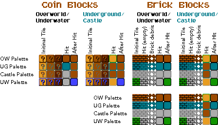

# Sprite (computer graphics)

> In [[Computer_graphics|computer_graphics]], a sprite is a two-dimensional
> bitmap that is integrated into a larger scene, most often in a 2D video
> [[Game|game]]. Originally, the term sprite referred to fixed-sized objects
> composited together, by hardware, with a background. Use of the term has since
> become more general.

_SuperMario Bros sprite - Miscellaneous - Item and Brick Blocks_
