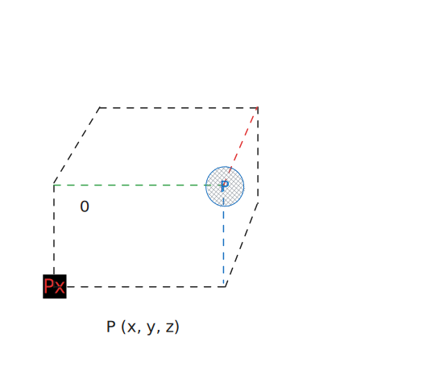

# Three-dimensional space (3D space, 3-space)

> In [[Geometry|geometry]], a three-dimensional space (3D space, 3-space or,
> rarely, tri-dimensional space) is a [[Mathematics|mathematical]] space in
> which three values (coordinates) are required to ==determine the position== of
> a point. Most commonly, it is the three-dimensional Euclidean space, the
> Euclidean n-space of dimension n=3 that models physical space. More general
> three-dimensional spaces are called 3-manifolds. The term may also refer
> colloquially to a subset of space, a three-dimensional region (or 3D domain),
> a solid figure.\
> — <cite>[Wikipedia](https://en.wikipedia.org/wiki/Three-dimensional_space)</cite>

