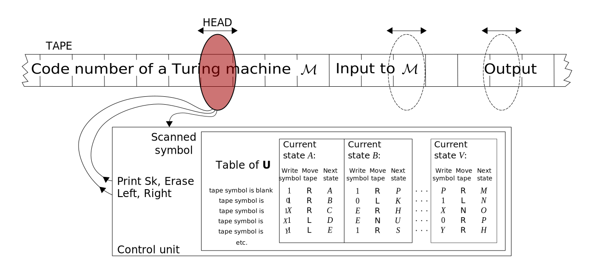

# Turing machine

TODO: not really fully understand what is Turing machine.
> A Turing machine is a mathematical model of computation describing an abstract
> machine that manipulates symbols on a strip of tape according to a table of
> rules. Despite the model's simplicity, it is capable of implementing any
> computer algorithm.
>
> The machine operates on an infinite memory tape divided into discrete cells,
> each of which can hold a single symbol drawn from a finite set of symbols
> called the alphabet of the machine. It has a "head" that, at any point in the
> machine's operation, is positioned over one of these cells, and a "state"
> selected from a finite set of states. At each step of its operation, the head
> reads the symbol in its cell. Then, based on the symbol and the machine's own
> present state, the machine writes a symbol into the same cell, and moves the
> head one step to the left or the right, or halts the computation. The choice
> of which replacement symbol to write, which direction to move the head, and
> whether to halt is based on a finite table that specifies what to do for each
> combination of the current state and the symbol that is read. Like a real
> computer program, it is possible for a Turing machine to go into an infinite
> loop which will never halt.\
> — <cite>[Wikipedia](https://en.wikipedia.org/wiki/Turing_machine)</cite>

_Universal Turing machine_

System of rules, states and transitions rather than a real machine.

There 2 purposes of Turing machine:

- deciding formal languages
- solving mathematical problems

Turning machine consists of:

- A limited set of states, with start state and while running it always has
  current state
- An infinite tape divided into cells, each cell can contain a symbol
- Read/write head, which can move on the tape and can read/write symbols
- A set of rules, which define what to do when the machine is in a certain state
  and reads a certain symbol (a definition of a so-called transition function).

When a Turing machine is started, a [[word]] (out of the working-alphabet) must
be present on the infinite tape of the machine, initial input. The
read/write-device on the first character now reads the first character and
depending on the current state of Turing machine the read/write-device
overwrites the character with a new one or moves one cell to the left or to the
right. Furthermore, the current state of the machine can be switched.

## References

- [ ] [Turing Machines Explained - Computerphile -
YouTube](https://www.youtube.com/watch?v=dNRDvLACg5Q)
- [ ] Turing machines that decide languages
- [ ] Turing machines that compute functions
- [ ] Related video game [[Turing_complete]]
