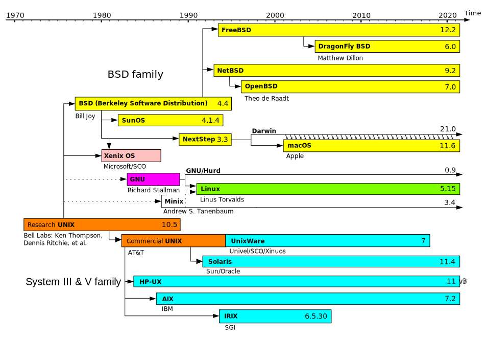

# Unix

> UNIX is a computer operating system. It was first developed in 1969 at Bell
> Labs. Ken Thompson, Dennis Ritchie, Douglas McIlroy, and others created it.
> They used assembly language to write it. In 1972, the Unix code was rewritten
> with the new C programming language.\
> — <cite>[Wikipedia](https://simple.wikipedia.org/wiki/Unix)</cite>

 _The history of UNIX and its variants_

## Resources

- [ ] [AT&T Archives: The UNIX Operating System - YouTube](https://www.youtube.com/watch?v=tc4ROCJYbm0)
- [ ] ["The early days of Unix at Bell Labs" - Brian Kernighan (LCA 2022 Online) - YouTube](https://www.youtube.com/watch?v=ECCr_KFl41E)
- [ ] [Time is an illusion, Unix time doubly so...](https://www.netmeister.org/blog/epoch.html)
