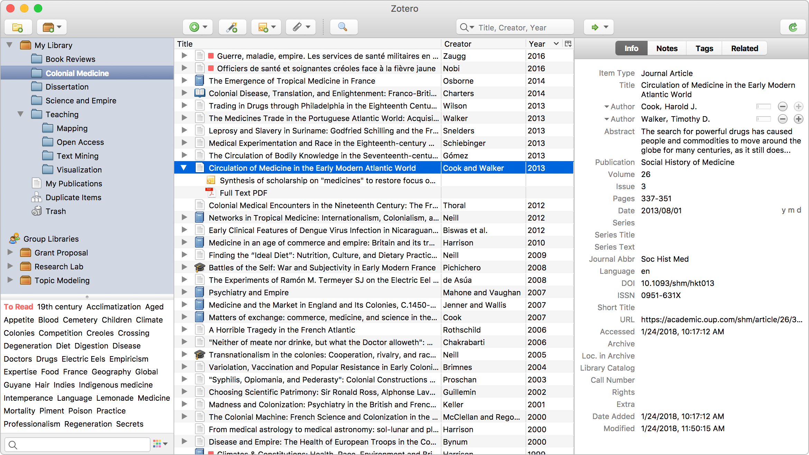

# Zotero Research Assistant


_Zotero main window_

I find zotero too complicated for me, and I just use my [[Telekasten.nvim]] with
[[Calibre]] for books management.

Zotero - free citation manager, it's contains a lot of features, such as:

- UI to manage your references;
- zotero importer to import references from websites (useful to import
  references from Google Scholar, Amazon, etc.);
- rich plugin system to extend Zotero's functionality (rename files, translate
  in PDF viewer, etc.);
- built-in PDF viewer and annotator;
- API to extend Zotero's functional.

I use it to store my [[Literature]]: books, articles, education resources,
cheatsheets, feeds, etc.

Zotero has advanced search capabilities, you can search by author, title, year,
tags, etc. It's also indexing your references, so you can search by content (PDF
only).

Using syncthing and "Zoo for Zotero" you can sync your references between PC and
android devices. Zoo for Zotero allow set a custom attachment folder, so you can
sync your attachments too (use syncthing to sync zotero attachments directory).

Better BibTeX is a plugin for Zotero that allows you to export your references
to BibTeX format. It's useful to use with LaTeX, integrate with your favorite
tool, etc. I use [[Neovim]] telescope BibTeX plugin to quickly add
references to my [[Zettelkasten_note_type|notes]].

## Plugins

Zotfile - useful to rename attachments, shortcut <kbd>M-r</kbd> to rename
attachments. Mdnotes - useful to generate markdown notes from references,
shortcut <kbd>M-n</kbd> to generate notes.

## Fix url's script example:

```js
// [regex101 test](https://regex101.com/r/ZdzzFC/1)
const re = /^\/library\/datasets\/books\/(.*?)/;
const mode = Zotero.Attachments.LINK_MODE_LINKED_FILE;
var attArray = ZutiloChrome.zoteroOverlay.getSelectedAttachments(mode);
var attItem = new Zotero.Item("attachment");
attItem.attachmentLinkMode = mode;
var m, n, attTitle, oldFullPath, newFullPath;
m = n = 0;
attTitle = oldFullPath = newFullPath = '';

for (let i = 0; i < attArray.length; i++) {
    if (await attArray[i].fileExists()) continue
    m++;
    oldFullPath = attArray[i].attachmentPath;
    newFullPath = '' + oldFullPath.replace(re, '/home/inom/Inbox/$1');
    if (newFullPath === oldFullPath) continue
    attItem.attachmentPath = newFullPath;
    if (!await attItem.fileExists()) continue
    attArray[i].attachmentPath = newFullPath;
    await attArray[i].saveTx();
    n++;
}

return `Summary of selected linked attachment items:\n
${attArray.length} item(s) selected
${m} item(s) broken
${n} item(s) fixed\n

Values for last broken item:\n
attachment title:\n${attTitle}\n
old full path:\n${oldFullPath}\n
new full path:\n${newFullPath}
`;
```

## Fix titles

1. Validate
```js
var s = new Zotero.Search();
s.libraryID = Zotero.Libraries.userLibraryID;
s.addCondition('itemType', 'is', 'book');
s.addCondition('title', 'contains', '.cbz');
var ids = await s.search();
if (!ids.length) {
    return "No items found";
}

for (let id of ids) {
    let item = Zotero.Items.get(id);
    let title = item.getField('title');
    if (title.includes('.cbz')) {
        item.setField('title', title.replace('.cbz', ''));
        await item.saveTx();
    }
};
```

## TOC

- [-] zotero pre-commit hook replace absolute paths
- [-] zotero password recover android
- [-] zotero documentation update
- [-] need link all this :: To generate TOC I use pdftoc.sh script, its use
      pdftocgen to generate TOC and [[GNU_Sed]] to add heading markup rules.
      It's work more stable than built-in TOC generator.

Then I can easily add TOC to my research notes.
