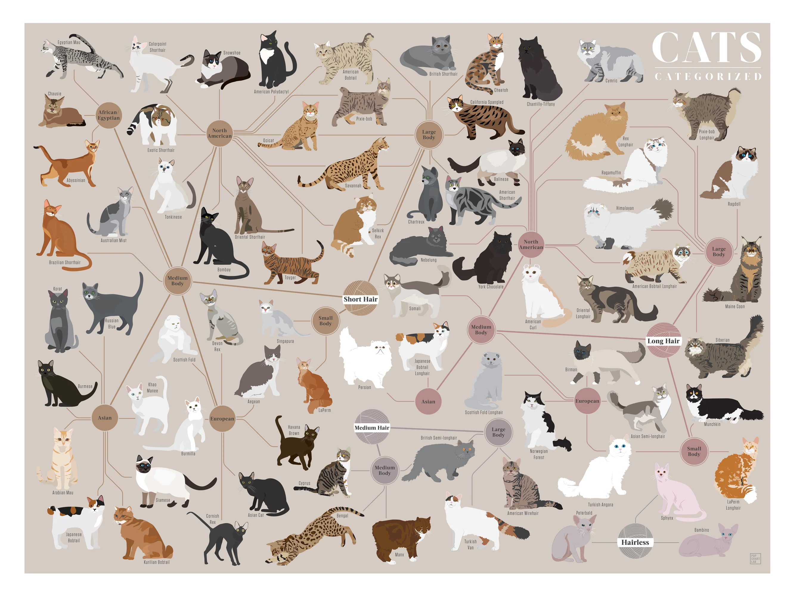
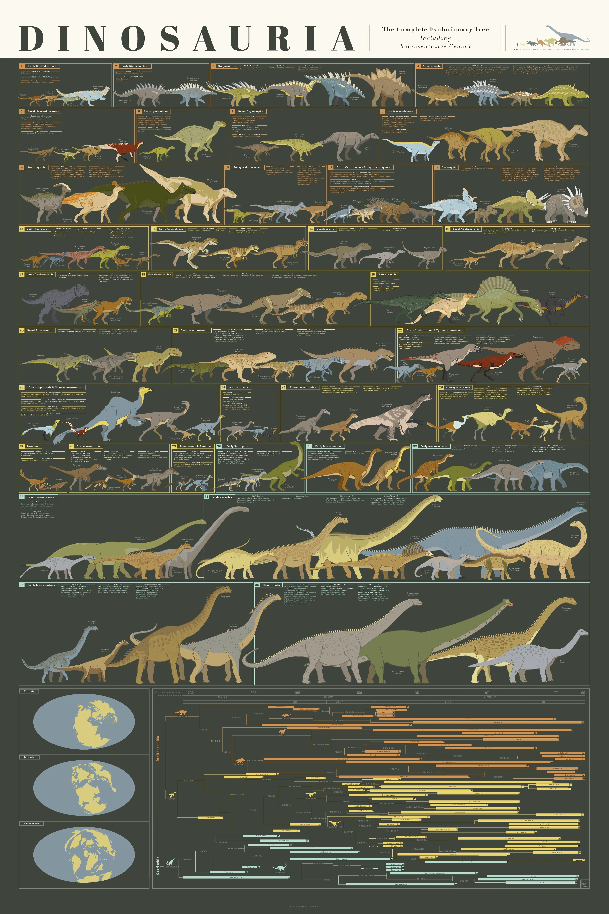

# Animal

> Animals are multicellular, eukaryotic organisms in the biological kingdom Animalia. With few exceptions, animals consume organic material, breathe oxygen, have myocytes and are able to move, can reproduce sexually, and grow from a hollow sphere of cells, the blastula, during embryonic development.\
> — <cite>[Animal - Wikipedia](https://en.wikipedia.org/wiki/Animal)</cite>

In my [[life]] I had some pets, cats and dogs. I like animals, especially if they are cute 🐱.

Here I store various useful and interesting information about animals.

## Birds of the World

> Warm your nest with this first-of-its-kind mega-mapping of all the birds in the world! This truly tremendous chart taxonomies over 11,000 international avifauna by clade, order, and family—featuring nearly 1200 illustrations of notable species alongside a complete list of genera. A bird-lover’s diagrammatic dream, this chirpy chart is sure to make your walls sing.\
> — <cite>[Popchart](https://popchart.co/products/birds-of-the-world)</cite>

## Cats, Categorized

> Wondering what category your favorite feline falls into? Re-fur to this expert examination, which maps out a multitude of mousers.\
> — <cite>[Popchart](https://popchart.co/products/cats-categorized)</cite>

## Dinosauria

> This groundbreaking new take on the classification and evolution of dinosaurs assembles over 700 genera into a first-of-its-kind taxonomy synthesized from existing classification systems. *Updated with a striking new design, more dinosaur illustrations, and data reflecting the most up-to-date paleontological research as of October 2022!.\
> — <cite>[Popchart](https://popchart.co/products/dinosauria)</cite>

