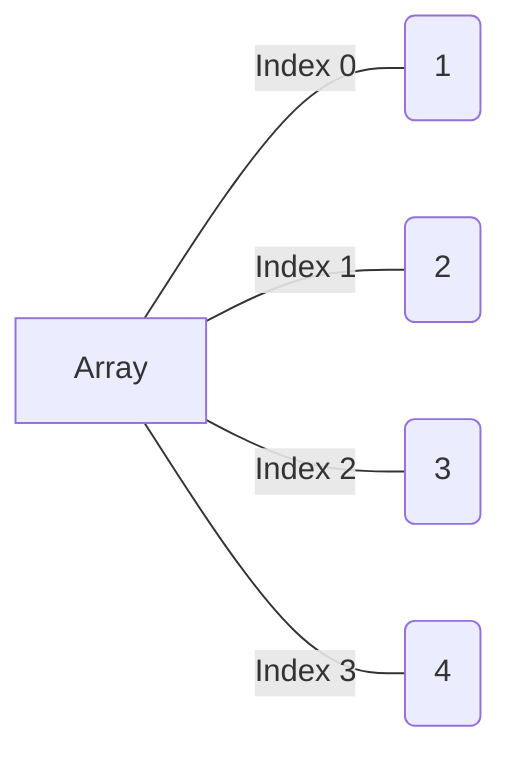

# Array (computer science)

## Array (data structure)

> Array is a [[data structure]] consisting of a collection of
> elements (values or variables), each identified by at least one array index or
> key.
>
> -- [Wikipedia](https://en.wikipedia.org/wiki/Array_\(data_structure\))

> An assemblage of items that are randomly accessible by integers, the index. --
> https://xlinux.nist.gov/dads/HTML/array.html

## Array (data type)

> In [[computer science]], **array** is a [[data type]] that represents a
> collection of _elements_ [[value (computer science)|values]]
> or [[variable (computer science)|variables]], each selected by one or more indices
> (identifying keys) that can be computed at [[runtime (program lifecycle phase)|runtime]] during program execution.
> Such a collection is usually called
> an **array variable** or **array value**. By analogy with the mathematical
> concepts [[vector]] and [[matrix (mathematics)|matrix]], array types with one
> and two indices are often called **vector type** and **matrix type**,
> respectively. More generally, a multidimensional array type can be called a
> **tensor type**, by analogy with the physical concept, [[tensor]].

| 0   | 1   | 2   | 3   | 4   | 5   |
| --- | --- | --- | --- | --- | --- |
|     |     | 9   |     |     | 1   |
|     | 5   |     |     |     |     |
|     |     |     | 10  |     |     |
|     |     |     |     | 6   |     |
|     | 7   |     |     | 11  |     |

So in general array is a 1 way storing several items (such as integers). Usually
array store the same type of items (this depending on language). Every item in
array indexed (by integer number starting from 0) and you can access array item
by index (key in array). As rule index starting from
[[zero-based numbering|0]] to `n-1` where `n` is a number of items
in array.

In general array is ==list of data elements==.
<!--SR:!2023-04-15,2,210-->

Size of an array is ==how many data elements the array holds==.
<!--SR:!2023-04-15,2,228-->

The index of an array is the number that identifies ==where a piece of data
lives== inside the array.

In most programming languages, arrays are ==zero-indexed==, meaning that the
first element of the array is at index 0, the second element is at index 1, and
so on.
<!--SR:!2023-04-15,2,228-->



When you create array ([[initialization (programming)]]) you must
set array size (number of items stored in the array). Size of array is fixed.
Also, computer ==allocate some [[computer memory|memory]]== for
array during its initialization.
<!--SR:!2023-04-17,3,241-->

When allocating an array the computer always keeps track:
?
Beginning address and array size
<!--SR:!2023-04-16,2,221-->

An array is stored such that the **position of each element** can be computed
from its **index tuple** by a mathematical formula. So a computer can find the
value at any index by performing simple addition.

| value          | A   | B   | C   | D   | E   | F   | G   | H   | I   | J   |
| :------------- | :-- | :-- | :-- | :-- | :-- | :-- | :-- | :-- | :-- | :-- |
| memory address | 10  | 11  | 12  | 13  | 14  | 15  | 16  | 17  | 18  | 19  |
| index          | 0   | 1   | 2   | 3   | 4   | 5   | 6   | 7   | 8   | 9   |

Read value at index 3:

1. Array begins from memory address 10
2. Index 3 will be exactly 3 positions after address 10
3. So, memory address for index 3 is 13
4. Read value from memory address 13 = D

## Arrays in [[c (programming language)]]:

```c
int array[4];  // Initialize array with 4 items
array[0] = 1;
array[1] = 18;
array[2] = 5;
array[3] = 33;
for (int i = 0; i < 4; i++) {
    printf("%d ", array[i]);
}
printf("%f", 2.14 + array[0]);  // Error: index out of range
```

## Arrays in [[java (programming language)]]:

```java
int[] array = new int[5];
array[0] = 1;
array[1] = 18;
array[2] = 5;
array[3] = 33;
array[4] = 50;
```

## Arrays in [[rust (programming language)]]:

```rust
let mut array: [i32; 3] = [0; 3];

array[1] = 1;
array[2] = 2;

assert_eq!([1, 2], &array[1..]);

// This loop prints: 0 1 2
for x in array {
    print!("{x} ");
}
```

In Python used [[list (abstract data type)]] not arrays, and here
no restrictions on the type of items stored in the array, and its size is not
fixed.

## Array operations

### Array read operation
?
Looking up (access/retrieve) a value at a particular index in an array.
<!--SR:!2023-04-16,2,206-->

It's efficient and fastens operation, since require only one step.

### Array search operation
?
Looking to see if a particular value exists within the array, and if so, at
which index.
<!--SR:!2023-04-15,1,186-->

Basic search operation is "==linear search==". We check each cell one at time
until we find the value we are looking for (or until we read all cells).
Steps = `N` cells in array. Search is much slower than read (less efficient).
<!--SR:!2023-04-16,2,220-->

In other words it's search for an index of a value in the array, sort of inverse
of reading. We provide a value to the computer and asking it to return the
index of that value's location.

### Array insert operation
?
Adding a new value to an additional slot within the array.
<!--SR:!2023-04-15,1,186-->

Efficiency depends on where we insert the value.

- End - one step, we know index where to place, because we have beginning
  address and size of array. But keep in mind, we need to allocate more memory
  for array while inserting.
- Beginning or in the middle, this operation require shifting data.
  In the worst case (begging of array) it's $N+1$ steps, where $N$ is a number
  of items in array.

How many steps will take insertion in the worst case?
?
$N+1$ steps, where $N$ is a number of items in array.
<!--SR:!2023-04-16,2,221-->

## Array delete operation
?
Removing a value from the array. In other words process of eliminating the value
at a particular index.
<!--SR:!2023-04-15,2,226-->

In worst case deletion operation will take
?
$N$ steps, where $N$ is a number of items in array.
One step to delete value, and $N-1$ (we don't need to shift deleted value) steps
to shift data.
<!--SR:!2023-04-16,2,220-->
