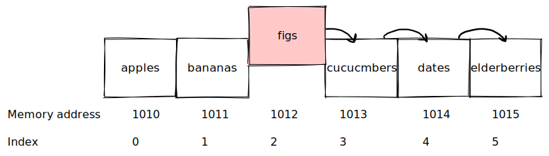

# Array operations

There are four basic operations that can be performed on an
[[array (computer science)]].

## Reading

Array reading is ==looking up (access/retrieve)== a value at a particular index
in an array. It's efficient and fastens operation, since require only one step.

Array reading require ==only one== step, because we can retrieve value by some
computation (array address + index).

*Schematic array representation in memory*

Facts about computers and arrays:
- A computer can jump to any memory address in ==one step==. Fox example if we
jump to `1010` address, we can read "apples" value.
- When computer allocate an array, it makes note at which memory addresses the
array begins, and knowing that address and index of any element, computer can
calculate the memory address (simply addition) of that element in ==one step==.

## Searching

Reading is looking to see if a particular value ==exists== within the array, and
if so, at which index.

Basic search operation is "==linear==" search. We check each cell one at time
until we find the value we are looking for (or until we read all cells).

Search is much slower than read (less efficient). Maximum steps are `N`, where
`N` is ==a number of cells in array==.

In other words, search for an index of a value in the array, sort of ==inverse==
of reading. We provide a value to the computer and asking it to return the index
of that value's location.

## Insertion

Insertion is operation of?
?
Adding a new value to an additional slot within the array.

When computer allocating an array, the computer always keeps track of the
array's ==size==.

Efficiency depends on where we insert the value.

- End - one step, we know index where to place, because we have beginning
  address and size of array. But keep in mind, we need to allocate more memory
  for array while inserting, which cost some time/operations.
- Beginning or in the middle, this operation require shifting data. In the worst
  case (begging of array) it's $N+1$ steps, where $N$ is a number of items in
  array.

Inserting element into array at index means we insert it at the right place of
that index and shift all elements to the right.

*Array insertion operation in memory*

How many steps will take insertion in the worst case?
?
$N+1$ steps, where $N$ is a number of items in array required to shift and 1 is
insert operation.

## Deletion

Deletion is operation of?
?
Removing a value from the array. In other words process of eliminating the
value at a particular index.

*Array deletion operation in memory*

In worst case deletion operation will take ?
?
$N$ steps, where $N$ is a number of items in array. One step to delete value,
and $N-1$ (we don't need to shift deleted value) steps to shift data.

