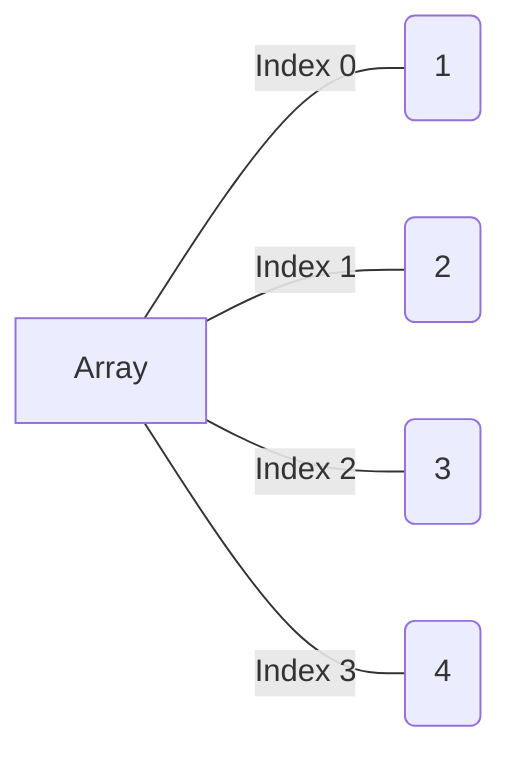

# Array (computer science)

> Array is a [[data_structure]] consisting of a collection of elements (values or variables), each identified by at least one array index or key.\
> — <cite>[Wikipedia](https://en.wikipedia.org/wiki/Array_(data_structure))</cite>

> An assemblage of items that are randomly accessible by integers, the index.\
> — <cite>[Dictionary of Algorithms and Data Structures](https://xlinux.nist.gov/dads/HTML/array.html)</cite>

Array in memory is a ==contiguous== block of memory locations (which allocated when you create it). Array usually at least has an **address** in memory and **size** (number of items in array). Each element of array has an index (location of elements or address), and first index is `0`.

size_of_zero_indexed_array = <wbr class="f"> $\text{lastindex} + 1$ <!--SR:!2024-10-18,21,221-->

|     | 0   | 1   | 2   | 3    | 4    | 5   |
| --- | --- | --- | --- | ---- | ---- | --- |
| 0   |     |     | `9` |      |      | `1` |
| 1   |     | `5` |     |      |      |     |
| 2   |     |     |     | `10` |      |     |
| 3   |     |     |     |      | `6`  |     |
| 4   |     | `7` |     |      | `11` |     |
_Graphical representation of array in memory (allocated space)_\
How many total items in this array? Is empty items has address in memory?
<br class="f">
6*5 = 30\
Yes, empty items has address in memory <!--SR:!2024-09-07,4,196-->

## Array (data type)

> In [[computer_science]], **array** is a [[data_type]] that represents a collection of _elements_, [[value|values]] or [[variable|variables]], each selected by one or more indices (identifying keys) that can be computed at [[runtime]] during program execution. Such a collection is usually called an **array variable** or **array value**. By analogy with the mathematical concepts [[vector]] and [[matrix]], array types with one and two indices are often called **vector type** and **matrix type**, respectively. More generally, a multidimensional array type can be called a **tensor type**, by analogy with the physical concept, [[tensor]].

So in general array is a 1 way storing several items (such as integers). Usually array store the same type of items (this depending on language). Every item in array indexed (by integer number starting from 0) and you can access array item by index (key in array). As rule index starting from [[zero-based_numbering|0]] to `n-1` where `n` is a number of items in array.

Array is one of most basic data structure in computer science. In general array is list of indexed data elements.

Size of an array is how many data elements the array holds.

The **index** of an array is the number that identifies value ==location==. <!--SR:!2025-08-07,14,161-->

In most programming languages, arrays are ==zero-indexed==, meaning that the first element of the array is at index 0, the second element is at index 1, and so on. <!--SR:!2025-08-16,23,221-->



![[img/shopping_list_array_insert.excalidraw.md|Shopping list array, insert operation example]]
_Array with insert operation example_

When you create array ([[initialization|initialize]]) you must set array size (number of items stored in the array). Size of array is fixed. Also, computer ==allocate some [[computer_memory]]== to store array, during its initialization. <!--SR:!2025-08-15,22,216-->

When allocating an array the computer always keeps track <wbr class="f"> the beginning address and array size. <!--SR:!2025-08-02,3,163-->

Examples, how to use [[array_in_programming_languages]].

Array operations explained in [[array_operations]].

## Ordered array

Ordered array is same as array, but with one difference: elements in ordered array are ==sorted in some order== (usually ascending or descending), and when you modify array, you must keep it sorted.\
And this brings some specific rules. For example, we want to add 75 into ordered array (3.17.80.202) at some point, we do following steps:
<br class="f"> 
```
3.17.80.202          # initial array, we want to add 75
*.**.17<75<80.**.*** # 3 steps, we go through array, to find right place for 75
                     # this steps are called comparison

3.17.80.202.[ ]      # we allocate memory for new element
3.17.80.[ ].202      # we shift right all elements after 75
3.17.[ ].80.202      # here at least 2 operations?

3.17.75.80.202       # new ordered array
```
<!--SR:!2025-08-04,5,165-->

When inserting into an ordered array, we need to always conduct a ==search== before the actual insertion to determine the correct spot for the insertion. This is why ordered array usually slower than [[array]] for inserting operation. <!--SR:!2025-08-17,24,221-->

In the worst case when using linear search, we spent ==$N+2$== steps to insert new value into ordered array (`75` into `[3.17.80.202]`). But with [[binary_search]] we can insert elements more effectively, but still slower when we use classic array data structure. <!--SR:!2025-07-31,4,178-->

Main advantage of ordered array is that we can use ==[[binary_search]] or other effective== algorithm to find elements in array very efficiently. <!--SR:!2025-08-29,36,237-->
