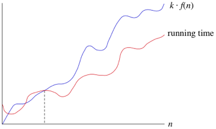

# Big O notation in [[mathematics]] and [[computer science]]

> Way of comparing ==rates of growth== of different functions. It is often used
> to compare the efficiency of different algorithms, which is done by
> calculating how much memory is needed, and how much time it takes to complete.
>
> -- [SE Wikipedia](https://simple.wikipedia.org/wiki/Big_O_notation)
<!--SR:!2023-07-20,1,250-->

_Big O notation_

Big O Notation allows us to easily categorize the efficiency of a given
[[algorithm]], which focus on the number of operations an algorithm requires to
complete.

An algorithm that is $\mathcal{O}(N)$ is also known as having ==linear== time.
<!--SR:!2023-07-22,3,270-->

$\mathcal{O}(1)$ algorithm can also be referred to as having ==constant== time.
<!--SR:!2023-07-22,3,270-->

Big O is not about how many steps an algorithm takes with specific input, but
more about how the number of steps grows as the size of the input grows. So it's
describe relationship between input data and the algorithm efficiency.

Let’s say we have an algorithm that always takes three steps no matter how
much data there is. That is, for N elements, the algorithm always takes three
steps. How would you express that in terms of Big O?
?
The algorithm is $\mathcal{O}(1)$. Because the number of steps is constant.
<!--SR:!2023-07-22,3,270-->

$\mathcal{O}(N)$ is ==less== efficient than $\mathcal{O}(1)$ no matter how many
steps the $\mathcal{O}(1)$ n algorithm actually takes.
<!--SR:!2023-07-22,3,270-->

Big O can describe the best and worst case scenario of an algorithm. But Big O
Notation generally refers to the ==worst case (pessimistic approach)== scenario,
unless specified otherwise.
<!--SR:!2023-07-22,3,270-->

