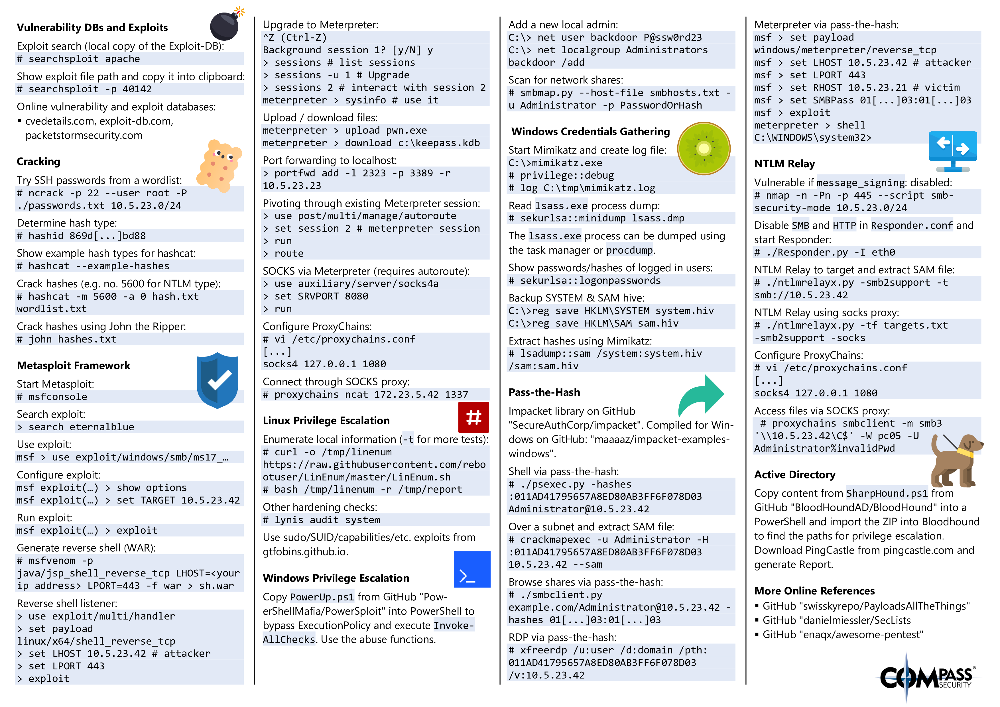

# Computer security

## Software

- [[Multi-factor_authentication_MFA]]
- [[GNU_Privacy_Guard_GPG|GPG]]
- [[Pass]]
- [[Dm-crypt]]
- [DroidFS](https://github.com/hardcore-sushi/DroidFS) - use encrypted virtual
  filesystems on Android

## Hacking tools

Great list of hacking tools provided by [Compass Security Blog](https://blog.compass-security.com/2019/10/hacking-tools-cheat-sheet/):

[Hacking Tools Cheat Sheet – Compass Security Blog](https://blog.compass-security.com/2019/10/hacking-tools-cheat-sheet/)

- Basic Linux Networking Tools (ip, dig)
- Information Gathering (whois, CT logs, subdomain enumeration)
- TCP Tools (ncat)
- TLS Tools (openssl, ncat, sslyze, socat)
- HTTP Tools (python webserver, curl, nikto, gobuster)
- Sniffing (ARP spoofing, tcpdump, Wireshark, …)
- Network Scanning (nmap, masscan)
- Shells (Bind/reverse shells)
- Vulnerability DBs and Exploits (searchsploit and some links)
- Cracking (ncrack, hashcat, John the Ripper)
- Metasploit Framework (Use exploits, generate shells, shell listeners, meterpreter, pivoting, SOCKS proxying)
- Linux Privilege Escalation (LinEnum, lynis, GTFOBins)
- Windows Privilege Escalation (PowerSploit, smbmap)
- Windows Credentials Gathering (mimikatz, lsadump)
- Passh-The-Hash (Lots of impacket tools)
- NTLM Relay (ntlmrelayx, SOCKS proxying)
- Active Directory (BloodHound & PingCastle)
- Online References

## References

- [ ] [0xRadi/OWASP-Web-Checklist: OWASP Web Application Security Testing Checklist](https://github.com/0xRadi/OWASP-Web-Checklist)
- [ ] [Introduction - OWASP Cheat Sheet Series](https://cheatsheetseries.owasp.org/index.html)
- [ ] [Security - ArchWiki](https://wiki.archlinux.org/title/security)
- [Keybase](https://keybase.io/)
- [Kitboga - YouTube, mostly entertaiment](https://www.youtube.com/@KitbogaShow/videos)
