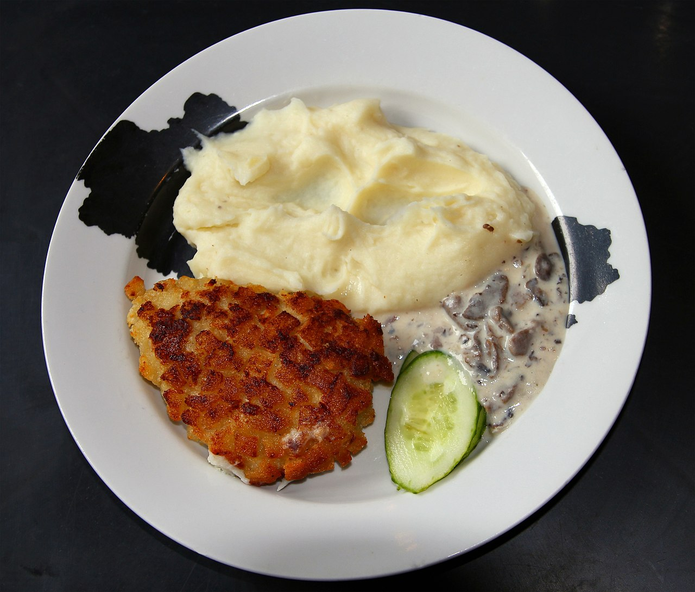

# Cutlets

_Pozharsky cutlet_

## Cuisines of Russia, Ukraine and other countries of former Soviet Union

> In modern Russian, the word kotleta (котлета) refers almost exclusively to
> pan-fried minced meat croquettes / cutlet-shaped patties. Bread soaked in
> milk, onions, garlic, and herbs is usually present in the recipe. When in a
> hurry, a "cutlet" can be eaten between bread slices like a hamburger, but this
> fast meal is rarely served in restaurants. It is usually served with pan-fried
> potatoes, mashed potatoes, pasta, etc.
>
> A particular form of the Russian `kotleta` known as Pozharsky cutlet is an
> elaborated version of minced poultry kotleta covered with breadcrumbs or small
> croutons. A distinct feature of this cutlet is that butter is added to minced
> meat, which results in an especially juicy and tender consistency.
>
> Another Russian version of a cutlet, called otbivnaya kotleta (отбивная
> котлета), meaning "beaten cutlet", is a fried slice of meat, usually pork or
> beef, beaten flat with a tenderizing hammer or knife handle and covered with
> beaten eggs, dough or breadcrumbs. The recipe is similar to those of
> escalopes, schnitzel, Polish, or American cutlets. Today, this dish is simply
> called otbivnaya, with the word kotleta reserved for minced meat patties.
>
> Chicken Kiev is called kotleta po-kievski (котлета по-киевски) in Russian and
> similarly kotleta po-kyivski (котлета по-київськи) in Ukrainian, which means
> "Kiev-style cutlet".\
> — <cite>[Wikipedia](https://en.wikipedia.org/wiki/Cutlet#Cuisines_of_Russia,_Ukraine_and_other_countries_of_former_Soviet_Union)</cite>

Famous Russian cutlet recipe, favoured by Nicholas I. Despite what seems to be a
massive amount of butter required, they’re rather light, yet creamy.

## Ingredients

- Chicken mince
- Butter (originally, 1 part butter per 2 parts chicken; 1/4 works perfectly fine)
- Eggs (~1 egg per 500g chicken, plus 3-5 for the breading)
- A couple white bread loaves (store-bought breadcrumbs also suffice, but require more eggs)
- Spices/salt (optional, recommended)
- Non-lard based, non-chunky sauce (optional)
- Onions (optional)

## Directions

1. Prepare 2 medium-sized and 1 extra large bowl, a few plates and a regular
   frying pan.
2. Get the chicken out of the cold and into the XL bowl. Butter, too, but onto a
   plate.
3. While they warm up, crumb up the bread. By hand. The smaller, the better. If
   you’re using store-bought crumbs, just put those into a bowl.
4. Mince the chicken, if necessary. Mince the onions, if you desire them. Divide
   butter, once softened, into medium bits.
5. Add eggs to the meat and put a few into a medium bowl; mix both bowls'
   contents thoroughly.
6. Add the spices, salt and/or sauce of your choosing. Some may consider this
   barbaric, but I found that Heinz’s mustard ketchup works exceptionally well
with the recipe. They’ll come out a tad red, though.
7. Add the softened-up butter to the XL bowl and mix thoroughly.
8. MAKE A TEST CUTLET by rolling up a small ball of the mince, then dipping it
   into the bread, then into the eggs, then into the bread again, compounding
the breading slightly between dips. More dips means less leaked butter/juice,
but don’t overdo it lest you want more bread than meat in your cutlet.
9. Fry, let cool and then taste the cutlet. (Pozharskiye are very juicy, so
   liquid in the pan is to be expected.)
10. If unsatisfied, add more flavoring or throw everything away. If satisfied,
    repeat step 9. (Most cutlet sizes work well. Haven’t tried making giant or
tiny ones, though.)
