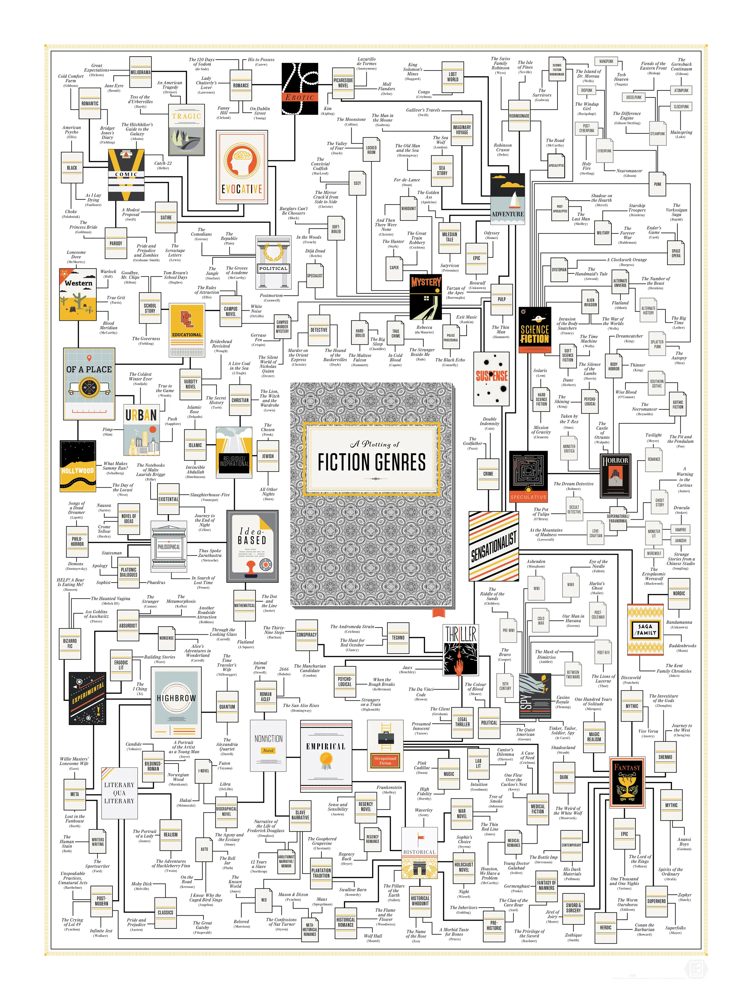

# Fiction

> Fiction is any creative work, chiefly any narrative work, portraying
> individuals, events, or places that are imaginary or in ways that are
> imaginary. Fictional portrayals are thus inconsistent with history, fact, or
> plausibility. In a traditional narrow sense, "fiction" refers to **written**
> narratives in prose – often referring specifically to novels, novellas, and
> short stories. More broadly, however, fiction encompasses imaginary narratives
> expressed in any medium, including not just writings but also live theatrical
> performances, films, television programs, radio dramas, comics, role-playing
> games, and video games.\
> — <cite>[Wikipedia](https://en.wikipedia.org/wiki/Fiction)</cite>

I associate fiction with the non-technical literature as first priority.

I'm store my reading and completed fiction literature [[my_fiction_books|here]].

You can check various fiction genres on the following image:

_[A Plotting of Fiction Genres by popchart](https://popchart.co/products/a-plotting-of-fiction-genres)_

## Genres

### Science fiction

> Science fiction (sometimes shortened to SF or sci-fi) is a genre of
> speculative fiction, which typically deals with imaginative and futuristic
> concepts such as advanced science and technology, space exploration, time
> travel, parallel universes, and extraterrestrial life. Science fiction can
> trace its roots to ancient mythology. It is related to fantasy, horror, and
> superhero fiction and contains many subgenres. Its exact definition has long
> been disputed among authors, critics, scholars, and readers.\
> — <cite>[Wikipedia](https://en.wikipedia.org/wiki/Science_fiction)</cite>

My favorite genre.

## References

- [Лаборатория Фантастики](https://fantlab.ru/)

