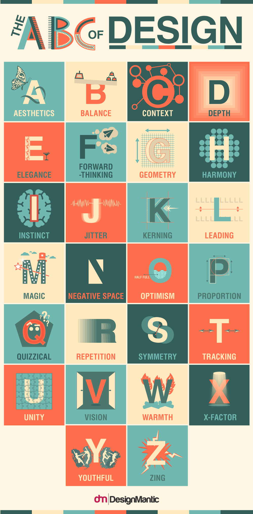

# Graphic design

> Graphic design is a profession, academic discipline and applied [[art]]
> whose activity consists in projecting visual communications intended to
> transmit specific messages to social groups, with specific objectives.
> Graphic design is an interdisciplinary branch of design and of the fine
> arts. Its practice involves creativity, innovation and lateral thinking using
> manual or digital tools, where it is usual to use text and graphics to
> communicate visually.\
> — <cite>[Wikipedia](https://en.wikipedia.org/wiki/Graphic_design)</cite>

Here good examples of graphic design, from popchart.

> A Stylistic Survey of Graphic Design.
>
> An array of aesthetic advancement, this rigorously researched and
> hand-illustrated diagram documents the progression of Graphic Design from the
> Victorian era into the modern digital age.\
> — <cite>[popchart](https://popchart.co/products/a-stylistic-survey-of-graphic-design)</cite>

_A Stylistic Survey of Graphic Design_

Another example, The ABC Of Design.

> What are the ABCs of design? More specifically, what are the elements that
> every visual design has in common? All that will be answered.\
> — <cite>[Designmatic](https://www.designmantic.com/blog/infographics/abc-of-design/)</cite>

_The ABC Of Design_

## Graphic design Inspiration

- [Terminal Hugo Theme](https://panr.github.io/hugo-theme-terminal-demo/)
- [Sentence Case: automatically capitalize sentences](https://getreuer.info/posts/keyboards/sentence-case/#overview)
- [The Interactive Fiction Archive](https://ifarchive.org/), mainly color scheme
- [PocketBase - Open Source backend in 1 file](https://pocketbase.io/)
- [the morning paper - Computer Science](https://blog.acolyer.org/)
- [Essays · Gwern.net](https://gwern.net/)
- [tek256](https://tek256.com/faq/)
- [seedit4.me](https://seedit4.me/)
- [Thunderbird](https://www.thunderbird.net/en-US/thunderbird/115.0/holidayeoy/)

## Learning path

- [ ] Refactoring UI (Thailwind CSS)
