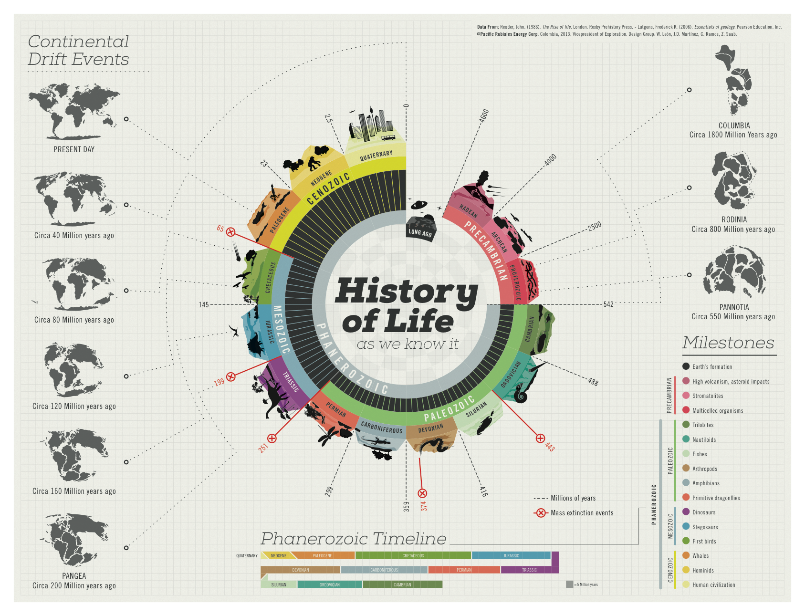

# History of life

> The [[history]] of life on Earth traces the processes by which living and fossil organisms evolved, from the earliest emergence of life to present day. Earth formed about ==4.5 billion== years ago (abbreviated as Ga, for gigaannum) and evidence suggests that life emerged prior to 3.7 Ga. Although there is some evidence of life as early as 4.1 to 4.28 Ga, it remains controversial due to the possible non-biological formation of the purported fossils.\
> — <cite>[Wikipedia](https://en.wikipedia.org/wiki/History_of_life)</cite>

## History of Life Art by [juanchit](https://www.behance.net/gallery/10901127/History-of-Life)

