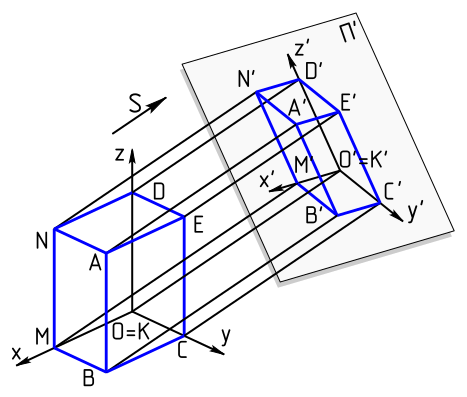

# Orthographic projection

> Orthographic projection (also orthogonal projection and analemma) is a means
> of representing [[3D_computer_graphics|three-dimensional]] objects in two
> dimensions. Orthographic projection is a form of parallel projection in which
> all the projection lines are orthogonal to the projection plane, resulting in
> every plane of the scene appearing in affine transformation on the viewing
> surface. The obverse of an orthographic projection is an oblique projection,
> which is a parallel projection in which the projection lines are not
> orthogonal to the projection plane.\
> — <cite>[Wikipedia](https://en.wikipedia.org/wiki/Orthographic_projection)</cite>

