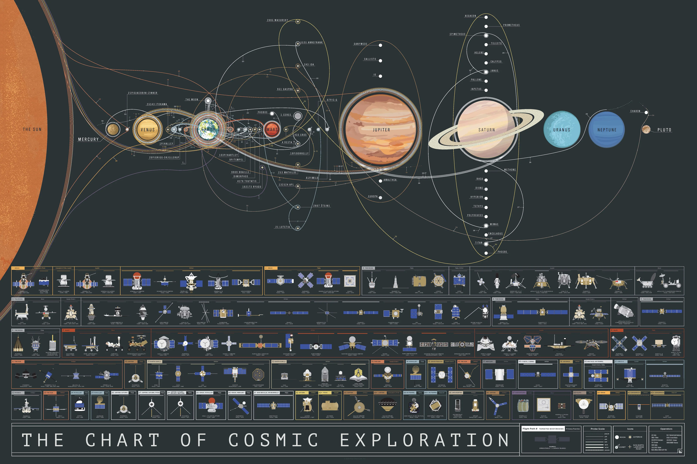

# Outer space

Outer space or space - near-vacuum expance between celestial bodies. Place where all the planets, stars, galaxies and objects are existing.

## The Chart of Cosmic Exploration

> This stellar schematic traces the trajectories of over 100 exploratory instruments to ever slip the surly bonds of lower Earth orbit and successfully complete its mission. Newly updated to include the James Webb Space Telescope and the DART Impactor!.\
> — <cite>[Popchart](https://popchart.co/products/the-chart-of-cosmic-exploration)</cite>

## External links

- [Roscosmos TV - YouTube](https://www.youtube.com/channel/UCOcpUgXosMCIlOsreUfNFiA)
