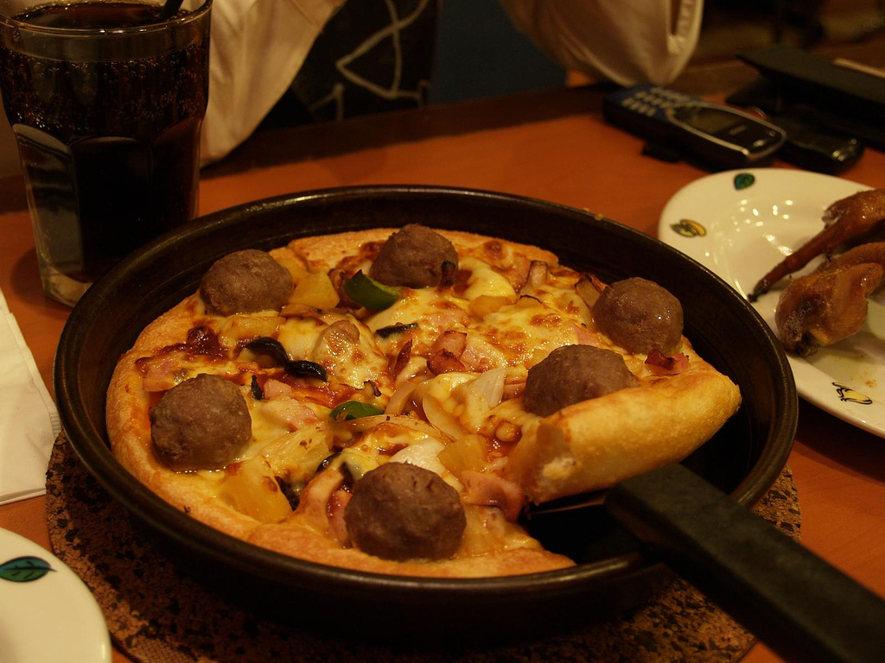

# Pan Pizza

_Pan Pizza_

- ⏲️ Prep time: 30 min

## Ingredients

- [no-knead pizza dough](https://based.cooking/no-knead-pizza-dough)
- [pizza sauce](https://based.cooking/pizza-sauce)
- cheese
- olive oil
- pepperoni (optional)
- mushrooms (optional)
- pineapple (optional)
- …really whatever you like (optional)

## Directions

1. Preheat oven to max temp.
2. Add olive oil to the bottom of an iron skillet. The whole bottom and sides should be coated.
3. Add some oil to hands and shape dough into a ball.
4. Place ball to the center of the pan and press it down gently. It will not cover the whole bottom yet.
5. Cover the skillet and let the dough rest for minimum 30 min.
6. Press the dough to cover the whole bottom of the skillet.
7. Add pizza sauce, cheese, and whatever you like on your pizza
8. Put in the middle of the oven, and cook for 15–20 minutes.

