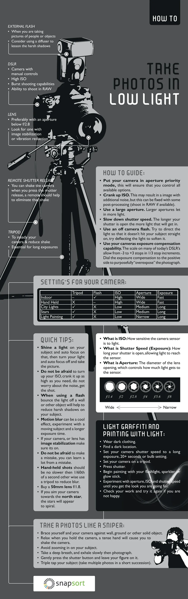

# Photography

> Photography is the [[art]], application, and practice of creating durable images by recording light, either electronically by means of an image sensor, or chemically by means of a light-sensitive material such as photographic film. It is employed in many fields of science, manufacturing (e.g., photolithography), and business, as well as its more direct uses for art, film and video production, recreational purposes, hobby, and mass communication.
>
> Typically, a lens is used to focus the light reflected or emitted from objects into a real image on the light-sensitive surface inside a [[camera] during a timed exposure. With an electronic image sensor, this produces an electrical charge at each pixel, which is electronically processed and stored in a digital image file for subsequent display or processing. The result with photographic emulsion is an invisible latent image, which is later chemically "developed" into a visible image, either negative or positive, depending on the purpose of the photographic material and the method of processing. A negative image on film is traditionally used to photographically create a positive image on a paper base, known as a print, either by using an enlarger or by contact printing.\
> — <cite>[Wikipedia](https://en.wikipedia.org/wiki/Photography)</cite>

## Gear and Settings

Cheatsheet, which explain what can be used for Low Light Photography:  and [Source](https://digital-photography-school.com/cheat-sheet-gear-settings-low-light-photography/)

## Soaking photographic film, straightening and stripping

Based on great article (Russian language) [^1].

1. Preparation:

- Use a developing tank
- Load film into the tank spiral
- Trim perforation edges at 45°.

2. Soaking:

- Fill with water at temperature up to 25 °C MAX! (use thermometer)
- Better to use distilled water
- Can add a drop of stabilizer, CM200 (1.5ml to 300ml)
- Soak for 10–15 minutes.

3. Drying:

- Carefully remove the film
- Hang with weight at bottom
- Dry in humid room (bathroom) in about 1 hour

4. Straightening:

- Roll dry film with emulsion side out
- Roll diameter 10-15 cm
- Leave for 2-3 days or more (2-4 weeks) in a dry environment (cardbox with holes, etc.).

5. Storage:

- Cut into strips of 4-6 frames (6 better)
- Place into sleeves
- Store in special folders to protect from dust and scratches.

## Learning path

- [ ] [Set.a.Light 3D Review & Tutorial](https://www.youtube.com/watch?v=YFlC6RL1MmM)
- [ ] [Вычислительная Фотография](https://vas3k.blog/blog/computational_photography/)
- [ ] [Вычислительная фотография 2.0](https://jejeya.pictures/future_of_photography)

[^1]: [Размачивание фотопленки для выпрямления](http://xn--80atkeanlo.xn--80ahcc7avfgj.xn--p1ai/material/razmachivanie-foto.html). [Local copy](./articles/Razmachivanie_fotoplenki_dlya_vypryamleniya.html).
