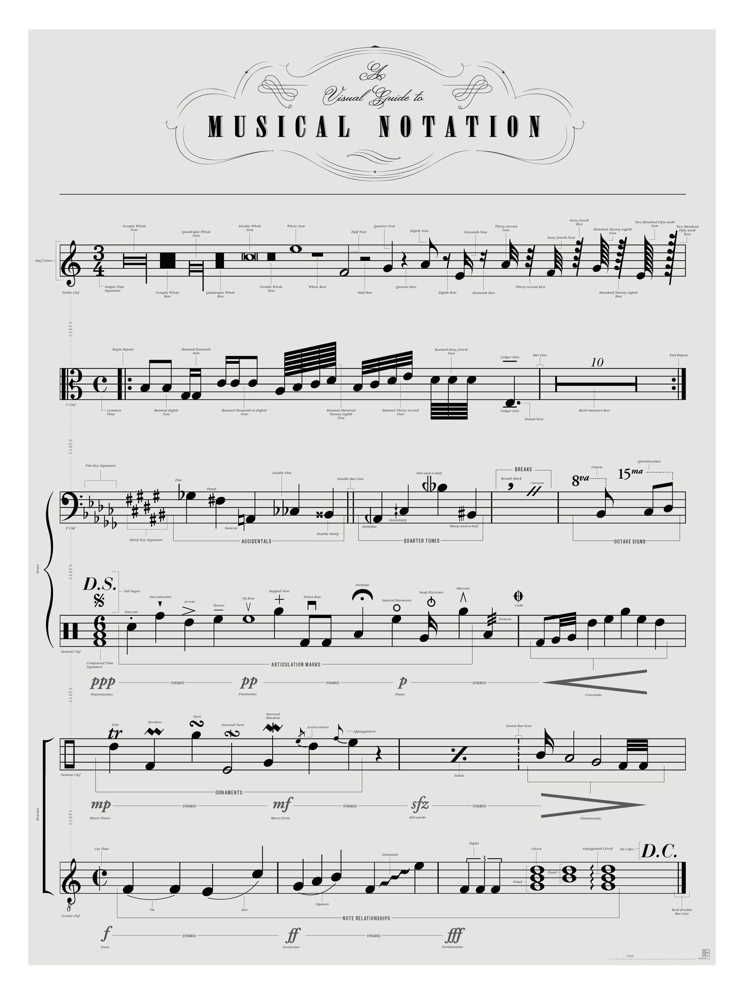

# Piano

> The piano is a **keyboard [[my_music|musical]] instrument** with strings struck by wooden hammers coated with a softer material (modern hammers are covered with dense wool felt; some early pianos used leather). It is played using its keyboard, which is a row of keys (small levers) touched by the performer with the fingers and thumbs of both hands, causing the hammers to strike the strings. It was invented in Italy by Bartolomeo Cristofori around the year 1700.\
> — <cite>[Wikipedia](https://en.wikipedia.org/wiki/Piano)</cite>

## A Visual Guide to Musical Notation

> An ensemble of sonic semiotics, this visual guide to musical notation charts the symbols and ideograms of classical sheet music across a sextet of staff lines.\
> — <cite>[Popchart](https://popchart.co/products/a-visual-guide-to-musical-notation)</cite> 

## External links

- [[my_music]]
- [Virtual Piano - Play The Best Online Piano Keyboard Virtual Piano v1](https://virtualpiano.net)
- [Virtual Piano | Play the Best Musical Keyboard Online](https://recursivearts.com/virtual-piano/)
