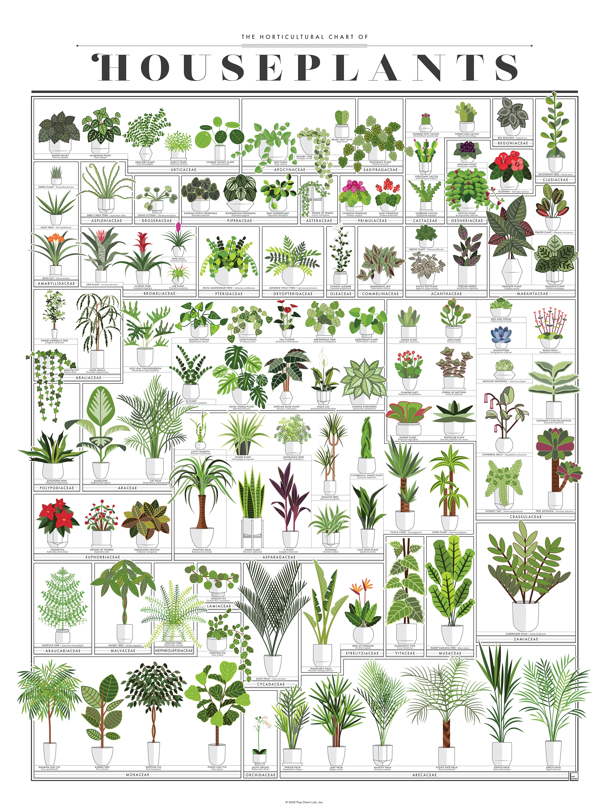

# Plant

> Plants are the eukaryotes that form the kingdom Plantae; they are
> predominantly photosynthetic. This means that they obtain their energy from
> sunlight, using chloroplasts derived from endosymbiosis with cyanobacteria to
> produce sugars from carbon dioxide and water, using the green pigment
> chlorophyll.\
> — <cite>[Wikipedia](https://en.wikipedia.org/wiki/Plant)</cite>

I'm not a big fan of plants, but I like to have some in my life. So here I want
to store some useful information about plants.

## The Horticultural Chart of Houseplants

> Make your house a little greener with this cheery chart of over a hundred
> popular potted plants! A veritable horticultural who’s who, each leafy friend
> has been lushly illustrated and labeled with nomenclature both common and
> scientific.\
> — <cite>[Popchart](https://popchart.co/products/the-horticultural-chart-of-houseplants)</cite>

