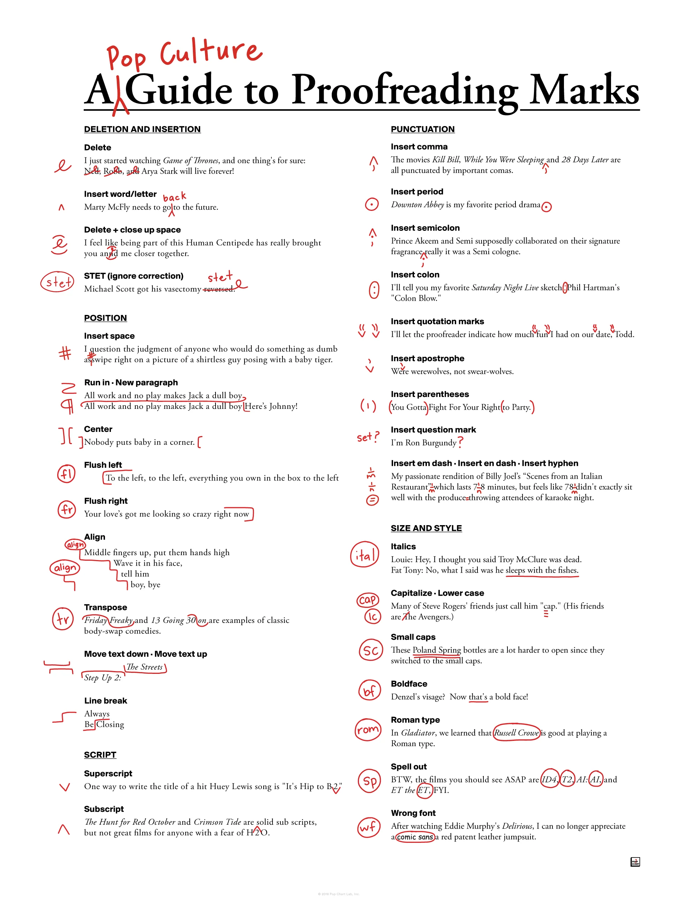

# Proofreading

> Proofreading is an iterative process of comparing galley proofs against the original manuscripts or graphic artworks to identify **transcription errors** in the typesetting process. In the past, proofreaders would place corrections or proofreading marks along the margins. In modern publishing, material is generally provided in **electronic form**, traditional typesetting is no longer used and thus (in general) this kind of transcription no longer occurs. Consequently the part played by pure proofreaders in the process has almost vanished: the role has been absorbed into copy editing to such an extent that their names have become interchangeable. Modern copy-editors may check layout alongside their traditional checks on grammar, punctuation and readability.\
> — <cite>[Wikipedia](https://en.wikipedia.org/wiki/Proofreading)</cite>

I use digital tools for proofreading, such as [LanguageTool](https://languagetool.org/ru) with [valentjn/ltex-ls](https://github.com/valentjn/ltex-ls)) to write grammatically correct text in [[English]] and [[Russian]].

## A Pop Culture Guide to Proofreading Marks

Interesting cheat-sheet how to properly use proofreading marks, can be useful to visually proofreading my own texts.

