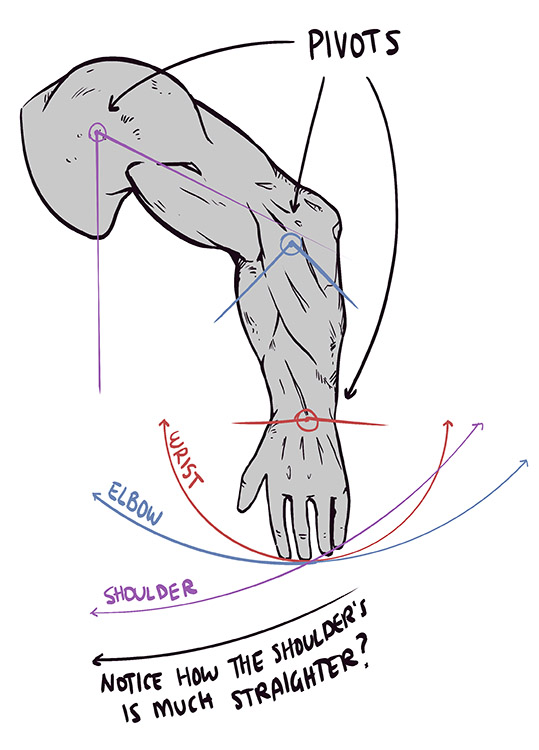

---
external:
  - https://drawabox.com/
date: 2023-05-29
tags:
  - inbox
  - SR_art
  - research
sr-due: 2024-05-28
sr-interval: 124
sr-ease: 208
---

# Drawabox - learning the fundamentals of drawing

Site looks well-done and well-organized. It's even contain read the text
feature, which help me as [[English]] learner.

## Lesson 0: Getting Started

### Introduction

[Drawabox Lesson 0, Part 1: What is Drawabox? - YouTube](https://youtu.be/9708PBUvCQ0).

Drawabox is community of professionals and enthusiasts, who want to develop
their drawing skills.

Content of drawbox continuously improving and based on Peter Han's Dynamic
Sketching course (which he built with his mentor).

Drawabox give you a strong foundation, but require a lot of practice and time.
It's not going to make you professional, but give you essential knowledge and
practice to improve your drawing skills. I like their comparative with MMO, you
start from Newbie and potentially can become a Hero.

Drawabox focus on 3 areas:
- Confident and controlled MARK MAKING - the ability to make the marks you
intend to make, and to keep them smooth and hesitation-free;
- Attentive and fastidious OBSERVATION;
- And the big focus of this course overall: SPATIAL REASONING - the
understanding deep in your brain that despite drawing on a flat page, the things
you're producing exist in a real, [[Three-dimensional_3D_space|three dimensional
world]].

It can be starting point to advanced topics, like lighting, rendering, or
shading (especially spatial reasoning).

### Changing your Mindset

End result (getting better at art) in drawing is getting in your way.

You want to impress someone, but this stresses us out and put into creative
paralysis.

Failure is a beginner's job and not bad at all, it's even critical integral part
of learning process, it's detect your weak points and allow you to improve
yourself by working on them.

You can be ashamed in some field if you are just beginner!

You don't need to find excuses to draw, you at least ready to draw something
on beginner level!

> Everyone following this course is expected to abide by what we call the 50%
> rule, without exception.

What is 50% rule about?
&#10;
1. Improving your skills, first `50%`. Coursework, exercises, studies,
   tutorials, etc.
2. Second `50%` is drawing done for the sake of drawing. In other words, play.
   Experimentation, just throwing yourself at the page and giving yourself full
freedom to just try, even though the result will likely turn out badly.

This is general rule, every minute you spend on learning must be followed by
practice (play). You can do it in various time sessions (day/day or any other).

Why ignoring 50% rule is critical mistake?
&#10;
> It'll help develop skills that do need to be developed at some point, and
> doing it now will help you avoid some stinging disappointment later on.
So it's sort of learning mathematics, if you don't understand one theorem, you
don't understand next related theorem.

If you spent time on 50% of play in relaxing fashion, it will help to absorb
them more fully. Balance between work and play is very important.

> Cleanly separating work and play allows us to do each whole-heartedly.

Drawabox has a tool to find what to draw (drawing prompts):

[Drawabox.com | Drawing Prompts | Tea Time at World's End](https://drawabox.com/drawingprompts/random)

Using your old techniques or art materials is fine.

Reference is not bad, but try to avoid them in first time and use as Reference,
not copy/paste material (multiple references to fill some gaps, or learn
something).

TODO: Additional related materials:
- [ ] [Stress-Free Sketching with Sheldon Borenstein](https://drawabox.com/nma/stressfreesketching)
- [ ] [Overcoming the Fear of a Blank Page](https://youtu.be/mgl6Ll3K3gw)
- [ ] [Personal vs Impersonal Satisfaction in Art](https://youtu.be/WV82BGfFjbM)

### Using this Course
### Required/Recommended Tools

## Lesson 1: Lines, Ellipses and Boxes
### Some Quick Reminders
### Lines: Using Your Arm

In drawbox course focus primarily on drawing from your shoulder. One good tip is
imagining that your shoulder able to draw/write which can help change your habit
to draw from wrist/elbow (on your "play" time, you can use any other
techniques).

Main idea is drawing from shoulder more effective (straight lines) and allow you
to draw longer sessions than from wrist.

 > Drawing only with your wrist, where your hand moves, but the wrist remains
 > pinned in place. This allows us to have very tight, stiff control, and it's
 > good for tight details and writing.

Drawing only with wrist, allow having very tight, stiff control, which useful
in writing and tight details drawing

Drawing with whole arm great for smooth, fluid line work. It's also useful for
drawing smaller marks, because it's emphasizes a consistent trajectory (more
straight lines according to image above) and minimizes erratic wobbling. I think
in 2 words more stable and consistent.

Resting the side of your hand or a finger is fine, but resting elbow is not a
good idea, since it force you to draw from elbow.

Using "overhand" grip is mainly used for tools like pencil, brush, etc. It
allows creating marks from tool edges, better for drawing on canvas, etc. In
drawbox course we use pen and using tripod grip-type is more suitable than
"overhand" grip type.

### Lines: Markmaking

Rules to draw marks:
- Marks should be continuous and unbroken (sort of linear motion);
- Marks should flow smoothly (flow better than accuracy);
- Marks must maintain a consistent trajectory (break patterns into drawing
steps).

### Lines: Homework

Some tips:

- Do not grind;
- Do not rush;
- Read all the instructions carefully;
- Take breaks.

Exercises:

- [x] two filled pages of the [Superimposed Lines](https://drawabox.com/lesson/1/superimposedlines) exercise

Start out with a simple straight line with a ruler and repeat it 8 times.

Split the page into 2 parts. In first draw 4 short and 4 medium lines (which
each repeat 8 times). In second part draw 4 long lines (which each repeat 8
times). At some space draw curved lines (optional).

Main purpose of this lesson is training muscle memory (confidence), you not
focus on process, you just quickly draw lines with some requirements.

Avoid common mistakes: wobbling, fraying on both edges (on end it's natural).

- [x] one filled page of the [Ghosted Lines](https://drawabox.com/lesson/1/ghostedlines) exercise

Ghosting lines is backbone of how to think whey you do markmaking. It's nice to
have habit for markmaking.

Generally ghosting lines contains 3 steps:
1. Planning, positions and what is meant to accomplish task, we are not
   sketching, and unnecessary lines are not required. Rotate page to the comfort
orientation.
2. Preparation, here where ghosting is ready to go. You draw "virtually" without
   touching the page. Select start and end positions and draw little above the
page, repeat this process several times (to trigger muscle memory).
3. Execution, just execute this mark with confidence. Avoid any hesitation,
   second guessing, attempting t avoid a mistake.

These lessons have 3 levels of success, focus on level 1, don't grind.

- Level 1 less accuracy (start/end position);
- Level 2 better accuracy but less on end position;
- Level 3 better accuracy on both start/end position.

Overshoot issue (too long/too short line), you can use lifting method:
> Try lifting your pen off the page the second you hit that end point.

We can still work with a line that is smooth and even, but there's not much that
can be done with a wobbly one. So this lesson train you to draw smooth lines.

- [ ] two filled pages of the [Ghosted Planes](https://drawabox.com/lesson/1/ghostedplanes) exercise

This exercise is extension of Ghosted lines. In drawbox concepts are presented
by units from easy to complex. Main purpose of this exercise is to apply
ghosting method to something more complex.

First you need to plan marks, just 4 dots for quadrilateral shape.

Then rotate page as comfort for you and make mark using ghosted method, focus
only on making this mark.

Then construct lines between corners of plane (diagonal).

Last step is bisecting the plane in both dimensions (vertical through center,
cross).

All this steps must be done using ghosting method, you can ignore perspective in
these lessons, just a bunch of lines on a flat page.

Fill page with planes with various of sizes, avoid empty space.

> This exercise is especially good for warmups, and I'd generally recommend
> doing it over the simpler ghosted lines exercise for obvious reasons - it's
> the same thing, but with more purpose to it. On top of that however, it's a
> particularly versatile exercise that can be modified to start incorporating
> perspective concepts as well.

Since this is only part of lesson 1. Send homework for review when you are
completed all parts of lesson 1.

### Ellipses
### Boxes: The Basics of Perspective and Projection
### Boxes: Foreshortening and Vanishing Points
### Boxes: Rotation, Perspective Grids, and the Concept of Infinity
### Boxes: Simplified Guidelines
### Boxes: Additional Notes
### Boxes: Homework
### What Next?
