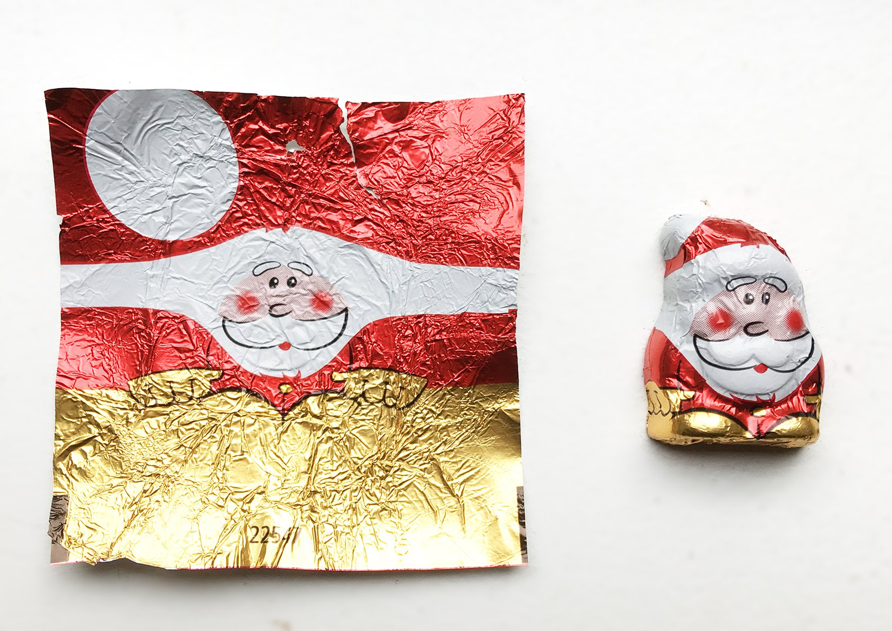

---
description:
tags:
- inbox
- research
- computer_graphics
created: 2023-06-05
sr-due: 2023-08-25
sr-interval: 1
sr-ease: 230
external: https://www.youtube.com/playlist?list=PLjEaoINr3zgEPv5y--4MKpciLaoQYZB1Z
directory: ~/Computer/graphics/Price-Donut_Tutorial
---

# Blender Beginner Donut Tutorial

A big part of this tutorial is also in
[[Blender_common_shortcuts|blender shortcuts]] note.

Probably better to place `subdivision modifier` on bottom of the stack (depends
on the situation)

To change world units need change properties.
?
Scene Properties (properties sidebar) > Units > Metric

How to apply subdivision modifier (or any modifier)
?
Modifier tab > Modifiers Properties > Add Modifier.

How to move siblings points in edit mode
?
You need to select point(s) enable proportional editing (`O`) and move (`G`) To
increase/decrease proportional editing radius use mouse wheel.

How select random points in edit mode
?
Select > **S**elect Random

Orthographic mode basically means
?
That you can't see perspective, only [[Orthographic_projection|orthographic ]]
view (no depth, objects same size regardless of distance).

You can click on circles in axis control widget (top-right) to orbit or ==hold
LMB== on it and drag.

Render working from ==point of view== of camera.

To quickly set camera position:
- Select camera in Scene Collection (right menu).
- Press `N` to open properties' menu.
- Open view tab and check `camera to view` checkbox.
- Select lock to object target.
- Enter into camera view mode (press `Num0`).
- Locate it as needed.
- Uncheck camera to view.

To set material, in properties window (right side), select material tab and
press add new, and set base color and other properties.

# Part 2

After adding new object, in bottom left corner will be temporary (until you not
do any action) available object options, to reopen them press `F9`.

You can quickly change object shading, by ==context menu (right click)==.

One method to smooth object better, is adding subdivision surface modifier in
object properties (right menu).

Subdivision surface split polygon to additional ==4== polygons.

To move sibling vertices use proportional editing mode `O`, or click on icon in
top right. Change how much vertices affected (circle of influence size), use
mouse scroll or use `PgUP`/`PgDown`.

Sometimes useful to hide part of object. One method to do it is select edge, use
grow selection and hide it.

# Part 3

TODO: add note
**Z-fighting**, also called **stitching** or **planefighting**, is a phenomenon
in 3D rendering that occurs when two or more primitives have very similar
distances to the camera. This would cause them to have near-similar or identical
values in the z-buffer, which keeps track of depth. This then means that when a
specific pixel is being rendered, it is ambiguous which one of the two
primitives are drawn in that pixel because the z-buffer cannot distinguish
precisely which one is farther from the other.

The ==Solidify== modifier takes the surface of any mesh and adds depth thickness
to it.

Usually solidify modifier is used ==before== subdivision modifier.

One useful property of solidify modifier is ==Edge data==, used to create crease
or bevel.

You can temporarily hide modifiers in edit (and other modes) by toggle
==visibility in modifier properties (on top after modifier name)==.

Here various types of snapping: for example `face project`. Snapping working
good if you have enough ==geometry (apply subdivision modifier for example)==.

To apply modifier, press arrow button near modifier name and click on apply.

Blender modifiers work from ==top to bottom== (order).

# Part 4

==Shrink wrap== modifier can help with snapping vertices between two objects.
Select target mesh, which vertices need to be snapped. Usually need to place
this modifier above other ones.

## Sculpting

If you have subdivision modifier, which is not applied, sculpting still working
on low-poly mesh, so usually you need to ==apply it==.

Subdivision modifier applying will use ==Viewport== level.

Very handy option for mask tool is =="Front Faces Only"==, which prevent
painting it in opposite faces, you can find it in top toolbar → brush dropdown.

==Mesh filter tool== can be used to apply to inflate/deflate, smooth, random,
etc. for not-masked faces.

You can smooth mask by ==Mask menu (top bar) and select smooth mask==.

To reduce "lumpiness" in model, you can use ==smooth== tool.

# Part 5 - Shading

To set color you need to add material, and usually first you need to set
==Base color==.

To make color less/more "glossy", change ==roughness== parameter.

To parent objects, select child object first, then parent and press ==`C-P`==.
BE CAREFUL not to have proportional editing enabled when you parent objects
(otherwise here possible issues with location properties).

To set image texture click on ==yellow circle== in base color in material
properties.

[Poliigon](https://www.poliigon.com ) - Andrew Price's site with
textures/models, they also have an add-on for Blender.

==Shading layout== allows you to "tune" your texture, properties contains only
basic options for textures.

Nodes are working from ==left to right, input ... output==.

You can add nodes by ==`S-A`==, to quickly add node between 2 just move new added
node into required edge and press LMB.

You can also add new node by dragging ==connector== and select required node in
menu. For example drag Roughness in Principled BSDF, select image texture color
and open roughness map.

If you're adding image texture double-check it's color space, sometimes need to
set ==`Non-color`== color space, if you use textures like roughness/normal maps
(here no color only required values).

A normal in 3D modeling is a depiction of the ==orientation== of a polygon's
surface.

Usually you need to connect into Principled BSDF ==Normal Map== first and only
then Image Texture.

The Principled BSDF that combines multiple layers into a single easy to use
node. It can model a wide variety of materials.
It is based on the OpenPBR ==Surface shading model==, and provides parameters
compatible with similar PBR shaders found in other software, such as the Disney
and Standard Surface models. Image textures painted or baked from software like
Substance Painter may be directly linked to the corresponding input in this
shader.

Shading Models control how your Material will ==reflect incoming light==.

TODO: Shading note.
TODO: Normal note.

Texture Paint require setting ==Image Texture (material base color circle)== on
object, and then you are able to draw on it. And sometimes you want to create
new texture instead using existing one.

In Texture Paint to preview texture, you need to select assigned texture in top
left dropdown (Browse image to be linked).

To apply 2d texture into 3d object you need to?
?

UV unwrap (UV mapping) your 3d object.

If you use eyedropper in texture paint, usually need to select ==Texture==
preview as source of new color. 3D view can contain shading information.

If you changed texture by using Texture Paint don't forget to ==save it== (they
are not part of blend file).

To determine isolate mode, check Top Left status in layout mode `User
Perspective (Local)` means we are in ==isolate mode==.

