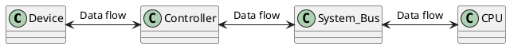
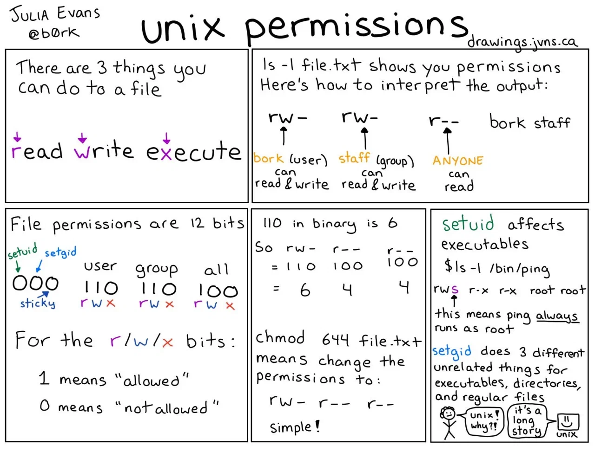

---
author:
  - Андрей Викторович Столяров
date: 2021
external:
  - http://www.stolyarov.info/books/programming_intro/vol1
tags:
  - research
  - inbox
  - SR_programming
sr-due: 2024-01-26
sr-interval: 1
sr-ease: 130
directory:
  - ~/Computer/programming/Столяров-Программирование
---

# 1. Preliminary information (Предварительные сведения)

## 1.1. Computer: what is it? (Компьютер: что это такое?)

Main [[Computer|computer]] function is ==to compute==. In our time millions
computing operations are wasted on information representation, then on actual
calculations (low efficiency).
<!--SR:!2024-02-27,9,227-->

### 1.1.1 Some history (1.1.1 Немного истории)

First computing machine is mechanical ==calculating clock== of Wilhelm
Schickard, 1623. But before it Leonardo da Vinci created some sketches of
computing mechanism.
<!--SR:!2024-03-09,4,162-->

Most old working computing machine is Pascal's ==adding machine== (pascaline),
1642.
<!--SR:!2024-02-22,4,182-->


Basic operation is addition, you input first number, then input second number,
and you will see sum.

To subtract number you need to use special method - nines'
==complement arithmetic==, which allows doing subtraction using summation.

Main steps to use it:
1. Input first number: `00500`
2. Calculate nines' complement from second number: `99866 = 100000 - 134`, here
  exist trick, you can use `100000 - 134 = 99999 - 134 + 1 = 99866`
3. Input nines' complement: `99866`
4. Calculate sum: `00500 + 99866 = 100366`
5. Subtract `100000` from sum and get result: `100366 - 100000 = 00366`

On pascaline it was little different (check video and description in book),
`99999 - x + y`.

In 1673 Gottfried Wilhelm Leibniz created calculating machine, with supported
==sum, subtraction, multiplication and division==.
<!--SR:!2024-02-22,2,152-->

General property (disadvantage) of arithmometer is it can't do calculations
without ==human help==, if you need to do more than one operation.
<!--SR:!2024-02-24,5,182-->

1823 Charles Babbage started working on difference engine, which can do
calculations using method of ==divided differences==, but he failed to finish
it. George Scheutz created working difference engine in 1843, by using Babbage's
ideas.
<!--SR:!2024-02-23,2,150-->

But Babbage's main idea was ==analytical== engine, which can do any
calculations. So he invited idea of programmable machines, data transferring
from one data storage into another and actions depending on analyze results
(compare for example).

Ada Lovelace - translated Babbage's analytical machine notes and added detailed
comments. In one of these comments (Note G) she provided full set of commands to
calculate Bernoulli numbers on analytical machine - this set of commands is
considered as first in history computer program, and Ada Lovelace is often
called ==first programmer==.
<!--SR:!2024-02-23,3,162-->

Also, she predicted future of programmable computers.
> The Analytical Engine might act upon other things besides number, were
> objects found whose mutual fundamental relations could be expressed by those
> of the abstract science of operations, and which should be also susceptible of
> adaptations to the action of the operating notation and mechanism of the
> engine... Supposing, for instance, that the fundamental relations of pitched
> sounds in the science of harmony and of musical composition were susceptible
> of such expression and adaptations, the engine might compose elaborate and
> scientific pieces of music of any degree of complexity or extent. [^1]\
> — <cite>Ada Lovelace</cite>

First full mechanical programmable computer?
&#10;
1938 Konrad Zuse created Z1, first full mechanical programmable computer
(electricity used only in motor). Z1 used [[Binary_number|binary]] logic.

<!--SR:!2024-02-25,4,162-->

Z2 used same mechanics but used electrical relay circuits for computational
operating. As Z1 it used perforated tape to execute program (instructions).
They can't do rewind tape and cycle operations was not supported.

Z3 used only relay circuits and used plastic tape to store program. This machine
supported cycle operations, but not conditional jumps.

Z4 was like Z3, but supported conditional jumps.

<!-- TODO: explain diode, triode, trigger -->
https://www.youtube.com/playlist?list=PLnw98JPyObn1i3yJ2Q7A62cl2eVXoIPP0

How to build trigger using vacuum tube?
&#10;
Vacuum tube is next element after mechanics to use in computers, it's glass bulb
with electrodes and electric vacuum inside. Using 2 triodes you can build
trigger, which can be used to store information and as base block to build logic
gates.
<!--SR:!2024-02-22,4,182-->

One of first programmable computers (electrical) was ==ENIAC==, which used
17,468 vacuum tubes. It was created by John Mauchly and J. Presper Eckert in
1946.
<!--SR:!2024-02-24,6,202-->

Colossus Mark I/II was a set of computers developed by ==British== codebreakers
in the years 1943–1945 to help in the cryptanalysis of the Lorenz cipher. But
they are was destroyed after war (by Tommy Flowers, creator of these machines)
on Winston Churchill's order.
<!--SR:!2024-02-23,5,202-->


#### Computer generations

Distinguishing by generation only electronic computers, not mechanical ones.

A vacuum-tube computer is a ==first==-generation computer, is a
computer that uses vacuum tubes for logic circuitry.
<!--SR:!2024-03-01,12,227-->

First generation computers have one very important principle, principle of
==stored-program in some memory==, (nowadays mostly electronically).
<!--SR:!2024-02-26,5,207-->

Program stored in sequences of commands codes in the same memory same as data,
memory is interchangeable or uniform, commands codes don't differ fundamentally.
Machines which meet this requirement are called
==Von Neumann architecture machines (not invented by Vonn Neumann only)==.
<!--SR:!2024-02-22,4,182-->

Compilers and interpreters are programs which can ==execute other programs== and
without Vonn Neumann architecture they can't exist (here used principle when
program can be interpreted as data and another program can execute it).
<!--SR:!2024-02-24,3,162-->

What useful computer illness is?
&#10;
If you want to be programmer you need to play with computers, this give you
infinite motivation to learn programming and more importantly it's fun!
<!--SR:!2024-02-22,4,182-->

Storing program in memory as instructions, saving a lot of time to change
programs, you can load another one from external storage (tapes or cards) and
storing data and program in same memory allowing interpreting data as
==another program== (allows creating compilers, OS, etc.).
<!--SR:!2024-02-24,3,162-->

One of first computer to deal not only with calculations.
&#10;
1951, in Great Britain was developed one of first computer to deal not only with
calculations, LEO I, first application is Lyons Electronic Office(J. Lyons &
Co.).
> The LEO (Lyons Electronic Office) was a series of early computer systems
> created by J. Lyons and Co. The first in the series, the LEO I, was the first
> computer used for commercial business applications.\
> — <cite>[Wikipedia](https://en.wikipedia.org/wiki/LEO_\(computer\))</cite>
Quotes of Ada Lovelace start become prophetic, object of computer programs can
be information and mathematical field is not only field where computer can be
used.
<!--SR:!2024-02-22,4,182-->

Next revolution after vacuum tubes was inventing ==transistor== (invented in
1947 by physicists John Bardeen, Walter Brattain, and William Shockley at Bell
Labs), which much smaller, cheaper and working very similar (schematically) to
vacuum triode.

<!-- TODO: review this after lamps section (above) -->
- A bipolar junction transistor (BJT) has terminals labeled base, collector and
emitter. A small current at the base terminal, flowing between the base and the
emitter, can control or switch a much larger current between the collector and
emitter.

- A field-effect transistor (FET) has terminals labeled gate, source and drain.
A voltage at the gate can control a current between source and drain.

<!-- TODO: explain effect. -->
In analog electronics transistors and vacuum triodes used to signal
amplification.

In digital circuits more important is ==control== effect of transistors than
amplification, two transistors allowing you to build trigger (the current
flowing through one transistor closes the second and vice versa).
<!-- TODO: check https://en.wikipedia.org/wiki/Flip-flop_(electronics) -->
<!--SR:!2024-02-25,7,185-->

Magnetic-core memory is second serious invention, which determineted the shift
of computer generation (with transistors).

> Magnetic-core memory was the predominant form of random-access computer memory
> for 20 years between about 1955 and 1975. Such memory is often just called
> core memory, or, informally, core.\
>
> Core memory uses toroids (rings) of a hard magnetic material (usually a
> semi-hard ferrite). Each core stores one bit of information.
> — <cite>[Magnetic-core memory - Wikipedia](https://en.wikipedia.org/wiki/Magnetic-core_memory)</cite>

Computers which used solid electronic components (mainly transistors) called
==second==-generation computers. They provide more possibilities, consume less
electricity, are much smaller and mainly have more memory (since use different
memory type).

They are also much cheaper (became after some time) and can be used for
commercial purposes.

In 1953 created first full transistor machines and in 1954 IBM created first
commercial computer - IBM 608 Transistor Calculator.

Next third-generation computers used ==integrated circuits (IC's)== and at this
point computers started producing massively, size was like small closet and
aviability of computers was much higher.
<!--SR:!2024-02-23,2,150-->

In 1971 Intel created one of first microprocessor (instead multiple IC's used
only one for microprocessor) - Intel 4004, which was aviable on market.

> The World's First Microprocessor was designed and developed from 1968-1970.
> This site describes the design work for a MOS-LSI, highly integrated,
> microprocessor chip set designed starting June 1968 and completed by June
> 1970. This highly integrated computer chip set was designed for the US Navy
> F14A “TomCat” fighter jet by Mr. Steve Geller and Mr. Ray Holt as part of a
> design team while working for Garrett AiResearch Corp under contract from
> Grumman Aircraft, the prime contractor for the US Navy. The MOS-LSI chips,
> called the MP944, were manufactured by American Microsystems, Inc of Santa
> Clara, California.\
> — <cite>[First Microprocessor](https://firstmicroprocessor.com/)</cite>

Microprocessors are start history of ==fourth==-generation of computers, which
are current generation of computers.
<!--SR:!2024-03-02,13,205-->

What information modern computers can process?
&#10;
Modern computers used to processing any information, which possible to write
and read in digital form (databases, text, sound, images, videos, tactile
information, etc.).

Supercomputers used for ==computationally intensive tasks==, mainly scientific
calculations, simulations, etc.

In mathematics, a function is a mathematical object that produces an
==output, when given an input== (which could be a number, a vector, or
**anything** that can exist inside a set of things).

Do computers compute any information?
&#10;
Yes. They can compute numbers and any other information. Computers can process
data (information) in specific determined form (binary code, chains of symbols
in some alphabet or "text"). In this approach any information transformations
are **functions** from one set of text into another set of text (sets have equal
alphabet). And any information processing is function computing.
<!--SR:!2024-02-22,1,142-->

### 1.1.2 Processor, memory, bus (Процессор, память, шина)

In [[Computer_architecture|computer architecture]] system bus (historically also
called data highway or databus) is a communication system that
==transfers data== between components inside a computer, or between computers.
<!--SR:!2024-02-23,3,162-->

Physically bus is many (tens) ==parallel wires==.

Main 3 components (computer devices) which connected to bus (computing) are:
&#10;
To the bus connecting central processor unit (CPU), random access memory (RAM)
and controllers.
<!--SR:!2024-02-22,1,142-->

Main controllers work is to control computer ==devices, yes all devices==.
<!--SR:!2024-02-24,3,162-->

CPU through ==bus== (communication, like send/receive data) interact with other
computer components.
<!--SR:!2024-02-24,3,162-->

RAM and controllers is designed to ignore any information, which go through bus,
except ==addressed== especially to specific RAM data bank or controller.
<!--SR:!2024-02-22,4,182-->

Three main parts of system bus:
&#10;
> A system bus is a single computer bus that connects the major components of a
> computer system, combining the functions of a **data bus** to carry
> information, an **address bus** to determine where it should be sent or read
> from, and a **control bus** to determine its operation.\
> — <cite>[System bus - Wikipedia](https://en.wikipedia.org/wiki/System_bus)</cite>
![[img/System_bus.excalidraw]]

Here my notes about how RAM is working:
[[research/How_does_Computer_Memory_Work]]

From schematic perspective each wire can be in 2 positions, logical ==1 or 0==.
<!--SR:!2024-02-22,4,182-->

Combinations of 0 and 1 make an address, and all devices except CPU working with
bus only when address from bus ==equal to their address==.
<!--SR:!2024-02-25,7,182-->

Memory (RAM) consist of identical memory addressable locations, which constitute
an addressable space. Which is $$2^{N}$$ addresses, where N is
==number of wires or bus size==.
<!--SR:!2024-02-22,2,152-->

Modern hardware operates by using virtual addressing memory (virtual memory),
it's different from physical addressing.

Is data is transferring in data bus in parallel?
&#10;
Through data bus memory values usually transferred in parallel, for example we
can read/write 32 bits of information from RAM in parallel (utilize multiple
memory locations).
<!--SR:!2024-02-22,4,182-->

DRAM can't work without ==electricity (power)== and data lost without it (not
completely, especially if RAM will be frozen at -60°С [^2]).
<!--SR:!2024-02-26,7,182-->

Difference between persistent memory and volatile memory (two differences)?
&#10;
Opposite to Volatile memory (SRAM - CPU cache/registers, DRAM), persistent
memory (SSD/HDD) is differnt, it can store data long time, without power. CPU
can't work directly with it, required to use special controllers and computer
programs (drives).
<!--SR:!2024-02-23,3,162-->

Does CPU differentiate between persistent and volatile memory locations?
&#10;
The CPU does not differentiate between persistent and volatile memory locations.
The CPU interacts with different levels of memory hierarchy, which include both
volatile and persistent memory components.
<!--SR:!2024-02-22,4,182-->

Some memory blocks can be physically read-only, they're not supporting direct
CPU writing operations, usually need to use some interface, for example I²C
(Inter-Integrated Circuit) and SPI (Serial Peripheral Interface) for EEPROM
(electrically erasable programmable read-only memory). Main advantage is
==persistent== memory.
<!--SR:!2024-02-25,6,182-->

Usually EEPROM used to store special BIOS/UEFI (Unified Extensible Firmware
Interface) program, which used to ==prepare (initialize) and test computer==
hardware. This program is starting to execute when you power on computer, main
task of it find where to boot operating system (OS), load it and give it
control. All other tasks are concern of OS (run subprograms, virtual memory
management, hardware access (internal/external) through drivers, etc.).
<!--SR:!2024-02-22,4,182-->

What is used to organize information storing (on storage for humans)?
&#10;
Computer files is one of method to organize information (OS using filesystem
organize it), usually computer files has filenames (which humans can understand).
<!--SR:!2024-02-24,3,162-->

### 1.1.3 Operations principles of Central Processor (Принципы работы центрального процессора)

CPU is electrical scheme (in microprocessor form), the only work of it is to
perform ==simple steps, instructions==.
<!--SR:!2024-02-22,2,152-->

Main work with information (for CPU, first place for data) carried out with
==registers, fast storage==, each of them can store up to tens of bits.
<!--SR:!2024-02-24,3,162-->

Processor can do following operations (==instruction set==):
- read and write memory locations
- arithmetic operations (`+`, `-`, `*`, `/`) through Arithmetic logic unit
(ALU).
- copy data between registers
- service actions (for example jump to location and code execution)
<!--SR:!2024-02-24,3,162-->

![[img/Computer_system.excalidraw]]

Each elementary instruction, which CPU is performing (it also CPU main goal) has
operation code or ==machine code==.
<!--SR:!2024-02-22,4,182-->

How basically CPU instruction cycle is working?
&#10;
Main parts of CPU instructions cycle (fetch-decode-execute cycle):
- Instruction pointer or program counter (IP/PC, special register) store address
(memory location) of next instruction to execute (by default usually program
start location).
- We get address from PC and read instruction from this address (memory
location(s))
- CPU increment PC value, which depends on command size (for example +3)
- CPU decode instruction code and execute it
- Goto cycle start
<!--SR:!2024-02-22,1,132-->

Some machine codes can change the instruction sequence, for example jump to
specific program place. This machine codes are called ==branch== instructions.
<!--SR:!2024-02-23,3,162-->

==Branch== instructions are used to implement control flow in program loops and
conditionals (i.e., executing a particular sequence of instructions only if
certain conditions are satisfied).
<!--SR:!2024-02-22,1,142-->

A branch instruction can be either an unconditional branch, which always results
in branching (CPU continue to execute instructions from specific address), or a
==conditional== branch, which may or may not cause branching depending on some
condition.
<!--SR:!2024-03-08,3,152-->

CPU also support branch instruction which remembers ==return point==, which used
to cal subroutines (RET).
<!--SR:!2024-02-22,1,142-->

### 1.1.4. Peripheral devices (Внешние устройства)

CPU and memory is core of computer, but without peripheral devices computer is
not usable.

In early times all devices connected directly into CPU, but this is not easy to
maintain (almost impossible), each day here new devices, and you need somehow
support them and physically change your processor. To solve this issues,
invented ==system bus== (which described above).
<!--SR:!2024-02-25,4,182-->

External peripheral devices connecting into system bus through ==controllers==.
This is electronic circuit which can interact through system bus with CPU.
<!--SR:!2024-02-24,3,162-->

Typical scheme of controller interaction with CPU:
&#10;


From CPU perspective all controllers are same, they interact in same way
(==read/write== commands).

Sometimes (on certain architectures) controllers and memory locations (DRAM for
example) use same address space, this means for CPU no any difference between
controller and memory location (Memory-mapped I/O, MMIO), but usually controllers has own address space,
in this case talking about port-mapped I/O (PMIO).

> Port-mapped I/O often uses a special class of CPU instructions designed
> specifically for performing I/O, such as the in and out instructions found on
> microprocessors based on the x86 architecture.\
> — <cite>[Wikipedia](https://en.wikipedia.org/wiki/Memory-mapped_I/O_and_port-mapped_I/O)</cite>

One controller can use multiple I/O ports, so it can respond from different I/O
addresses.

Difference of Read/Write operations for memory and controllers.
&#10;
Controllers Read/Write operations is almost working same as memory Read/Write
operations, but controllers not actually reading/writing information, instead
on write operation they interpret it as some action and on read operation they
provide some controller state (is operation complete, is controller ready to
execute next operation, is here any errors, etc.).

What instructions and their code's controller supporting, how many ports it's
supporting, CPU doesn't know, and to work with controller need to use special
program, which called ==driver==.

When CPU executes ==driver== program, it gives I/O (write/read) commands of its
controller, to solve assigned tasks.

Usually drivers are part of OS, or can be loaded by OS.

How program actually write data on disk (detailed answer)?
&#10;
For example user started some program and this program need to write some data
into some file on drive, in this case will be executed following sequence:
- program refer to the OS, with writing data into some file request
- OS compute address of file on disk
- OS will interact with driver (which is isolated part of OS), and will request
to write some data into some place on disk
- After that driver, which knows possibilities of disk controller, will do few
writing operations into I/O ports, controller will start writing operations
- Then driver after doing reading operations from ports will get writing
operations results and return them to OS.

### 1.1.5. Hierarchy of storage devices (Иерарахия запоминающих устройств)

Can you explain hierarchy of storage devices (speed, price, size)?
&#10;
Information in computing system can be stored on different storage devices,
depending on how fast it should be accessed, how long time it can be stored,
and it's size (check hierarchy above).
![[img/hierarchy_of_storage_devices.excalidraw]]
_Hierarchy of storage devices_

### 1.1.6. Summary (Резюме)

Computer is central bus based (multiple buses).
Into central bus connected RAM and CPU; peripheral devices (drives, keyboard,
monitor, sound devices, etc.), which connected through controllers.

With memory CPU can work itself, with other devices required special programs
(drivers).

For long-term data storage used disk storage devices, where information
organized by using files; in file can be stored data, programs, but to run
program or process data required to load them into RAM.

OS is special program, it loaded first and receives full hardware control,
other programs haven't direct access to hardware, to make some actions (except
modification/read of allocated memory) programs forced refer to the OS.

If you don't understand these principles, try to re-read this chapter again,
they are very important in build computing systems for programmers.

## 1.2. How to use computer properly (Как правильно использовать компьютер)

### 1.2.1. Operational Systems and types of user interface

Main tasks of OS?
&#10;
Main tasks of OS, is starting/stopping other programs and control peripheral
devices.

How typically user program opens files?
&#10;
User program can "ask" OS to read some files, providing only filenames, program
doesn't care about which devices and controllers will be used, all this work
will be done by OS (read data from device and place it into program memory
space). Program will use this data and close file (stop working with it), then
OS decides what to do with allocated data.
<!--SR:!2024-02-24,3,162-->

First OSes appeared in ==1960s==. Nowadays, there few of them (types) used,
mostly 2 family: ==Windows and Unix==.

An operating system (OS) distribution is a copy of the OS distribution and
service levels that are obtained from the operating system files (usually ISO).
Most used are (order is not matter here):

[[Microsoft_Windows|Microsoft Windows]] and Unix family:
- Linux based: [[NixOS]], [[Arch_Linux]], Debian, Ubuntu, Fedora, Slackware, Gentoo, etc.
- BSD family: FreeBSD, OpenBSD and other;
- [[Android]]: based on linux kernel;
- macOS

Do operating system require components which providing user interaction (UI)?
&#10;
For Unix-like OS, main tasks are not including user interaction (user interface), since OS is
very complex, these tasks are solved by different OS add-ons (special programs,
which controlled by OS, but not their part).
For Windows its most likely yes (this included in core of Windows OS).

Modern graphical UI use special ==widgets or controls==, which can replicate some
real world objects (buttons, checkboxes, radiobuttons, inputs, sliders, labels,
notifications, icons, indicators, windows etc.).

Professional programmers (and system administrators), mostly prefer
==command-line interface==. In this mode user enter commands to execute some actions, computer execute
these commands and return results (show them on display).
This is dialog mode to interact with computers (there is also batch mode).
Initially dialog mode was created by using **teleprinters**.
<!--SR:!2024-02-24,3,162-->

> Computers used ==teleprinters== for input and output from the early days of
> computing. Punched card readers and fast printers replaced teleprinters for
> most purposes, but teleprinters continued to be used as interactive
> time-sharing terminals until video displays became widely available in the
> late 1970s.
>
> Users typed commands after a prompt character was printed. Printing was
> unidirectional; if the user wanted to delete what had been typed, further
> characters were printed to indicate that previous text had been cancelled.
> When video displays first became available the user interface was initially
> exactly the same as for an electromechanical printer; expensive and scarce
> **video terminals** could be used interchangeably with teleprinters. This was
> the origin of the text terminal and the command-line interface.\
> — <cite>[Wikipedia](https://en.wikipedia.org/wiki/Teleprinter#Teleprinters_in_computing)</cite>

Why [[Escape_sequence|escape-sequences]] are needed for terminals (Terminal
emulator)?
&#10;
They allow control how text will be rendered (colors, style, etc.), change cursor
positions, etc.
<!--SR:!2024-02-23,3,162-->

Can user work without graphical interface with some OS on some computer?
&#10;
Yes, you can use for example some device with serial port (USB-serial,
laptop and special software), connect it to server and receive command-line
interface. You can do initial setup, load/install OS from external device, setup
local network, setup remote access (like SSH), and then switch to control
through network (usually much more comfortable).

Command-line interpreter, or command language interpreter, is a blanket term
for a certain class of programs designed to read lines of text entered by a
user, thus implementing a ==command-line interface==.

What command-line interpreter do?
&#10;
This program usually outputs command line **prompt** and wait when user types
some text and press `Enter`. After that program execute users commands. This
commands can be linked together, executed with some conditions, etc. (usually
[[Turing_complete|Turing complete]]).
<!--SR:!2024-02-24,3,162-->

Command line interpreter identify first word as command (can be **built-in** or
some program) and second as ==command parameters==, they are just string passed
into command.

Working with files from command line can be much easier and faster than using
any file manager program (they are has limits).

Term folder is abstract object of graphical interface. They can be not
represented actually in disk (virtual objects). And correct term is directory.

What this command in sh interpreter will do: `cp !:1/dcim/* .`?
&#10;
!:1 will be transformed into **first** option of previous command, and we will
copy files from generated path into current directory.
<!--SR:!2024-02-24,3,162-->

Let's say you typed command `mount /mnt/flash`, what will be happening when you
type `u!m`?
&#10;
`u!m` will be transformed into `u` + `!m -> get last command started with m ->
mount /mnt/flash`
<!--SR:!2024-02-22,2,152-->

How to test first argument is not exists, and if true execute set of commands
(`$1`, Bourne shell interpreter)?
&#10;
```sh
[ "$1" = "" ] && { echo "No argument"; exit 1; } # { block of commands }
```
<!--SR:!2024-02-23,2,150-->

You can combine multiple commands into chains (link inputs/outputs) which are
called ==pipeline==. Unlike graphical interface, CLI capabilities (which are
worth to learn) are limited only by computers capabilities.
<!--SR:!2024-02-24,3,162-->

For professional in information technology industry fluency in working with CLI
are almost strict requirement.

### 1.2.2. History of Unix OS (Истори ОС Unix)

1960s - General Electrics, MIT, Bell Labs (AT&T) developed OS MULTICS, one of
member was Ken Thompson.

Ken Thompson wrote OS for PDP-7 machine in Bell Labs, by using his experience
form MULTICS, initially it was dual-tasking (allowed to run 2 processes).
Brian Kernighan as a joke named it UNICS, and then this name was stuck, but CS
was replaced with X, so this OS was named ==Unix==.

Ken Thompson and Brian Kernighan started porting this OS to PDP-11, and they
also had new idea, use high-level programming language for new OS. They
initially tried to use limited BCPL language, but it has too primitive, and they
improved it and named [[C]] (next letter in alphabet). This work finished in
1973.

In 1977 Unix was ported to different computer architecture (Interdata 8/32) by
Stephen C. Johnson and Brian Kernighan. In this project Stephan developed
first portable C compiler.

In 1977 Bill Joy created first Unix BSD. BSD also has issues with license of
Unix, which slowed down BSD development. In this situation other OS was taking a
lot of attention.

In 1991 Linus Torvalds started work on Unix-like OS kernel for new i386 platform
(one of the first cheap Intel CPU, potentially compatible with Unix). Initially
he wanted to write terminal emulator, which working without OS, but at some
point he realized that he's writing OS (it was included CPU time scheduler,
floppy drive driver, etc.). He published results in [[Internet]], and he had
many contributors (right now it's thousands). Linux use GNU GPL license (creator
is Richard Stallman).

When you use GNU GPL licensed code, you need to ==share== results of your work
within GPL conditions.

A Unix-like (sometimes referred to as UN\*X or \*nix) operating system is one
that behaves in a manner similar to a Unix system, although not necessarily
conforming to or being certified to any version of the Single UNIX
Specification.

### 1.2.3. Unix on home machine (Unix на домашней машине)

I'm already experienced enough user of Unix-like OS, right now it's [[NixOS]].

Desktop metaphor is not native for Unix, Unix in first is CLI oriented OS, and
you should use lightweight GUIs, main OS task is run program and not spend too
many resources for UI.

First program in Unix-like OS which you should to learn is
==Terminal emulator==.

Comfort in using OS is important factor for study process in Unix.

Some programs suggestions:

- Browser (Firefox)
- LibreOffice to work with "office" files formats
- atril to read PDF files (I use [[Sioyek]])
- eog to view images (I use nsxiv)
- mplayer or vlc to play audio and video (I use [[mpv]])
- vim, joe and nano to edit code (I use [[Neovim]])
- Free Pascal compiler (fpc or fp-compiler)
- NASM assembler (nasm)
- C/C++ compiler ([[GNU_Compiler_Collection_GCC|GCC]])
- make task runner
- GNU debugger ([[GNU_Debugger|gdb]])
- find other programs alternatives

You need to work under unprivileged user, working with root are not safe, and
you must use root access only when it's required (install programs, maintenance
system, etc.).

Also, highly undesirable to use `sudo` command, much better approach is login as
root from text console (`C-M-F1`, go back with `M-F7` or `M-F8` or `M-F9`,
depending on system configuration). Experienced user even not installing sudo on
their system (potential security risks, potential bugs, human-factor).

### 1.2.4 First session in computer class (Первый сеанс в компьютерном классе)

To work with remote connection, you usually need to use some program for remote
terminal access, for example [[Secure_shell_SSH|SSH]].

To start X Window system type `startx` (after you log in for example).

Then you can start terminal emulator, for example `xterm` (I use suckless st
fork - `xst`).

Very first action when you log in into OS first time is change your password.
Use `passwd` program for it.

Password requirements:
- minimum 8 characters
- must contain at least 1 uppercase/lowercase letter, digit, special character
- NEWER share your password with others, and don't allow working with your
user account, even if you trust someone.
- one method to generate password is taking some phrase which has numerals and
punctuation characters, and by using some technique (template) you can generate
password.

### 1.2.5 Directory tree. Working with files. (Дерево каталогов. Работа с файлами.)

`$` in command-line prompt means we are working under some unprivileged user
(normal user), `#` under root user.

Unlike Windows in Unix path is separated by ==`/` (slash)== character.

After login in system default path is user's ==home== directory.

`pwd` used to find ==current directory path==.

`ls` used to list ==directory content==.

Names which started with ==`.`== character are "invisible" (not visible when you
use some commands, `ls` for example).
<!--SR:!2024-02-24,3,162-->

Unix filenames can contain any number of dot characters in any position,
`a.b..c...d....e` is valid filename.

To list "invisible" files by using `ls` command need to use ==`-a`== command
option.

To classify files with using `ls` use ==`-F`== option.

Using `cd` without options (target directory) go home directory, to go into
specific user directory use ==`cd ~username`== command.

If I started process with from some directory, can it change it?
&#10;
Yes. In Unix OS each running program (process) has own current directory (CWD)
and each program can change it independently.
<!--SR:!2024-02-24,3,162-->

Check [[Unix_commands|Unix commands]] note to learn some of them (main are `cp,
mv, rm, mkdir, rmdir, touch, less`).

Which type of file path is used in Unix?
&#10;
Unix OS allowing to use two main types of file paths:
- Absolute (not depending on CWD, starting with `/` character, which indicate
root directory).
- Relative, you can use relative file paths, and omit full path to it, for
example: `ls relative/path/filename.jpg` or `ls
../../relative/path/filename.jpg`

Let's say you have this path: `/home/inom/photos/Mars.jpg`, in which level of
directories hierarchy is `Mars.jpg` file, how to go into root by using `..`
based path?
&#10;
In 4 level (here 4 slash characters).
`cd ../../../..`

Use filenames only with ==alphanumeric, dot, underline and rarely minus
characters==.

### 1.2.6. Command and its options (Команда и её параметры)

What `;` is used for?
&#10;
You can execute commands in sequence with `;` character (error code is ignored).
<!--SR:!2024-02-22,2,152-->

Each command consist of words, where first word is ==command== and other
commands options.

Any command options are just ==strings== type. Which include one or more words.

Is A number of spaces are affects somehow (command options)?
&#10;
No, you can use any number of spaces, for example `echo abra     kadabra` will
generate same output as `echo abra kadabra`.

Let say you need to remove file with spaces, you need somehow remove special
role from space, and delete this file, how you can do it? How they work?
&#10;
Use one of these variants:
1. `rm File\ with\ spaces.md`, here you escape spaces with `\` character.
2. `rm 'File\ with\ spaces.md'`, escaping almost any character, except apostrophe
3. `rm "File\ with\ spaces.md"`, escaping not any character (`\`, ````, `$`, `!`
   are not escaped).
You can escape any other character with these variants.
<!--SR:!2024-02-22,2,152-->

Quotes and apostrophes not splitting words, they just change special characters
special meaning and become "invisible" for commands.
They also can be used to create empty words ('', "").
`echo "abra"shvabra'kadabra'` is equal to ==`echo abrashvabrakadabra`==.

### 1.2.7 Filenames templates (Шаблоны имён файлов).

Command-line interpreter support ==substitution file names== using a specific
template. This substitution method can be used with any commands.

As template can be used these characters: `*` - all files, `?` file with one
character, but they must be not enclosed in ==double quotes and apostrophes==.

You can combine template characters with other filename characters, they denote
==itself==.

What difference between `???`, `???*` and `*` template?
&#10;
`???` - filename length is equal to 3 characters, `???*` - filename minimum
length is 3 characters, `*` - no filename length restrictions.

For this template `img_????.jpg` will be fit these filenames: `img_256.jpg`,
`img_cool.jpg`, `img_1112.jpg`?
&#10;
Almost yes, except first file: `img_256.jpg`, it must contain 4 characters after
`img_` prefix.

How to remove all files, with `~` suffix?
&#10;
`rm *~`, but I'm use moving files to trash directory.

Is filename templates used only in file operations?
&#10;
No, you can use them for example with `echo *` command, which usually only
prints their arguments, but in this case it will print all files in current
directory.
<!--SR:!2024-02-23,2,151-->

Square brackets mean substitute any symbols within ==specified set==, for
example this template `img_27[234][0123456789].jpg` will be equal to these
files: `img_2720.jpg`, `img_2721.jpg`, `...`, `img_2734.jpg`, `...`,
`img_2749.jpg`. Some like this: `img_27[2-4][1-9]`, total 4 digits.

Exclamation mark allows you to mark any files except files matching pattern, for
example this template `[!_]*.c` will substitute to any files with `.c` suffix,
except files ==starting with `_` character==.

Curly brackets in template means any chain of symbols from explicitly enumerated
in some set, for example this template `*.{jpg,png,gif,webp}` will select all
files with ==`jpg, png, gif, webp` suffixes`==.

If there are no files which fit to template, interpreter will ==leave template
as is== and send it into command. Usually this means you need to validate
templates substitution.

### 1.2.8. Commands history and filenames autocompletion (История команд и автодописывание имён файлов).

Modern command-line interpreters supporting autocompletion of commands (with
parameters) and filenames, usually you need to type some part of file/command
and press `<Tab>` key to trigger autocomplete command (in some cases need press
it two times, for example if here multiple ==filenames/commands/options==
matches).

You can find previous entered command from history, use ==`history|less`==
commands pipeline to list history of commands with `less` pager.

You can substitute specific templates to transform them into commands form
history, for example:
- `!!`::last entered command
- `!:0`, `!:1`::last entered command options (command and second option)
- `!:*`::last entered command all options
- `!28`::command with number 28 from history
- `!28:1`::first option from command number 28

Most useful is search command by substring (reverse search), use this key
combination: `C-R`, if you press it twice, you get next command which contains
==same substring== (if it was entered). Press `C-c` to stop search.

By using these opportunities you can potentially save hours of your time.

### 1.2.9. Jobs management (Управление выполнением задач).

In Unix programs usually execute until they not reach end
==of file/stream (EOF)==, if it's working with standard streams. With keyboard
and command-line interpreter you can create this situation with `C-d` keybinding
(create EOF condition to active program or interpreter itself).
<!--SR:!2024-02-23,2,151-->

Sometimes programs ignoring EOF (not working with standard streams, or it was
hangs up). In that case you need to send special signals by pressing one of two
keys combination, ==C-c, `SIGINT` or C-\, `SIGQUIT`==.

Sometimes you can temporarily pause input stream and active program execution
(`C-S`), in that case to resume it use ==`C-Q`== keybinding.

Is closing window with terminal is good idea?
&#10;
Killing application by closing window is HIGHLY not recommended, this program
can continue working in background and consume computer resources. Use `C-d` and
`C-c` keybindings to gracefully close your terminal windows.

Process it is a program which are ==executed and running currently== in system.
It can be also stopped (process will be gone), start sub-processes, etc.

Each process has own number ==PID, process id==. To list processes in current
session use `ps` command.

To list all processes and all processes with owners use these commands:
==`ps ax` and `ps axu`==. Check `man` documentation if you need to understand
these options.

To list most active processes interactively use ==`top`== command (`q` to quit).

You can kill process with special signal. Each signal has own number (name),
process can ignore some signals, some signals can't be ignored, for example
==SIGKILL, #9==.

To kill process with `SIGKILL` signal, use this commands (one of the two):
==`kill -9 2763` or `kill -KILL 2763`==. To get process number use `ps ax`
command (some command-line interpreters can expand process name into number).

Sometimes you can't kill process, usually it means process in two states:
- ==zombie, Z in stat column== (need to delete parent process)
- issues with hardware, D in stat column (for example unsafe removing flash
drive and `cp` process).

### 1.2.10. Running in background (Выполнение в фоновом режиме)

To start program in background use ==`&`== symbol. After running in background
system will notify that task was started in background (`[1] 1234 ...`).

To list background tasks use ==`jobs`== command (`[1]+ Running ...`). When job
will be completed, command-line interpreter will notify with message (`[1]+ Done
...`). Here can be different messages, if program was terminated, finished with
error, etc.

You can control background jobs with `%n` suffix (n - number of job), for
example, bring forward `fg %1`, kill `kill %1`, etc.

`C-z` used to ==temporarily pause process and its moves into background==.

### 1.2.1. Redirecting I/O streams (Перенаправление потоков ввода-вывода)

In Unix all programs interacts with external world through standard streams
(I/O), each stream can get or send ==bytes sequences (data)==.
Input data - through various devices, communication channel with other program, network.
Output data - into display, file on storage, into communication channel, network.

Program can work with multiple streams, each of them has own number, these
number are named ==descriptors==.

Which standard streams you know, which number they have?
&#10;
In UNIX here convention for give numbers of descriptors, 0 - standard input
(stdin), 1 - standard output (stdout), 2 - standard error (stderr).

To view some long output (for example `ls -lR` command output) you can use pager
command, for example `ls -lR | less`.

Many programs output errors messages into `stderr` stream, to view them page by
page need use special ==stream merge command, `>&`, merge stderr with stdout==
and send output to pager, for example: `gcc -Wall -g myprog.c -o myprog 2>&1 |
less`.

If you want to ignore some output, you can redirect it into `/dev/null` pseudo-device.
For example this command will list all files and write into list.txt file,
except directories which we can't read (no access rights) all errors will be
ignored: `ls -lR / > list.txt 2> /dev/null`

### 1.2.12 Text editors (Редакторы текстов)

#### Vim editor (Редактор Vim)

I'm big fan of [[Neovim]], and use it every day. Author describes some basic
information about vim, I manage my own notes, so some useful information moved
into my note.

### GNU nano editor (Редактор Nano)

Nano emulates the Pico text editor, part of the Pine email client, and also
provides additional functionality.

How to navigate in Nano?
&#10;
Nano support standard arrows and navigation keys (PgUp/PgDn, Home, End,
Backspace and Del). Each have one-byte alternative to work on slow network, for
example `C-f`, `C-b`, `C-p` and `C-n` are forward (left), backward (right),
previous (up) and next (down) navigation keys.

In bottom place here useful ==help== section, nano also can interactively ask
some questins, so check them carefully.

Do you know some useful nano keybindings?
&#10;
Most useful commands are:
- `F1` or `C-g` open help
- `C-o` save current file
- `C-x` exit from editor and optionaly save it's content
- `C-_` go to specific line and optionaly line, for example `3,1`.
- `C-k, C-u` (cut + uncut) copy text

### Joe editor

JOE is a full-featured terminal-based screen editor which is distributed under
the GNU General Public License (GPL). JOE has been around since 1988 and comes
standard with many Linux distributions.

| Key       | description          |
| --------- | -------------------- |
| `C-k h`   | help                 |
| `C-k d`   | save file            |
| `C-k x`   | save file and exit   |
| `C-c`     | exit without saving  |
| `C-y`     | delete current line  |
| `C-k b`   | init block selection |
| `C-k k`   | end block selection  |
| `C-k c`   | copy selected block  |
| `C-k m`   | move selected block  |
| `C-k y`   | delete selection     |
| `C-k l`   | find line number     |
| `C-S-'-'` | undo                 |
| `C-^`     | redo                 |
| `C-k F`   | search word          |
| `C-l`     | repeat search        |

### Midnight Commander file manager editor (Встроенный редактор оболочки Midnight Commander)

MC is clone of Norton Commander file manager (popular in MS-DOS).
To start MC enter ==`mc`== command.

To edit file use ==`S-F4`== key, `F4` will create new file.

Sometimes you want to disable `Fill tabs with spaces` in **editor** option, use
`F9` → `Options` → `General` settings to change it.

## 1.2.13 Files access rights (Права доступа к файлам)

<!-- NEXT: repeat this section -->

Each file in Unix has special 12-bit word, File-system ==permissions== (how it
stored depends on filesystem).

9 low-order bits are grouped into 3 groups, 3 bits each. These 3 bits set
following access rights: ==**r**ead, **w**rite, e**x**ecute==. First group set
access rights for file owner, second for group and last for others users.

To list files with access rights use ==`ls -l`== command. Currently I use eza
with following alias `alias l=eza -blF`.
```sh
$ ls -l /etc/subgid
# "-" is file
# rw- owner with read/write access
# r-- group with read only access
# r-- others with read only access
# also possible "x" flag (execute access)
-rw-r--r-- 1 root root 18 Feb 24 18:39 /etc/subgid
```
Since 3-bit number group are equal to one octal number, usually access writing
using three or four-digit octal number.
```
r-- rw- rwx
-----------
100 110 111
  4   6   7
-wx -w- r-x
-----------
011 010 101
  3   2   5
```

Usually in Unix has 0644/0640 (zero indicate octal number) access rights for
files (`rw r r`) (0644 for web) and ==0755== access rights for directories.

Is same access number for file and directory working differently?
&#10;
Yes, there specific rules for directories.
- `r` - list filenames (no anything else)
- `w` - allow changing directory (create and delete files), you can even delete
  file from different user
- `x` - main difference with files, this bit allowing you fully to use directory
files, for example read files. If you have only `r` access you can list files in
directory but can't read, with `rx` (05) you can actually read/execute files in
a. Sometimes you can set only `x` flag (01), with this flag you can open this
file if you know its filename.

For access rights used 9 bits, here also 3 high-order bits of access rights
word.
&#10;
- SUID, SetUid Bit (0400)
- SGID, SetGid Bit (0200)
- Sticky Bit (0100)

If you set SUID bit for executable file (usually `passwd`), when you execute it, this file will
have ==owner (usually ROOT)== access rights, even if it was executed by different user.

If you set SGID bit for executable file, when you execute it, this file will
have ==group== access rights, even if it was executed by different group user.

On modern systems Sticky Bit on files usually ==ignored==. On directories, it
set behavior when you create some file in that directory, as group owner of
this file will be used directory group regardless of who created this file (lock
group).

To change files access rights use ==`chmod`== command.

`chmod` can use special ==mnemonic== string, to set access rights:
```sh
# [ugoa][+-=][rwxsXtugo]
# [ugoa] - [u]ser, [g]roup, [o]thers, [a]ll, this is first optional option group
chmod ugo+x test_file; chmod a-x test_file
# [+-=] - [+] add new rights, [-] remove rights, [=] set rights
chmod ug=x test_file; chmod a=rwx test_file
# [rwxsXtugo] [r]ead, [w]rite, [e]xecute;
# [X] set execution bit on directory and files with somebody execution access
# rights # (ugo), file s[t]icky bit, use [u]ser, use [g]roup, use [o]thers
# rights to set
chmod g=Xx test_file; chmod u=g test_file
chmod -R u+rwX,go=rX ~  # restore home directory access rights (DON'T try to
                        # execute it, only in very rarely situation)
                        # toggle user r,w,x(if someone has x flag),
                        # set group/other r,x(if someone has x flag)
                        # other access rights will be removed
```

Here good infographic cheatcheet which describing Unix files permissions:


### 1.2.14. Electronic documentation (man command). Электронная документация (команда man)

Unix distribution usually containing many documentation for internal parts
(kernel, system calls, library functions of programming languages), file
formats, some general terms, commands, etc. This documentation (manuals) usually
use ==`man`== - format and display manual pages.

For example, you can get `waitpid` system call manual by using
==`man 2 waitpid`== command. 2 here is man section number.

You can close `man` pager program with ==`q`== key. Here also aviable some
additional vi-like keybindings, use `h` key to list them.

Which man sections do you know?
&#10;
- 1 — users commands, like `ls`, `rm`, `mv`, etc.
- 2 — kernel system calls
- 3 — library functions of C, like `printf`
- 4 — devices files information, like `null`, `stdin`, etc.
- 5 — system configuration file formats, like `passwd`, `fstab`, etc.
- 6 — games programs, like `BSOD` (require xscreensaver)
- 7 — general terms, like `ip`, `tcp`,
- 8 — system administration commands, like `mount`
- other sections

### 1.2.15 Shell scripts in Bourne Shell (Командные файлы в Bourne Shell)

In Unix kernel can work (two types of executables) with binary files and shell
==scripts==. In shell script you place special character sequence of beginning
of your script ([[Shebang]], kernel search 2 bytes `#!` to detect shell script),
this will tell and toggle executable bit (`x`).
This shebang has length limit (`man execeve`, 127 or 255 bytes).

Process of creating shell script, firs create file with this data:

```sh
#!/bin/sh
echo "Humpty Dumpty sat on a wall,"
echo "Humpty Dumpty had a great fall."
echo "All the king's horses and all the king's men"
echo "Couldn't put Humpty together again."
```

Give executable rights to file with `chmod +x filename` command and run it
`./filename`. To execute file there should be at least ==one slash==, otherwise
command-line interpreter will search file (program) in `PATH` environment
variable or run built-in command.

In bash variables are contains only alphanumeric characters, underscore
character to split words starting with ==some letter== (declaration).

Variable assignment (no ==spaces== around equal, otherwise assignment will be
interpreted as usual command): `I=10`, `MYFILE=/tmp/the_file_name`,
`MYSTRING="Hello, world, with spaces!"`

To variable access, need to place ==`$`== character before variable name.

To combine variables with some strings without spaces, use
==curly brackets `${I}_item`==.

To make arithmetic operations, use ==`$(( ... ))`, `I=$(( $I + 7 ))`== construction.

Do these constructions are equal: `I=$((I+1))` and `I=$(( $I+1 ))`?
&#10;
Yes, you can omit spaces and `$` character in this construction.

Which output this script will generate with this command:
`./argdemo.sh abra schwabra kadabra`
```sh
#!/bin/sh
# argdemo.sh
echo "My name is" $0
echo "I'v got" $# "parameters"
echo "Here are the first three of them, in reverse order:"
echo "" "$3 $2 $1"
```
&#10;
```
My name is ./argdemo.sh
I'v got 3 parameters
Here are the first three of them, in reverse order:
kadabra schwabra abra
```
Last "" in `echo` command used to prevent `echo` command interpreting options
starting with `-` character.

Bourne Shell (and ZSH) also supporting subroutines, where $1, $2, $3, ... are subroutine
options, and $# is a number of options.

In Unix any commands are completed with some exit code (from 0 to 255), where
==0== is success, and other numbers are errors. You can get last command exit
code by using `$?` variable.

In Bourne Shell conditions and loops are implemented by using special command
`test` (alias is `[`), as True used command exit code ==0==, and False used any
other exit code.

Some examples of conditions, are they correct?:
```sh
[ -f "file.txt" ] && echo "File exists" || echo "File not exists"
[ "$I" -lt 10 ] && echo "I less than 10" || echo "I more than 10"
[ "$A" = "abc" ] && echo "A equals abc" || echo "A not equals abc"
[ "$A" != "abc" ] && echo "A not equals abc" || echo "A equals abc"
```
&#10;
Yes they are correct, but you can use `[[` (upgraded `test`) command instead of
`[` command, which support wildcard patterns.

Are these constructions are equal?
```sh
if [ -f "file.txt" ]; then
  cat "file.txt"
else
  echo "File file.txt not found"
fi

if test -f "file.txt"; then
  cat "file.txt"
else
  echo "File file.txt not found"
fi

if mkdir new_dir; then
  echo "Directory dir created"
else
  echo "Directory dir not created"
fi
```
&#10;
First two constructions are equal, but third is not equal, because `mkdir` will
create directory, and will not check file existence.

Print numbers from 1 to 100 in Bourne Shell (while loop).
&#10;
```sh
#!/bin/sh
I=1
while [ $I -le 100 ]; do
  echo $I
  I=$(( I + 1 ))
done
```

Print all colors of rainbow in Bourne Shell (for loop).
&#10;
```sh
for color in red orange yellow green blue indigo violet; do
  printf "%s " $color
done
```

Compare operators in Bourne Shell:
&#10;
- `-eq` - equal
- `-ne` - not equal
- `-lt` - less than
- `-le` - less or equal
- `-gt` - greater than
- `-ge` - greater or equal

"Conditional execution" command separators in Bourne Shell?
&#10;
`&&` and `||`, logical `AND`, and logical `OR` used to combine commands (their
exit codes, 0 - True any other False).

In which cases next operands can be skipped for conjunction (`&&`) and
disjunction (`||`)?
&#10;
If first command in conjunction (`&&`) is False, or first command in disjunction
(`||`) is True, next command(s) will be skipped.

Priorities of execution this construction: `cmd1 && cmd2 | cmd3 || cmd4`?
&#10;
Pipe operations have higher priority than conjunction and disjunction, so first
will be executed `cmd2 | cmd3` (as boolean value used status from last command
of pipe), and then `cmd1 && ...` and `cmd4` will be executed. You can change
priorities by using `(` and `)` characters.
Example: `echo1 "Incorrect command" && ls | sort || echo "Last Line"`

### 1.2.16. Environment variables (Переменные окружения)

Environment are many strings like ==`VAR=VALUE`==, each process (including
command-line interpreter) has own environment, process can change it, and child
process usually inherit it from parent process.

Which important environment variables do you know? How to list them?
&#10;
Use `export` or `env` command without options to list environment variables.
You can review each env variable by using `echo $VAR` command.
```sh
echo $PATH
echo $HOME
echo $LANG
```
- `PATH` - list of directories where command-line interpreter will search
programs to execute (if you typed command without slash in path, short name).
- `HOME` - user home directory
- `LANG` - language (program can use it to select language for output)
- `EDITOR` - default text editor

You can export variables back to environment by using `export` command. Local
assignments are not exported to environment.
&#10;
```sh
export MYVAR="Hello, world!"
PATH=$PATH:/etc/dotfiles/bin
export PATH
```
Unset command.
&#10;
```sh
unset MYVAR
unset -v MYVAR
```

Set variable only for one command.
&#10;
```sh
EDITOR=nano chfn  # change real user information
```

### 1.2.17. Logging working session (Протоколирование сеанса работы)

How to log all commands and their output into file?
&#10;
```sh
script my_protocol.log
ls
echo "Hello, world!"
[Ctrl-D]
```
Better to use `cat`/`less` programs to view this protocol file, because it
usually contains control characters.

### 1.2.18. Graphical subsystem in Unix OS (Графическая подсистема в ОС Unix)

The X Window System (X11, or simply X) is a windowing system for ==**bit**map==
displays, common on Unix-like operating systems (currently it's my main GUI
software package to work in Unix OS).

Central role in X Window System play ==X server==, which is responsible for
displaying graphical information on user's display. Each program, which interact
with X server, called X client.

Most used X client usually is ==window manager==, which is responsible for
windows placement, their appearance (decorations like titles, borders), size,
etc. Other X applications responsible for drawing windows content. You can even
switch window manager on the fly, without restarting X server if it supports it
(usually used `--replace` option). You can also connect into remote X server
(XDM based) by `X -broadcast` command,
[more info](http://www.fifi.org/doc/HOWTO/en-html/mini/XDM-Xterm/index.html).

To start locally X server, you can use `startx` command, but usually it's
started automatically by display manager (like `xdm`, `gdm`, `kdm`, `lightdm`,
etc.).

Traditional way to configure X server (`~/.xinitrc` + `startx`) can be checked
in ArchWiki - [xinit - ArchWiki](https://wiki.archlinux.org/title/xinit),
[xprofile - ArchWiki](https://wiki.archlinux.org/title/Xprofile).

Modern window managers can not only manage windows, but also can implement
desktop ==metaphor== functionality, they are known as desktop environment, DE
(Gnome, KDE, xfce, MATE, Cinnamon, Unity, etc.). Some DE are not really window
mangers, but they can't be used without window manager and include some default
one (like Gnome).

The desktop metaphor was first introduced by Alan Kay, David C. Smith, and
others at Xerox PARC in ==1970==. The first computer to use an early version of
the desktop metaphor was the experimental Xerox Alto.

In ==1983== was released first mass-market computer with desktop metaphor,
Commodore 64 (GUI was optional). Apple Macintosh was released in 1984. Windows
1.0 in 1985.

Usually all DE have high resources' consumption (overhead) with questionable
features and behavior (like automatic creating directories in `$HOME`, too much
"bloatware", etc.). I'm like author, preferred to use lightweight window manager
(like [[DWM]]). Graphical shell it's ==auxiliary== tool, to run programs and
related tasks, and not to spend too many resources for UI.

First thing when you use some new window manager is to learn how to start
terminal and global menu (for example hotkey or mouse click on desktop).

On Linux used 2 clipboard buffers (also exist 3rd, SECONDARY):
- **PRIMARY** selection is typically used by e.g. terminals when selecting text
and pasting it by pressing middle mouse button (click, or use Shift+Insert). As
in selected text is in Primary Clipboard without any explicit copy action taking
place. Quick-Copy is a good name for it. Not limited to terminal emulators, but
as an example.
- ==**CLIPBOARD**== "modern" clipboard operations (like in other OS).
Select+Copy. The data resides in the buffer.

## 1.3 Now a little mathematics (Теперь немного математики)

In this section author describes some basic discrete mathematics, which is
required to understand next parts of this book.

### 1.3.1. Basics of Combinatorics (Элементы комбинаторики)

Combinatorics operates with finite ==sets== (various operations, modify,
grouping, sorting, etc.).

We have 2 lamps, 1 lamp can handle 2 states (on, off), how many states can be
treated by 2 lamps?
&#10;
Lets say we have one lamp, we can send these signals:
```
0
1
```
If we add additional lamp, we can double number of signals (new lamp off,
previous signals set, new lamp on, previous signals set), so we can send 4
signals:
```
0 0 ← dec 0
0 1 ← dec 1
---
1 0 ← dec 2
1 1 ← dec 3
```

Each time when we are adding new lamp, which represent signals, we are
==doubling== number of states. new lamp 0 → some states, new lamp 1 → some
states.

If with n lamps we can send N signals, each new lamp will double number of
possible signals ==2N==.

If we have 0 lamps (n=0), how many signals can we send. If we have 1 lamp we can
describe for example two situations (from set of situations)?
&#10;
One, we are merged all possible situations into one.
When we add new lamp it doubles number of possible signals, so with 0 lamps we
have 1 signal, with 1 lamps we have 2 signals, etc.


## References

[^1]: Lovelace, Ada; Menabrea, Luigi (1842). "Sketch of the Analytical Engine
    invented by Charles Babbage Esq". _[Scientific Memoirs][]_. Richard Taylor:
1. [Scientific Memoirs]: https://en.wikipedia.org/wiki/Scientific_Memoirs
"Scientific Memoirs"
[^2]: Section 7. [Secure Deletion of Data from Magnetic and Solid-State Memory](https://www.cs.auckland.ac.nz/~pgut001/pubs/secure_del.html)
