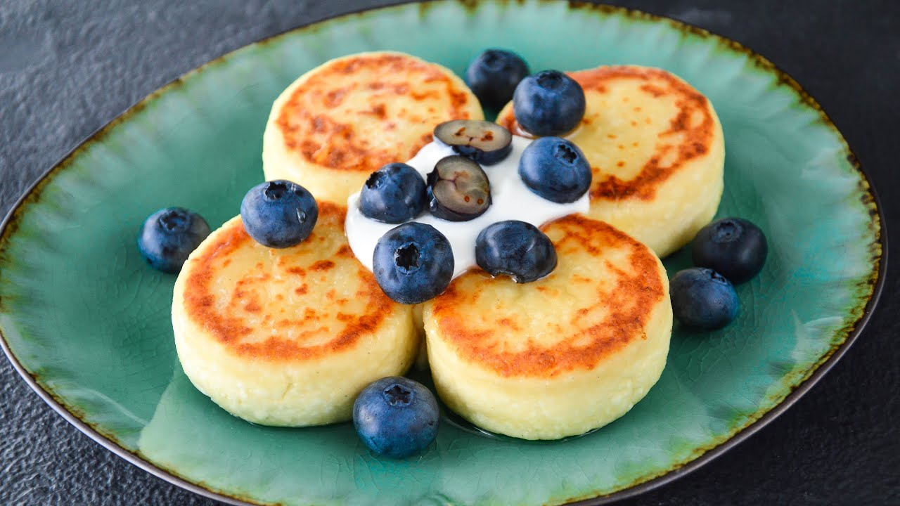

# Сырники (Curd pancakes)

> Сы́рники, творо́жники — жареное горячее блюдо из творога в форме биточков,
> кружочков или небольших лепёшек из теста на основе творога и пшеничной
> муки. В советских кулинарных книгах сырники часто именовались «творожниками»
> и в одном ряду с борщом, варениками и фаршированной рыбой относились к блюдам
> украинской кухни, которые «в результате тесных экономических связей, обмена
> опытом» между народами союзных республик получили признание в белорусской и
> русской кухнях.\
> — <cite>[Википедия](https://ru.wikipedia.org/wiki/%D0%A1%D1%8B%D1%80%D0%BD%D0%B8%D0%BA%D0%B8)</cite>

Learn how to [[cooking|cook]] them:

- [ ] [Лучшие Сырники](https://www.youtube.com/watch?app=desktop&v=qg4D7NFtTeI#dialog)
- [ ] [СЕКРЕТ СЫРНИКОВ ☆ Как в РЕСТОРАНЕ](https://www.youtube.com/watch?app=desktop&v=o-J33AkQja4)
