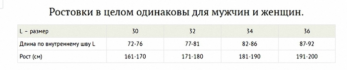
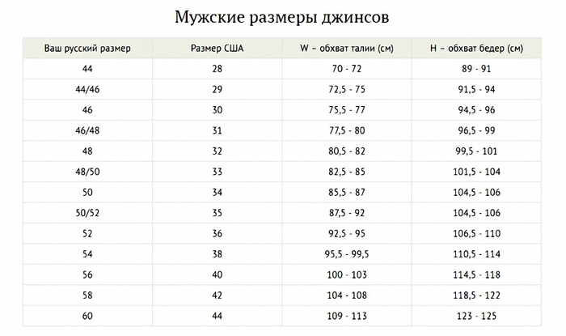
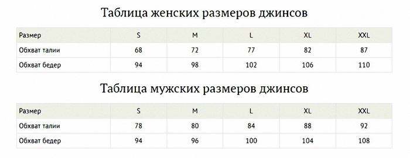

# Какие джинсы выбрать

В интернет магазине довольно сложно выбрать джинсы, в отличии от
[[in real life (irl)|оффллайн]] магазинов.

Данный гайд поможет с разбором таблицы размеров и выбором джинсов.

По сути, размер любой пары джинсов определяется всего двумя основными
параметрами.:

W (Waist) – полнота. Она же – объем в талии: берем гибкий портняжный метр,
оборачиваем его вокруг **талии**, фиксируем получившееся значение.

Примерный ориентир талии — прилегающий локоть вытянутой вниз руки.

L (Lenght) – длина. Она же – шаговый шов. Измеряется по внутреннему шву (inseam)
джинсов: прикладываем нулевую отметку метра к нижней части штанины и измеряем
длину до места пересечения швов под ширинкой.

Размер джинсов, которые продаются в зарубежных интернет-магазинах или
онлайн-стоках, обозначается с помощью этих букв. Например, 38W x 34L. Или,
положим, W32 L30. Значения в дюймах.

1. Измерьте объем своей талии и длину внутреннего шва (это можно сделать,
   например, на уже имеющихся в вашем гардеробе и идеально сидящих джинсах).
   Полученные значения в сантиметрах разделите на 2,54. Округлите до ближайшего
   целого

Например: ваша талия – 80 см. Делим на 2,54 – получаем 31,496… Округляем до 32.
Итого, ваш W – 32; ваш inseam (длина по внутреннему шву) – 86 см. Делим на 2,54
– получаем 1.,858… Округляем до 34. Итого, ваш L – 34.

Значит, ищем в интернет-магазинах джинсы с размером 32W x 34L (он же – W32 L34).

2. Длину определяем по таблице роста. L34 (inseam до 86 см) – идеален для роста
   178-188 см

 

Длина штанины Наряду с шириной пояса, длина штанины (inseam) является важнейшим
параметром для правильного выбора джинсов. Замеряется она от пахового шва до
нижнего края штанины. Производители обозначают эту величину буквой L,
обозначается она также дюймами и имеет она только четные значения: 32, 34 и пр.
Несмотря на кажущуюся простоту, замер длины штанины имеет свои особенности, в
зависимости от посадки. Низкая посадка более свободна, джинсы могу немного
провисать и, чтобы не было складки в виде «гармошки» над обувью, длина штанины
должна иметь величину на 1-2 см меньше стандартной. Напротив, при высокой
посадке джинсы сидят в паху плотно, поэтому даже на сантиметр уменьшенная длина
штанины уже будет портить вид. Кроме того, выбор длины зависит от обуви, которая
будет с этими джинсами носиться (толщина подошвы, высота каблука – все это имеет
значение). Следует также учитывать, особенно при покупке моделей унисекс, что
женские ноги обычно пропорционально длиннее мужских. Для страховки в любом
случае есть удобное решение в виде отворота нижней части штанины – это не всегда
выглядит эстетично, зато дает возможность комбинировать гардероб, подбирая к
джинсам обувь разнообразного вида и стиля.

3. Замечания Чем больше хлопка в составе джинсов, тем выше вероятность, что
   после первой же стирки (особенно в горячей воде) они “сядут”. Поэтому,
   покупая настоящий деним, берите размер чуть больше, чем вам необходимо.

Скинни с содержанием эластана, ситуация будет противоположной: со стиркой джинсы
чуть увеличатся в размерах. Тоже учитывайте этот факт при покупке.

Некоторые производители выпускают джинсы с так называемой “предварительной
усадкой”: это означает, что, как бы вы их ни стирали, они не изменят свой
размер. Внимательно читайте описания

Такие размеры не дают информацию о длине модели (ее надо будет уточнить в
описании), но хорошо характеризуют посадку джинсов в талии и на бедрах

- Силуэт может быть сильно облегающим – skinny, узким – slim, средним -
  **regular**, свободным – relaxed, просторно-мешковатым – loose.

  Самый популярный и, без сомнения, универсальный крой. Довольно плотная посадка
  в поясе и прямое полуприлегание по всей длине ноги. Достоинство джинсов
  силуэта regular в том, что они очень хорошо сидят практически на любой фигуре,
  слегка подтягивая ее и одновременно не стесняя движений. Это вечная классика,
  не выходящая из моды, пример тому – легендарные Levi’s модели 501. Regular fit
  предпочитают в основном люди среднего возраста, однако и молодежь не обходит
  их своим вниманием, особенно ценя за то, сочетать с такими джинсами можно
  любой верх – как облегающий, так и свободный. В коллекции каждого известного
  производителя джинсов обязательно встречаются несколько моделей классического
  кроя, а именно - regular.

  Джинсы свободного кроя, совершенно не стесняющие движений, подходящие для
  повседневной носки вне офиса, для спокойного времяпрепровождения и отдыха.
  Неплотная посадка по всей длине изделия создает даже ощущение некоторой
  большемерности, однако именно такой эффект изначально заложен в фасоне.
  Большинство людей используют relaxed-джинсы исключительно для активной
  деятельности, выездов на природу или прогулок с детьми и домашними любимцами.
  Под джинсы relaxed fit очень удобно поддевать утепляющий слой нижнего белья,
  поэтому зимой они пользуются большей популярностью. Однако некоторые мужчины и
  женщины плотного телосложения, которым крой regular излишне обтягивает бедра,
  носят джинсы relaxed fit ежедневно в любое время года

- Посадка (rise) определяется уровнем, на котором находится пояс джинсов, по
  отношению к талии человека. Различают высокую посадку (high), среднюю (medium)
  и заниженную (low)

  Средняя посадка. Наиболее распространенный вариант, хорошо сидящий практически
  при любом телосложении и подходящий под любой силуэт джинсов. Такую посадку
  имеет большинство традиционных моделей regular fit, ее предпочитают люди
  самодостаточные, уравновешенные, спокойно относящиеся к веяниям моды. Средняя
  посадка универсальна, она не мешает ни двигаться, ни сидеть, она зрительно
  улучшает фигуру и подходит к любой одежде.

  Глубина посадки Процедура измерения глубины (высоты) посадки джинсов очень
  проста. Посадка замеряется спереди и сзади по среднему шву изделия. Таким
  образом, глубина посадки имеет две величины – переднюю (front rise) и заднюю
  (back rise). В обоих случаях точка начала замера – паховый шов, точка
  окончания – верхний край пояса. Чем меньше значение глубины посадки, тем ниже
  будут сидеть джинсы. Соответственно, значение back rise будет несколько
  превышать front rise (обычно на 3-4 дюйма). В редких случаях, обычно только в
  женских моделях, эта величина впереди и сзади имеет довольно резкое различие:
  например сзади она соответствует средней посадке, а впереди – низкой.

- Ширина по бедрам Ширину бедра (upper thigh) в джинсах обычно замеряют в том
  случае, если неизвестно точно, какого прилегания данная модель – плотного или,
  наоборот, свободного. Значение ширины штанины по бедру даст представление о
  том, с каким силуэтом мы имеем дело: regular, slim или relaxed fit. Замеряется
  ширина бедра от пахового до бокового шва параллельно поясу джинсов. При
  покупке следует учитывать, что джинсы гораздо легче разнашиваются и
  растягиваются в поясе, чем в бедрах.

- Ширина в колене Ширина джинсов в области колена (knee) не имеет никакого
  особенно решающего значения. Пожалуй, это иногда волнует лишь женщин, не
  желающих, чтобы при общем облегающем силуэте колени выглядели чрезмерно
  обтянутыми. Замер делается просто – штанина измеряется горизонтально в районе
  колена, ориентировочно это будет на 13-14 дюймов ниже пахового шва.

- Не забудьте проверить ширину низа штанин (leg opening). Этот параметр
  обозначает не линейную величину, а покрой штанины от области колена до низа
  изделия. Этот силуэт обозначается терминами tapered (зауженный), straight
  (прямой) и boot (расклешенный)

  Замер низа штанины джинсов (leg opening) производится, соответственно, по
  нижней кромке. Данная величина позволяет определить, насколько расклешенный
  фасон имеет выбранная модель. Ширина низа штанины может варьироваться в
  пределах 7-10 дюймов, в «экстремальных» клешах – свыше 10.

## TLDR

- Начните с измерения талии. Найдите свой естественный размер талии, который
  находится между верхней частью бедер и ребрами. Оберните мерную ленту вокруг
  своей талии и замерьте ее окружность. Убедитесь, что мерная лента не слишком
  туго облегает вашу талию, чтобы избежать неправильных измерений.
  107

- Затем перейдите к измерению бедер. Найдите самую широкую часть вашего бедра и
  оберните мерную ленту вокруг этой области, чтобы замерить окружность бедер.
  63

- Измерьте длину ноги. Используя мерную ленту, измерьте расстояние от вашей
  талии до пола. Это измерение позволит определить необходимую длину джинс.
  103

- При необходимости, вы можете измерить дополнительные параметры, такие как
  длину по внутреннему шву или обхват колена.

- Проверьте полученные измерения с размерной таблицей джинсов, чтобы определить
  правильный размер для вас. Обратите внимание на то, что различные бренды могут
  иметь разные размерные таблицы, поэтому важно проверять таблицы размеров перед
  покупкой.

Если у вас есть возможность, примерьте джинсы, чтобы убедиться, что они подходят
вам по размеру и комфорту.

## Levis jeans series

|FIELD1  |#  |Massive Thighs?|Skinny Guy?|Average Guy?|Fat Guy?|Are You A Cowboy?|Skinny Cut Legs?|Slim Cut Legs?|Tapered Legs?|Straight Cut Legs?|Boot Cut?|Relaxed Legs?|
|--------|---|---------------|-----------|------------|--------|-----------------|----------------|--------------|-------------|------------------|---------|-------------|
|Skinny  |519|               |Yes        |            |        |                 |Yes             |              |             |                  |         |             |
|        |501|               |Yes        |            |        |                 |Yes             |              |             |                  |         |             |
|        |510|               |Yes        |            |        |                 |Yes             |              |             |                  |         |             |
|Slim    |511|               |Yes        |            |        |                 |                |Yes           |             |                  |         |             |
|        |513|               |Yes        |            |        |                 |                |              |Yes          |                  |         |             |
|        |522|               |Yes        |            |        |                 |                |              |Yes          |                  |         |             |
|        |512|               |Yes        |Yes         |Yes     |                 |                |Yes           |             |                  |         |             |
|        |603|               |Yes        |Yes         |Yes     |                 |                |Yes           |             |                  |         |             |
|Tapered |508|Yes            |           |Yes         |Yes     |                 |                |              |Yes          |                  |         |             |
|        |502|Yes            |           |            |Yes     |                 |                |              |Yes          |                  |         |             |
|        |501|               |           |Yes         |Yes     |                 |                |              |Yes          |                  |         |             |
|        |504|               |           |Yes         |Yes     |                 |                |              |Yes          |                  |         |             |
|Straight|501|               |           |Yes         |Yes     |                 |                |              |             |Yes               |         |             |
|        |504|               |           |Yes         |Yes     |                 |                |              |             |Yes               |         |             |
|        |505|               |           |Yes         |Yes     |                 |                |              |             |Yes               |         |             |
|        |513|               |           |Yes         |Yes     |                 |                |              |             |Yes               |         |             |
|        |514|Yes            |           |Yes         |Yes     |                 |                |              |             |Yes               |         |             |
|        |541|Yes            |           |Yes         |Yes     |                 |                |              |             |Yes               |         |Yes          |
|Boot Cut|503|               |           |            |        |Yes              |                |              |             |                  |Yes      |             |
|        |517|               |           |            |        |Yes              |                |              |             |                  |Yes      |             |
|Relaxed |541|Yes            |           |            |        |                 |                |              |             |                  |         |Yes          |

